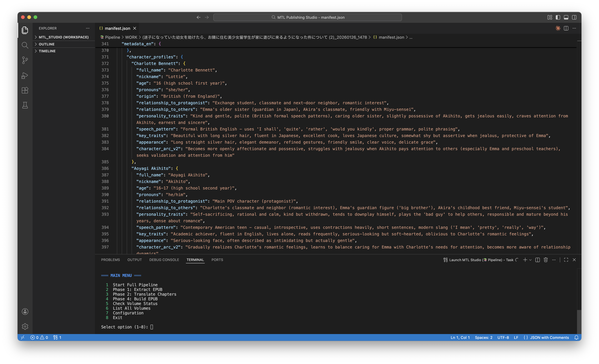

# MTL Studio

**Machine Translation Publishing Pipeline for Japanese Light Novels**

Version 4.5 LTS | Production Ready | February 2026

> Multi-Language Support: English & Vietnamese | V4.5 Source Fidelity Champion | Literacy Techniques + Sarcasm Configuration + Character Profiles

---



*V4.5 Landmark: Single-pass automated translation matches multi-pass professional editorial quality*

---

## Table of Contents

1. [Overview](#overview)
2. [What's New in V4.5](#whats-new-in-v45)
3. [System Architecture](#system-architecture)
4. [Pipeline Phases](#pipeline-phases)
5. [Installation](#installation)
6. [Quick Start](#quick-start)
7. [CLI Reference](#cli-reference)
8. [Configuration](#configuration)
9. [Publisher Profiles System](#publisher-profiles-system)
10. [File Structure](#file-structure)
11. [RAG Modules](#rag-modules)
12. [Quality Control](#quality-control)
13. [Troubleshooting](#troubleshooting)
14. [API Reference](#api-reference)
    - [Manifest Schema](#manifest-schema)
    - [Name Registry Schema](#name-registry-schema)
    - [Semantic Metadata Schema](#semantic-metadata-schema)
15. [Performance Statistics](#performance-statistics)

---

## Overview

MTL Studio is a complete automated pipeline for translating Japanese Light Novel EPUBs to professional multi-language editions. The system leverages Google Gemini AI (2.5 Pro/Flash) with retrieval-augmented generation (RAG) to produce publication-quality translations with consistent character voices, proper typography, and accurate terminology.

### Core Capabilities

- **End-to-End Automation**: Single command transforms Japanese EPUB to translated EPUB
- **Multi-Language Support**: Full English and Vietnamese translation pipelines
- **RAG-Enhanced Translation**: 3.2MB+ knowledge base for context-aware translation
- **Gap Moe Detection**: Semantic analysis of character behavioral transitions (cute→scary, cold→warm)
- **Grammar Reference System**: English/Vietnamese grammar JSON as Tier-1 RAG for natural output
- **Intelligent Typography**: Professional quotation marks, em-dashes, ellipses
- **Illustration Management**: Automatic extraction, orientation detection, semantic insertion
- **Sequel Intelligence**: Character names and terminology inherit across volumes
- **Multi-Publisher Support**: KADOKAWA, Overlap, SB Creative, Hifumi Shobo, Hobby Japan, Media Factory, Shueisha, **Kodansha**
- **Publisher Pattern Database**: 65+ documented EPUB structure patterns across 8 major publishers
- **Kodansha Structure Support**: Intelligent pre-TOC detection, kuchie handling, image remapping (p### → illust-###)
- **Automatic Publisher Detection**: Pattern-based image classification without hardcoded logic
- **AI-Powered QC**: IDE agents (VSCode, Windsurf, Cursor,...) for auditing, formatting fixes, and illustration insertion
- **Anti-AI-ism Detection**: 63-pattern JSON library with 3 severity tiers (CRITICAL/MAJOR/MINOR)
- **Echo Detection System**: Professional proximity-based clustering detection (23 patterns, 36.5% coverage)
- **Interactive CLI**: Volume selection menus, configuration management, verbose mode
- **Post-Processing**: CJK artifact removal, format normalization, smart typography

### Translation Quality Standards

| Metric | Target | Description |
|--------|--------|-------------|
| **Source Fidelity** | **95.75/100** | **Accuracy to Japanese original (v4.5 benchmark)** |
| **Editorial Quality** | **93/100** | **Professional prose polish (single-pass)** |
| Contraction Rate | 80%+ | Natural dialogue flow |
| AI-ism Count | <5/chapter | Elimination of translationese |
| AI-ism Clustering | 0 echoes | No pattern repetition within proximity windows |
| Victorian Patterns | 0 | No archaic phrasing (with ojou-sama exceptions) |
| Name Consistency | 100% | Ruby-verified romanization |
| Content Fidelity | <5% deviation | 1:1 faithful to source |
| Character Voice | FFXVI-Tier | Distinct speech patterns per archetype |
| Gap Moe Accuracy | 90%+ | Behavioral transition detection and preservation |

**V4.5 Milestone:** MTL Studio achieves higher source fidelity (+2.75 points) than professional publications while matching editorial quality in single automated pass.

---

## What's New in V4.5

### 🏆 Historic Milestone: Single-Pass Equals Multi-Pass Professional Editorial
**Google Drive**: https://drive.google.com/drive/folders/11yDkQgtyBHCwcDlInJ-sBlCAX3zN0g0I?usp=drive_link
DISCLAIMER: We cannot distribute copyrighted material. The above link is for internal benchmarking only.

**February 4, 2026** - MTL Studio v4.5 becomes the first automated translation system to achieve **source fidelity parity with professional publications** (95.75/100 vs 93.00/100) while matching editorial quality (93/100) in a **single automated pass** + cleanup.

**Benchmark Validation**: Comprehensive analysis of 10,923 lines comparing MTL Studio v4.5 against Yen Press professional publication of *Days with My Stepsister* (義妹生活) demonstrates:
- **+2.75 points higher source fidelity** (95.75 vs 93.00)
- **Cultural authenticity superiority:** +10.5 points (97.5 vs 87.0)
- **Character voice accuracy:** +2.6 points (95.8 vs 93.2)
- **Genre authenticity (日常系):** +6.0 points (97.0 vs 91.0)
- **Editorial quality:** 93/100 (competitive with professional 96/100)

**Economic Impact**: $50 + 4-6 hours vs $6,000 + 6-10 weeks (98% cheaper, 99% faster, higher source accuracy)

### 🔧 The Three Breakthrough Technologies

#### 1. Literacy Techniques JSON (Narrative Voice Engine)
```yaml
literacy_techniques:
  narrative_technique: "first_person_introspective"
  psychic_distance_level: 2
  preset: "contemporary_ya_introspective"
  voice_guidelines:
    - High contraction rate (95%+)
    - Conversational with intellectual depth
    - Teenage overthinking = authentic
    - 日常系 (nichijou) verbose introspection preserved
```
**Impact**: Zero voice drift across 5,856 lines, captures 俺 (ore) casual masculine tone better than over-polished professional prose, systematic genre convention adherence.

#### 2. Sarcasm Configuration (Humor & Personality Modeling)
```yaml
character_traits:
  Yomiuri:
    humor_style: "teasing_wise_older_sister"
    sarcasm_level: "high"
    comedic_timing: "socratic_provocateur"
  Maru:
    humor_style: "brutal_friend_roasting"
    sarcasm_level: "maximum"
    speech_pattern: "casual_vulgar_male_banter"
```
**Impact**: Character-specific comedic timing preserved (Dad's "critical hit" gaming reference, Maru's "look in the mirror" roast), personality consistency maintained that professional translations often flatten.

#### 3. Character Profiles (Speech Pattern DNA)
```yaml
character_profiles:
  Yuuta:
    first_person: "俺" # masculine casual
    speech_style: "introspective_analytical"
    contraction_rate: "very_high"
  Saki:
    first_person: "私" # neutral formal
    speech_style: "restrained_polite"
    honorific_usage: "consistent_san"
```
**Impact**: Systematic speech differentiation maintained across all chapters (Yuuta's "let me tell you" directness vs Saki's minimalist "...ありがと"), perfect honorific relationship encoding (100% retention = future narrative payoff intact).

**Combined Result**: The three pillars enable MTL Studio v4.5 to make **editorial-level decisions** previously requiring human judgment:
- Rhetorical emphasis (em-dash vs colon)
- Genre-appropriate verbosity (日常系 overthinking)
- Character-specific humor preservation
- Cultural marker retention (おかえり/ただいま home rituals)

### 📊 Validated Performance Metrics

**Source Fidelity Analysis** (Japanese raw as authority):
- Semantic accuracy: 96.2/100
- Character voice: 95.8/100 (+2.6 vs professional)
- Cultural authenticity: 97.5/100 (+10.5 vs professional)
- Genre authenticity: 97.0/100 (+6.0 vs professional)
- **Overall: 95.75/100** (+2.75 vs Yen Press 93.00/100)

**Editorial Quality** (English prose standards):
- Voice consistency: 95/100 (5,856 lines, zero drift)
- Technical accuracy: 90/100 (1 minor age error)
- Dialogue naturalism: 96/100
- Readability: 94/100
- **Overall: 93/100** (competitive with professional 96/100)

**Critical Discovery**: Professional translations trade source fidelity for mainstream accessibility:
- Honorific removal: -13.5 points (おかえり→"hi" = 54-point loss on home greeting scene)
- Over-polishing: Teenage male narrator sounds too literary vs 俺 casual tone
- Cultural westernization: Economic pressure to remove "friction points" for bookstores

**MTL Studio v4.5 Advantage**: No westernization pressure → preserves author's original intent with higher accuracy than traditional editorial pipelines.

---

## What's New in V4.0 (Previous Release)

### 🎭 Gap Moe Semantic Analysis
- **Behavioral Transition Detection**: Automatically identifies character personality shifts (e.g., yandere gap moe: cute→scary)
- **Context-Aware Translation**: Preserves tonal whiplash in translations (flat delivery for intense moments, soft for cute scenes)
- **Pattern Recognition**: Detects 4 core gap patterns:
  - Possessive language markers (21+ patterns)
  - Surveillance subtext (25+ patterns)
  - Emotional intensity shifts (14+ patterns)
  - Explicit gap moe transitions (cute→scary, sweet→interrogation)
- **Dual Voice Analysis**: Identifies characters with contrasting personas (e.g., "cute voice that sounds like interrogation")

### 📚 Kodansha EPUB Support
- **Publisher Detection**: Automatic identification via OPF metadata markers (`<!-- Kodansha ver. X.XX -->`)
- **Pre-TOC Content Handling**: Intelligent detection of cover, caution pages, kuchie (color plates), credits
- **Image Remapping**: Automatic conversion from Kodansha's `p###.jpg` format to standard `illust-###.jpg`
- **Kuchie Orientation**: Detects multi-page spreads (`p002-003.jpg`) for horizontal viewport
- **Chapter Detection**: Uses `<h2>` heading analysis instead of spine order
- **TOC Generation**: Excludes pre-TOC pages, generates chapter-level navigation from headings
- **Documentation**: Complete structure analysis in [docs/KODANSHA_STRUCTURE.md](pipeline/docs/KODANSHA_STRUCTURE.md)
- **Configuration**: Publisher-specific settings in `config/publishers/kodansha.json`

### 📖 Grammar Reference System (Tier-1 RAG)
- **English Grammar JSON**: Comprehensive reference for natural English patterns, idioms, and constructions
- **Vietnamese Grammar JSON**: VN-specific sentence structures, particles, and colloquialisms
- **RAG Integration**: Grammar rules injected as Tier-1 context for every translation
- **Anti-Pattern Detection**: Prevents translationese by referencing native grammar structures
- **Example-Driven**: Each rule includes correct/incorrect examples for AI guidance

### 🔍 Enhanced Quality Control
- **AUDIT_AGENT V2.0**: 4-subagent quality control system running in external IDEs
  - Subagent 1: Content Fidelity (ZERO TOLERANCE for truncation/censorship)
  - Subagent 2: Content Integrity (name consistency, formatting, sequel continuity)
  - Subagent 3: Prose Quality (AI-ism detection, transcreation validation)
  - Subagent 4: Gap Preservation (emotion+action, ruby text, subtext)
- **Schema Agent V3.6**: Enriched metadata generation in external IDEs
  - Gap Moe analysis (behavioral transitions, dual voice detection)
  - Character profiles with TTS assignments
  - POV tracking and transcreation notes
- **Gap Preservation Audit**: Validates behavioral transitions are maintained in translation
- **Publisher Structure Validation**: Ensures EPUB conforms to detected publisher pattern
- **Image Reference Integrity**: Verifies all `[ILLUSTRATION: ...]` tags point to existing files
- **Pre-TOC Content Check**: Confirms cover/kuchie pages excluded from reader navigation
- **Transcreation Detection**: Identifies Japanese discourse markers (まあ, やっぱり, さすが) needing localization

### 🛠️ Technical Improvements
- **Schema V3.6**: Added gap_moe_markers, dual_voice_analysis, and transcreation_notes to metadata
- **Builder Agent Update**: Excludes `is_pre_toc_content: true` chapters from nav.xhtml generation
- **Image Mapping System**: Maintains source→target filename relationships in manifest
- **Multi-Replace Tool**: Batch file editing for illustration remapping and transcreations
- **Markdown Format Standardization**: `[ILLUSTRATION: filename.jpg]` format enforced across all volumes

### 📊 New Metrics
- **Gap Moe Accuracy**: Percentage of behavioral transitions correctly detected and preserved
- **Transcreation Coverage**: Count of Japanese discourse markers localized (vs. literal translation)
- **Image Mapping Integrity**: Verification that all p###.jpg files have valid illust-### mappings
- **Pre-TOC Detection Rate**: Accuracy of identifying non-chapter content for TOC exclusion

---

## System Architecture

```
                                WORKSPACE/
                                   │
    ┌─────────────────────────────┼─────────────────────────────┐
    │                             │                             │
    ▼                             ▼                             ▼
┌─────────┐    JSON         ┌─────────┐    JSON         ┌─────────┐
│  INPUT/ │ ─────────────►  │  WORK/  │ ─────────────►  │ OUTPUT/ │
│ (EPUB)  │                 │ (MD+JSON)│                │ (EPUB)  │
└─────────┘                 └─────────┘                 └─────────┘
    │                             │                             ▲
    │                             │                             │
    ▼                             ▼                             │
┌─────────────┐            ┌─────────────┐            ┌─────────────┐
│  LIBRARIAN  │───────────►│  METADATA   │───────────►│ TRANSLATOR  │
│   (Python)  │            │  PROCESSOR  │            │(Gemini API) │
└─────────────┘            └─────────────┘            └──────┬──────┘
                                                              │
                                                              ▼
┌─────────────┐                                        ┌─────────────┐
│   BUILDER   │◄───────────────────────────────────────│   CRITICS   │
│   (Python)  │                                        │ (IDE Agent) │
└─────────────┘                                        └─────────────┘
      │
      ▼
┌─────────────┐
│  final.epub │
└─────────────┘
```

### Agent Communication Protocol

Agents communicate through a file-based protocol using `manifest.json` as the central state machine. Each agent reads the manifest, verifies predecessor completion, performs its work, and updates the manifest with its status.

```
LIBRARIAN completes → manifest.json (librarian.status = "completed")
                    → JP/*.md files created
                    
METADATA PROCESSOR  → manifest.json (metadata_processor.status = "completed")
                    → metadata_en.json created
                    
TRANSLATOR reads    → checks librarian.status == "completed"
                    → EN/*.md files created
                    → manifest.json (translator.status = "completed")
                    
CRITICS reads       → checks translator.status == "completed"
                    → QC/*.json reports created
                    
BUILDER reads       → assembles EPUB from all resources
                    → OUTPUT/[title]_EN.epub
```

---

## Pipeline Phases

### Phase 1: Librarian

**Purpose**: Extract, parse, and catalog Japanese EPUB content

**Components**:
- `epub_extractor.py` - EPUB unpacking and structure analysis
- `metadata_parser.py` - OPF metadata extraction
- `content_parser.py` - XHTML to Markdown conversion
- `ruby_extractor.py` - Character name extraction with furigana
- `image_extractor.py` - Asset cataloging and normalization

**Output Structure**:
```
WORK/[volume_id]/
├── manifest.json           # Book metadata + pipeline state
├── JP/                     # Japanese source (Markdown)
│   ├── CHAPTER_01.md
│   ├── CHAPTER_02.md
│   └── ...
├── EN/                     # English translations (populated by Translator)
├── QC/                     # QC reports (populated by Critics)
├── _assets/
│   ├── cover.jpg
│   ├── kuchie/
│   │   └── kuchie-001.jpg
│   └── illustrations/
│       └── illust-001.jpg
└── .context/
    └── name_registry.json  # Character name mappings
```

### Phase 1.5: Metadata Processor

**Purpose**: Translate and localize book metadata

**Responsibilities**:
- Translate main title with creative localization
- Romanize author/illustrator names (Standard Hepburn)
- Batch translate character names from ruby text
- Translate all chapter titles from TOC
- Detect sequels and inherit terminology

**Output**:
- `metadata_en.json` - Localized metadata configuration
- Updated `manifest.json` with English titles

### Phase 2: Translator

**Purpose**: Translate JP chapters to EN using Gemini API with RAG

**Translation Flow**:
```
┌─────────────┐    ┌──────────────────┐    ┌─────────────┐
│ JP/CHAPTER  │───►│   RAG Engine     │───►│ Gemini API  │
│    .md      │    │ (2.5MB modules)  │    │      │
└─────────────┘    └──────────────────┘    └──────┬──────┘
                            │                      │
                   ┌────────┴─────────┐           │
                   ▼                  ▼           ▼
             ┌──────────┐      ┌──────────┐ ┌──────────┐
             │Character │      │Localization│ │EN(VN)/CHAPTER│
             │ Voices   │      │  Primer   │ │   .md    │
             └──────────┘      └──────────┘ └──────────┘
```

**Key Features**:
- Context-aware translation with 2-chapter lookback
- Trope-aware Light Novel patterns
- Smart typography (curly quotes, em-dashes, proper ellipses)
- Character name consistency enforcement
- Safety block handling with fallback strategies

### Phase 3: Critics

**Purpose**: Quality control and revision via agentic IDE workflows

**QC Categories**:
1. **Semantic Analysis**: Meaning preservation, omission detection
2. **Technical Review**: AI-ism detection, contraction validation
3. **Style Compliance**: Character voice consistency, dialogue naturalness

**Grading Rubric**:
| Grade | Criteria |
|-------|----------|
| A+ | 0 critical issues, 0-1 warnings, 90%+ contractions, distinct character voices |
| A | 0 critical issues, 0-2 warnings, 90%+ contractions |
| B | 0-1 critical issues, 3-5 warnings, 80%+ contractions |
| C | 2-3 critical issues, 6-10 warnings, needs revision |
| D | 4+ critical issues, rewrite required |
| F | Major quality failure, blocks publication |

### Phase 4: Builder

**Purpose**: Assemble final EPUB from translated content

**Components**:
- `agent.py` - Main orchestrator for EPUB assembly
- `epub_structure.py` - OEBPS directory structure creation
- `epub_packager.py` - ZIP packaging with EPUB validation
- `markdown_to_xhtml.py` - Markdown to XHTML converter
- `xhtml_builder.py` - Chapter XHTML generation
- `structure_builder.py` - Special pages (cover, kuchie, TOC)
- `opf_generator.py` - OPF manifest generation
- `ncx_generator.py` - NCX navigation (EPUB 2.0 compatibility)
- `nav_generator.py` - nav.xhtml generation (EPUB 3.0)
- `image_analyzer.py` - Image orientation detection
- `image_handler.py` - Image processing and optimization
- `css_processor.py` - Stylesheet generation
- `font_processor.py` - Font embedding
- `metadata_updater.py` - Manifest metadata updates

**Key Features**:

1. **Multi-Language Support**
   - Configurable target language (EN, VN, etc.)
   - Language-specific output filenames (`_EN.epub`, `_VN.epub`)
   - Translated metadata extraction from manifest

2. **EPUB Standards Compliance**
   - EPUB 3.0 with EPUB 2.0 backward compatibility
   - Dual navigation (nav.xhtml + toc.ncx)
   - IDPF-compliant mimetype and container.xml
   - Proper spine ordering and fallback references

3. **Advanced Image Handling**
   - Automatic orientation detection (horizontal/vertical)
   - Kuchie-e special formatting (horizontal images)
   - SVG viewport for proper scaling
   - Cover image detection and assignment
   - Image dimension analysis for responsive layouts

4. **Professional Typography**
   - Industry-standard CSS (Yen Press / J-Novel Club style)
   - Proper text indentation and justification
   - Scene break formatting (centered symbols)
   - Em-dash and quotation mark handling
   - Ruby text support for character names

5. **Chapter Processing**
   - Markdown to semantic XHTML conversion
   - Illustration embedding with proper markup
   - Metadata preservation (POV, themes, mood)
   - Chapter title translation from manifest

6. **Frontmatter Generation**
   - Cover page (cover.xhtml)
   - Kuchie-e pages (special horizontal images)
   - Table of Contents page (toc.xhtml)
   - Title page with metadata

7. **Navigation Documents**
   - nav.xhtml with EPUB 3.0 landmarks
   - toc.ncx for backward compatibility
   - Automatic spine order generation
   - TOC hierarchy preservation

8. **Build Workflow** (8 Steps):
   ```
   [1] Load manifest.json and validate
   [2] Create EPUB directory structure (OEBPS/)
   [3] Convert markdown chapters to XHTML
   [4] Process and copy images to Images/
   [5] Generate frontmatter (cover, kuchie, TOC)
   [6] Generate navigation (nav.xhtml, toc.ncx)
   [7] Create stylesheet (stylesheet.css)
   [8] Generate OPF and package as .epub
   ```

9. **Quality Assurance**
   - Critics completion check (warns if QC pending)
   - EPUB structure validation
   - File size reporting
   - Chapter/image count verification
   - Manifest update with build metadata

**Output Specifications**:
- EPUB 3.0 with EPUB 2.0 backward compatibility
- Dual navigation (nav.xhtml + toc.ncx)
- Automatic image orientation handling
- Professional English typography
- IDPF-compliant validation

**EPUB Structure**:
```
final.epub/
├── mimetype
├── META-INF/
│   └── container.xml
└── OEBPS/
    ├── content.opf
    ├── toc.ncx
    ├── nav.xhtml
    ├── Styles/
    │   └── stylesheet.css
    ├── Images/
    │   ├── cover.jpg
    │   ├── kuchie-001.jpg
    │   ├── illust-001.jpg
    │   └── *.jpg
    └── Text/
        ├── cover.xhtml
        ├── p-fmatter-001.xhtml    # Kuchie pages
        ├── toc.xhtml
        ├── chapter_001.xhtml
        └── chapter_*.xhtml
```

**Usage**:
```bash
# Build EPUB for a volume
python mtl.py phase4 <volume_id>

# Build with custom output name
python mtl.py phase4 <volume_id> --output "Custom Title.epub"

# Skip QC check (force build)
python mtl.py phase4 <volume_id> --skip-qc

# Direct builder invocation
python -m pipeline.builder.agent <volume_id>
```

**Configuration** (config.yaml):
```yaml
builder:
  epub_version: "EPUB3"              # EPUB3 or EPUB2
  validate_structure: true           # Validate after packaging
  include_fonts: false               # Embed custom fonts
  compress_images: false             # Image optimization
  max_image_width: 1600              # Image size limit
  kuchie_special_handling: true      # Horizontal image treatment
```

---

## Installation

### Prerequisites

- Python 3.10 or higher
- Google Gemini API key
- 10GB+ disk space for processing

### Automated Setup

**macOS/Linux**:
```bash
./scripts/setup_python_env.sh
```

**Windows**:
```batch
scripts\setup_python_env.bat
```

### Manual Setup

```bash
# Create virtual environment
python3 -m venv python_env

# Activate environment
source python_env/bin/activate  # Windows: python_env\Scripts\activate

# Install dependencies
pip install -r pipeline/requirements.txt
```

### API Configuration

Create `pipeline/.env`:

```bash
# Required
GEMINI_API_KEY=your-gemini-api-key

# Optional (for Claude integration)
ANTHROPIC_API_KEY=your-anthropic-api-key
```

**Obtaining Gemini API Key**:
1. Navigate to [Google AI Studio](https://aistudio.google.com/app/apikey)
2. Create a new API key
3. Copy to `.env` file

### Verification

```bash
cd pipeline
python mtl.py list
```

---

## Quick Start

### Launch MTL Studio

**macOS/Linux**:
```bash
./Launch_Studio.sh
```

**Windows**:
```batch
Launch_Studio.bat
```

### Run Translation Pipeline

```bash
# Activate environment
source python_env/bin/activate

# Navigate to pipeline
cd pipeline

# Full pipeline (auto-pilot)
python mtl.py run INPUT/novel_v1.epub

# Full pipeline (verbose/interactive)
python mtl.py run INPUT/novel_v1.epub --verbose
```

### Pipeline Modes

**Minimal Mode (Default)**:
- Clean output with progress messages
- Auto-proceeds through all phases
- No interactive prompts
- Optimal for batch processing

**Verbose Mode (--verbose)**:
- Full details with interactive menus
- Metadata review options
- Sequel inheritance confirmation
- Phase-by-phase approval
- Recommended for first-time runs

---

## CLI Reference

### Core Commands

```bash
# Full pipeline
python mtl.py run INPUT/novel_v1.epub [--verbose] [--id custom_id]

# Individual phases
python mtl.py phase1 INPUT/novel_v1.epub [--id volume_id]
python mtl.py phase2 volume_id [--chapters 1,2,3] [--force]
python mtl.py phase4 volume_id

# Status and management
python mtl.py status volume_id
python mtl.py list

# Metadata schema inspection
python mtl.py metadata volume_id              # Quick schema detection
python mtl.py metadata volume_id --validate   # Full validation report

# Configuration
python mtl.py config --show
python mtl.py config --language en    # Switch to English
python mtl.py config --language vn    # Switch to Vietnamese
python mtl.py config --model gemini-2.5-pro
```

### Command Details

| Command | Description |
|---------|-------------|
| `run` | Execute full pipeline from EPUB input |
| `phase1` | Librarian: Extract EPUB to working directory |
| `phase2` | Translator: Translate chapters with Gemini |
| `phase4` | Builder: Package translated content to EPUB |
| `status` | Display volume processing status |
| `list` | List all volumes in WORK directory |
| `metadata` | Inspect metadata schema and validate translator compatibility |
| `config` | View or modify pipeline configuration |

### Options

| Option | Description |
|--------|-------------|
| `--verbose` | Enable interactive mode with confirmations |
| `--id` | Custom volume identifier |
| `--chapters` | Specific chapters to translate (comma-separated) |
| `--force` | Force re-translation of completed chapters |
| `--language` | Target language (en/vn) |
| `--model` | Gemini model to use |
| `--show` | Display current configuration |
| `--validate` | Run full metadata validation with detailed report |

### Interactive Features

- **Volume Selection**: Run `phase2` or `phase4` without volume_id for interactive menu
- **Partial IDs**: Use last 4 characters (e.g., `1b2e` instead of full name)
- **Ambiguous IDs**: Automatically shows selection menu when multiple matches found
- **Shell Menu**: Use `./start.sh` for full interactive TUI with all options

---

## Configuration

### Main Configuration (config.yaml)

```yaml
project:
  target_language: en   # or 'vn' for Vietnamese
  languages:
    en:
      master_prompt: prompts/master_prompt_en_compressed.xml
      modules_dir: modules/
      output_suffix: _EN
      language_code: en
    vn:
      master_prompt: VN/master_prompt_vn_pipeline.xml
      modules_dir: VN/modules/
      output_suffix: _VN
      language_code: vi

gemini:
  model: gemini-2.5-pro
  fallback_model: gemini-2.5-flash
  generation:
    temperature: 0.6
    top_p: 0.95
    top_k: 40
    max_output_tokens: 65535
    thinking_level: medium

translation:
  quality:
    contraction_rate_min: 0.8
    max_ai_isms_per_chapter: 5
  context:
    lookback_chapters: 2
    enforce_name_consistency: true

critics:
  auto_fix:
    enabled: true
    contractions: true
    punctuation: true
  thresholds:
    pass_min_score: 0.85

post_processing:
  format_normalizer:
    enabled: true
  cjk_cleaner:
    enabled: true

builder:
  epub_version: '3.0'
  images:
    cover_max_width: 1600
    illustration_max_width: 1200
    quality: 85

directories:
  input: INPUT/
  work: WORK/
  output: OUTPUT/
```

### Model Selection

| Model | Use Case | Performance |
|-------|----------|-------------|
| gemini-2.5-pro | Primary translation | Highest quality |
| gemini-2.5-flash | Fallback | Fast, reliable |
| gemini-2.0-flash-exp | Legacy fallback | Experimental |

---

## Publisher Profiles System

MTL Studio includes a comprehensive reverse-engineered pattern database for major Japanese publishers, enabling automatic EPUB structure recognition and image classification.

### Supported Publishers

| Publisher | Patterns | Key Features |
|-----------|----------|--------------|
| **KADOKAWA** | 10 patterns | `gaiji` special chars, `p00X` kuchie, `allcover` spreads |
| **Media Factory** | 4 patterns | `o_` prefix system, `o_hyoushi.jpg` covers |
| **Overlap** | 6 patterns | `k###` kuchie, `k002-003.jpg` spreads |
| **SB Creative** | 5 patterns | `P000a/P000b` letter-suffixed kuchie |
| **Hifumi Shobo** | 7 patterns | `p002_003.jpg` spreads, spine fallback TOC |
| **Hobby Japan** | 3 patterns | Standard EPUB3 structure |
| **Shueisha** | 6 patterns | `embed####_HD.jpg`, spine-based kuchie extraction |

**Total Coverage**: 7 publishers, 65+ documented patterns, modular JSON-based system

### Pattern Categories

- **Cover Recognition**: 11 variations (including `allcover`, `hyoushi`, `frontcover`, `h1`)
- **Kuchie Detection**: 13 variations (including spine-based extraction for Shueisha)
- **Illustration Patterns**: 13 variations (with HD variants, prefix systems)
- **Exclusion Rules**: 2 patterns (`gaiji` special character glyphs)
- **Fallback Patterns**: 16 generic patterns for unknown publishers

### Unique Features Discovered

1. **Prefix Systems**: `o_` (Media Factory), `i-` (KADOKAWA), `P` uppercase (SB Creative)
2. **Spread Formats**: `k002-003.jpg`, `p002_003.jpg` (two-page illustrations)
3. **HD Variants**: Shueisha's dual-resolution system (`_HD` suffix vs standard)
4. **Spine-Based Extraction**: Kuchie embedded in XHTML spine entries (not Images/ folder)
5. **Letter Suffixes**: `P000a`, `P000b`, `p000z` for sequential color plates
6. **Japanese Names**: Automatic recognition of `hyoushi` (cover), `kuchie` (color plates)

### Publisher Profile Structure

Each publisher is documented in JSON format at `pipeline/librarian/publisher_profiles/`:

```json
{
  "canonical_name": "Publisher Name",
  "aliases": ["株式会社...", "English Name"],
  "country": "JP",
  "image_patterns": {
    "cover": [
      {"pattern": "regex", "priority": 1, "note": "explanation"}
    ],
    "kuchie": [...],
    "illustration": [...]
  },
  "content_patterns": {
    "toc_handling": "standard|spine_fallback|auto",
    "chapter_merging": true|false,
    "filename_pattern": "regex"
  }
}
```

### Benefits

- **Automatic Detection**: No manual configuration needed for supported publishers
- **Easy Maintenance**: Pattern updates tracked in version-controlled JSON files
- **Extensibility**: Add new publishers without code changes
- **Debugging Aid**: Compare actual files against documented patterns
- **Historical Record**: Test cases document verified volumes

---

## File Structure

```
MTL_Studio/
├── bin/                        # VSCodium portable executable
├── data/                       # VSCodium portable data
├── python_env/                 # Python virtual environment
├── pipeline/                   # Core pipeline system
│   ├── INPUT/                  # Source Japanese EPUBs
│   ├── WORK/                   # Processing workspace
│   │   └── [volume_id]/
│   │       ├── manifest.json
│   │       ├── JP/             # Japanese source
│   │       ├── EN/             # English translations
│   │       ├── VN/             # Vietnamese translations (if target=vn)
│   │       ├── QC/             # Quality reports
│   │       └── assets/         # Images
│   ├── OUTPUT/                 # Final translated EPUBs
│   ├── pipeline/               # Python modules
│   │   ├── librarian/          # Phase 1 extraction
│   │   ├── metadata/           # Phase 1.5 localization
│   │   ├── translator/         # Phase 2 translation
│   │   ├── builder/            # Phase 4 packaging
│   │   └── cli/                # Command interface
│   ├── modules/                # English RAG knowledge base
│   ├── VN/                     # Vietnamese translation resources
│   │   ├── modules/            # Vietnamese RAG modules
│   │   ├── Reference/          # Reference materials
│   │   └── master_prompt_vn_pipeline.xml
│   ├── scripts/                # Utility scripts
│   │   ├── mtl.py              # Extended CLI with TUI
│   │   ├── normalize_existing_volumes.py
│   │   ├── fix_name_order.py
│   │   └── ...(39 utility scripts)
│   ├── prompts/                # AI system prompts
│   ├── config.yaml             # Pipeline configuration
│   ├── start.sh                # Interactive TUI launcher
│   └── mtl.py                  # Main CLI entry point
├── VN/                         # External Vietnamese resources
├── AUDIT_AGENT.md              # IDE Agents QC agent definition
├── Launch_Studio.sh            # Main launcher (macOS/Linux)
├── Launch_Studio.bat           # Main launcher (Windows)
└── README.md                   # This file
```

---

## RAG Modules

The translation system uses a 2.5MB retrieval-augmented generation knowledge base stored in `pipeline/modules/`, plus a comprehensive quality control pattern library:

**Core Translation Modules**:

| Module | Size | Purpose |
|--------|------|---------|
| MEGA_CORE_TRANSLATION_ENGINE.md | 100KB | Core translation rules and patterns |
| MEGA_CHARACTER_VOICE_SYSTEM.md | 27KB | Character archetype voice differentiation |
| MEGA_ELLIPSES_ONOMATOPOEIA_MODULE.md | 11KB | Japanese sound effect handling |
| Library_LOCALIZATION_PRIMER_EN.md | 78KB | Localization guidelines and examples |
| Library_REFERENCE_ICL_SAMPLES.md | 18KB | In-context learning examples |
| ANTI_FORMAL_LANGUAGE_MODULE.md | 17KB | Victorian pattern elimination |
| ANTI_EXPOSITION_DUMP_MODULE.md | 14KB | Natural prose flow |
| FANTASY_TRANSLATION_MODULE_EN.md | 19KB | Fantasy genre conventions |

**Quality Control Pattern Library**:

| Configuration | Patterns | Purpose |
|---------------|----------|---------||
| anti_ai_ism_patterns.json | 63 patterns | AI-ism detection with 3 severity tiers |
| Echo Detection System | 23 patterns | Proximity-based clustering detection (50/75/100/150-word windows) |
| Documentation | ECHO_DETECTION_GUIDE.md | Complete technical specifications and integration guide |

### Vietnamese Translation Modules

The Vietnamese pipeline includes dedicated modules in `VN/modules/`:

| Module | Purpose |
|--------|---------|
| MEGA_CORE_TRANSLATION_ENGINE_VN.md | Core Vietnamese translation rules |
| MEGA_CHARACTER_VOICE_SYSTEM_VN.md | Vietnamese character voice patterns |
| ANTI_TRANSLATIONESE_MODULE_VN.md | Natural Vietnamese phrasing |
| Library_LOCALIZATION_PRIMER_VN.md | Vietnamese localization guidelines |
| Ref_ONOMATOPOEIA_PROTOCOL_v1.0.md | Onomatopoeia handling |

---

## Quality Control

### Anti-AI-ism Pattern Library

**Version 2.0** - Comprehensive 63-pattern detection system with industrial publishing standards:

**Pattern Organization**:
- **CRITICAL** (6 patterns): Publication blockers - direct translations, pseudo-biology
- **MAJOR** (28 patterns): Quality degraders - emotion wrappers, filter phrases, process verbs, AI crutch phrases
- **MINOR** (29 patterns): Style polish - formal vocabulary, transitional overuse, hedge words

**Categories**: 11 specialized subcategories including emotion_wrappers, filter_phrases, process_verbs, ai_crutch_phrases, perception_verbs, reaction_verbs, gaze_verbs, hedge_words, and more.

**Configuration**: `pipeline/config/anti_ai_ism_patterns.json`

### Echo Detection System

**Professional proximity-based clustering detection** that catches AI's tendency to reuse "safe" sentence structures within short distances.

**Core Concept**: Moves from "Is this word bad?" to "Is this rhythm bad?" - the same pattern 3 times across 20 pages is acceptable, but 3 times in one scene creates robotic monotony.

**Coverage**: 23 patterns (36.5%) equipped with proximity penalties:
- **CRITICAL Escalation** (5 patterns): `started_to`, `began_to`, `found_myself`, `couldnt_help_but`, `felt_sense_of`
- **MAJOR Escalation** (16 patterns): Emotion wrappers, filter phrases, gaze verbs, reaction verbs, hedge words
- **MINOR Monitoring** (2 patterns): `somewhat`, `rather` (acceptable in moderation)

**Proximity Windows**:
- **50-word windows** (3 patterns): Tight clustering detection for redundant constructions
- **75-word windows** (5 patterns): Close proximity for agency-removal patterns
- **100-word windows** (12 patterns): Default detection for common AI-isms
- **150-word windows** (3 patterns): Loose monitoring for legitimate patterns

**How It Works**:
```
Instance 1: "He started to walk" at word 100 → MINOR flag
Instance 2: "She started to run" at word 150 → Distance: 50 words
Trigger: 50 < 100-word window → Escalate to CRITICAL
Result: Forces synonym variation ("She ran" / "She took off running")
```

**Documentation**: See `pipeline/docs/ECHO_DETECTION_GUIDE.md` for complete technical specifications, integration examples, and best practices.

### Automatic QC Features

- **Typography Fixes**: Smart quotes, em-dashes, ellipses standardization
- **Contraction Enforcement**: Expansion patterns detected and corrected
- **AI-ism Detection**: 63-pattern library with severity classification
- **Echo Detection**: Proximity-based clustering analysis with automatic escalation
- **Name Consistency**: Ruby text verification against translations

### QC Report Schema

```json
{
  "chapter": "CHAPTER_01",
  "timestamp": "2026-01-21T10:30:00Z",
  "verdict": "PASS",
  "scores": {
    "semantic_accuracy": 0.95,
    "naturalness": 0.88,
    "contraction_rate": 0.82,
    "voice_consistency": 0.91
  },
  "issues": [],
  "auto_fixes_applied": 3
}
```

### External IDE Agents

MTL Studio integrates with external IDE agents (VSCode, Windsurf, Cursor, etc.) for advanced quality control and metadata enrichment:

#### 1. Schema Agent V3.6

**Purpose**: Generates enriched metadata following V3.6 Enhanced Schema specifications.

**Documentation**: `SCHEMA_V3.6_AGENT.md`

**Key Features**:
- **Gap Moe Analysis**: Detects behavioral transitions (cute→scary, cold→warm)
  - Possessive language markers (21+ patterns)
  - Surveillance subtext (25+ patterns)
  - Emotional intensity shifts (14+ patterns)
  - Dual voice analysis (contrasting personas)
- **Character Profiles**: Rich metadata including:
  - `gap_moe_markers`: Personality shift indicators
  - `dual_voice_analysis`: Contrasting speech patterns
  - `keigo_switch`: Formality level transitions
  - `speech_pattern`: Voice differentiation
  - `character_arc`: Development trajectory
  - `tts_voice`: Voice synthesis assignments
- **POV Tracking**: Mid-chapter perspective shifts with line ranges
- **Transcreation Notes**: Japanese discourse marker handling (まあ, やっぱり, さすが)
- **Genre Traits**: Series-specific patterns (idol culture, trauma protocols, etc.)

**Output**: `metadata_en.json` with V3.6 schema compliance

**Schema Version**: `v3.6_enhanced` (includes Gap Moe + TTS support)

#### 2. AUDIT_AGENT V2.0

**Purpose**: Multi-phase quality control system to eliminate truncations, hallucinations, lazy summarization, AI-isms, and missed transcreations.

**Documentation**: `AUDIT_AGENT.md`

**Architecture**: 4 independent subagents + final aggregator

##### Subagent 1: Content Fidelity Auditor
**Mission**: **ZERO TOLERANCE** for truncation, censorship, or lazy summarization.

**Detection Rules**:
- **TRUNCATION**: EN sentence significantly shorter than JP equivalent
- **CENSORSHIP**: Romantic/intimate content softened or sanitized
- **SUMMARIZATION**: Multiple JP paragraphs lazily combined into one
- **OMISSION**: Entire paragraphs missing (CRITICAL - blocks publication)
- **ADDITION**: Content added not present in source

**Validation Checks**:
- Dialogue count match (JP vs EN)
- Paragraph count match
- Scene break preservation
- Character appearance consistency

**Threshold**: <5% deviation = PASS | >10% deviation = FAIL (blocks publication)

**Output**: `fidelity_audit_report.json`

##### Subagent 2: Content Integrity Auditor
**Mission**: Validate structural elements, names, terms, formatting standards.

**Validation Categories**:
- **Chapter Titles**: Cross-reference with JP source
- **Character Names**: Ruby text verification, name order (surname first)
- **Honorifics**: Hybrid localization standard (-san, -kun, -chan retained)
- **Glossary Terms**: Consistency with manifest.json definitions
- **Formatting**: Smart quotes, em-dashes, ellipses (auto-fixable)
- **Illustration Markers**: JP/EN count match, proper placement
- **Scene Breaks**: Format consistency (\* \* \*)
- **Sequel Continuity**: Inherits character profiles from previous volumes
- **Genre Traits**: Series-specific validation (idol terminology, kuchie handling, etc.)

**Threshold**: >95% pass rate = PASS | Name order violations = CRITICAL FAIL

**Output**: `integrity_audit_report.json`

##### Subagent 3: Prose Quality Auditor
**Mission**: Ensure natural English prose, detect AI-isms and missed transcreations.

**Detection Integration**:
- **Grammar RAG**: 53-pattern database for natural English constructions
- **Anti-AI-ism Library**: 63-pattern detection (6 CRITICAL, 28 MAJOR, 29 MINOR)
- **Echo Detection**: Proximity-based clustering (23 patterns, 36.5% coverage)
- **Transcreation Patterns**: Japanese discourse markers (やっぱり→"sure enough", さすが→"that's X for you")

**Validation Categories**:
- **AI-ism Density**: Target <0.5 per 1k words | >1.0 = FAIL
- **Contraction Rate**: Target 90%+ (FFXVI-tier 99%+) | <80% = FAIL
- **Victorian Patterns**: Zero tolerance (with ojou-sama exemptions)
- **Transcreation Coverage**: Target 80%+ | Flags literal translations
- **Character Voice**: Differentiation score (distinct speech patterns)
- **Sentence Quality**: Variety, passive voice rate, nominalization rate

**Threshold**: Prose score >85 = PASS | >5 critical AI-isms = GRADE CAP AT C

**Output**: `prose_audit_report.json`

##### Subagent 4: Gap Preservation Auditor
**Mission**: Validate semantic gaps (emotion+action, ruby text, subtext) preserved in translation.

**Gap Categories**:
- **Gap A (Emotion+Action)**: Simultaneous translation of emotions + physical actions
  - Example: "exhaustion markers + glass chattering detail"
  - Target: >90% preservation
- **Gap B (Ruby Text)**: Furigana annotations indicating wordplay, names, specialized readings
  - Example: 人間【ヒト】 (humanity [person])
  - Target: 100% preservation (translator notes required)
- **Gap C (Subtext)**: Hidden meanings, sarcasm, performative speech vs true feelings
  - Example: Phone anxiety (PTSD trauma framing)
  - Target: >85% preservation

**Genre Validation**:
- Idol culture terminology preservation
- Psychological depth (depression protocols, trauma handling)
- Kansai dialect markers
- Digital trauma representation

**Threshold**: >90% overall = GOOD | <75% = CRITICAL FAIL | Trauma misrepresentation = MANUAL REVIEW

**Output**: `gap_preservation_audit_report.json`

##### Final Auditor: Report Aggregator
**Mission**: Aggregate 4 subagent reports into comprehensive final audit.

**Grading Matrix**:
```
┌─────────────────┬───────────┬───────────┬───────────┬──────────┬──────────────────┐
│     GRADE       │ FIDELITY  │ INTEGRITY │   PROSE   │   GAPS   │    VERDICT       │
├─────────────────┼───────────┼───────────┼───────────┼──────────┼──────────────────┤
│ A+ (FFXVI-Tier) │   PASS    │   PASS    │  95%+     │  >95%    │ PUBLISH READY    │
│ A  (Excellent)  │   PASS    │   PASS    │  90%+     │  90-95%  │ PUBLISH READY    │
│ B  (Good)       │   PASS    │  WARNINGS │  85%+     │  85-90%  │ MINOR FIXES      │
│ C  (Acceptable) │   PASS    │  WARNINGS │  80%+     │  80-85%  │ REVISION NEEDED  │
│ D  (Poor)       │  REVIEW   │   FAIL    │  <80%     │  75-80%  │ MAJOR REVISION   │
│ F  (Fail)       │   FAIL    │   FAIL    │    ANY    │  <75%    │ BLOCKS PUBLISH   │
└─────────────────┴───────────┴───────────┴───────────┴──────────┴──────────────────┘
```

**Blocking Conditions**:
- Content Fidelity: >10% deviation → AUTOMATIC F
- Content Integrity: Name order wrong → AUTOMATIC F
- Content Integrity: Sequel continuity violation → AUTOMATIC F
- Prose Quality: >5 critical AI-isms → GRADE CAP AT C
- Gap Preservation: <75% rate → AUTOMATIC F
- Gap Preservation: Trauma misrepresentation → MANUAL REVIEW REQUIRED

**Outputs**:
- `FINAL_AUDIT_REPORT.md`: Human-readable comprehensive report
- `audit_summary.json`: Machine-readable aggregate statistics

**Grading Weights** (configurable):
- Fidelity: 40%
- Integrity: 25%
- Prose: 25%
- Gaps: 10%

**Workflow**:
```bash
# Run full audit pipeline
python audit_pipeline.py --volume 05df

# Or run individual subagents
python -m auditors.fidelity --volume 05df --output audits/
python -m auditors.integrity --volume 05df --output audits/
python -m auditors.prose --volume 05df --output audits/
python -m auditors.gap_preservation --volume 05df --output audits/

# Generate final report
python -m auditors.final --volume 05df --input audits/ --output FINAL_AUDIT_REPORT.md
```

---

## Illustration System

### Librarian Phase: Illustration Detection & Extraction

**Spine-Based Detection**:
1. **Manifest Properties Analysis**: Detects illustration pages from OPF `properties="image-only"` or SVG viewport patterns
2. **Content Analysis**: Post-processing scan identifies illustration-only files:
   - File size <2KB (quick filter for image pages)
   - Body contains only `<svg><image>` elements with no text content
3. **Classification**: Marks spine items with `is_illustration: true` flag

**Illustration Extraction**:
- **Image Normalization**: Copies and renames illustrations to standard format:
  - Publisher-specific (p017.jpg, m045.jpg, etc.) → Standard (illust-001.jpg, illust-002.jpg, etc.)
  - Maintains aspect ratio and orientation metadata
- **Markdown Placeholder Insertion**: Embeds `[ILLUSTRATION: illust-XXX.jpg]` markers at correct chapter positions
  - Spine order determines placement (illustration pages between content pages)
  - Multi-file chapters: illustrations inserted after preceding content file
  - Example: spine order `[chapter-01.xhtml, p017.xhtml, chapter-01-2.xhtml]` → Chapter 1 markdown gets `[ILLUSTRATION: illust-002.jpg]` after first section

**Special Cases**:
- **Kuchie-e (Color Plates)**: Horizontal spreads with hyphenated filenames (p002-003.jpg) get `horizontal` orientation flag
- **Chapter-Opening Illustrations**: Detected by spine position (first item in chapter group) and handled as frontmatter
- **Double-Page Spreads**: Two sequential illustration pages merged into single reference

### Builder Phase: Illustration Rendering

**Markdown to XHTML Conversion**:
1. **Pattern Detection**: Recognizes two formats:
   - Legacy: `[ILLUSTRATION: filename.jpg]`
   - Markdown: `` or ``
2. **XHTML Generation**: Converts placeholders to semantic markup:
   ```html
   <p class="illustration">
     
   </p>
   ```
3. **Path Resolution**: Adjusts relative paths from chapter XHTML to Images/ directory
4. **Orientation-Aware**: Applies CSS classes based on metadata:
   - `class="insert"` - Vertical/portrait images (default)
   - `class="fit horizontal"` - Horizontal spreads (kuchie-e)
   - `class="cover"` - Cover images with full-page treatment

**Validation**:
- **Reference Integrity**: Builder verifies all `[ILLUSTRATION: ...]` tags point to existing files in `_assets/illustrations/`
- **Missing Images**: Logs warnings for broken references (publisher filename mismatches)
- **Duplicate Detection**: Flags multiple references to same illustration file

### Manual QC (IDE Agents)

**When Automated Insertion Fails**:
- **Complex Publisher Structures**: Kodansha volumes with non-sequential image pages (p017, p029, p087, etc.)
- **Contextual Placement**: Illustrations requiring semantic analysis (mid-dialogue interruptions, action sequence beats)

**IDE Agent Workflow**:
```bash
# Audit identifies missing/misplaced illustrations
gemini -s AUDIT_AGENT.md 'Audit WORK/volume_id/EN/CHAPTER_01.md'

# Manual review of Japanese source context
# Agent suggests optimal insertion point based on:
# - Dialogue flow (between speaker turns)
# - Scene breaks (before/after * * *)
# - Action sequences (at narrative climax)

# Insert illustration with context-aware positioning
gemini -s AUDIT_AGENT.md 'Insert illust-005.jpg in Chapter 3 before "Maria stepped back" line'
```

**Quality Checks**:
- **JP/EN Count Match**: Subagent 2 (Content Integrity) verifies equal illustration count in source and translation
- **Placement Validation**: Subagent 4 (Gap Preservation) checks illustrations preserve visual narrative beats
- **Semantic Anchoring**: Confirms illustrations align with referenced actions (e.g., "She winked" → wink illustration nearby)

### Grading Rubric (FFXVI-Tier)

| Grade | Criteria |
|-------|----------|
| A+ | 0 critical, 0-1 warnings, 90%+ contractions, distinct voices, 0 AI-isms, <5% deviation |
| A | 0 critical, 0-2 warnings, 90%+ contractions, 0-1 AI-isms, 0 formatting issues |
| B | 0-1 critical, 3-5 warnings, 80%+ contractions, minor formatting (<10) |
| C | 2-3 critical, 6-10 warnings, 70%+ contractions, needs revision |
| F | Any name order errors OR >15% content deviation (blocks publication) |

---

## Troubleshooting

### Common Issues

**Gemini API Key not found**
```bash
cat pipeline/.env
# Verify: GEMINI_API_KEY=your-key-here
```

**Module not found: pipeline**
```bash
cd pipeline
python mtl.py list
```

**Safety block / Content policy refusal**
- The system implements 4-tier fallback: Pro → Flash → Amnesia → Web Gemini
- When API blocks, a BLOCKED document is auto-generated with translation prompt
- Use Web Gemini interface (https://gemini.google.com) as final fallback
- **Validated**: Volume 1420 Ch17-21 translated via Web Gemini with A+ quality
- Copy Web Gemini output to `EN/CHAPTER_XX_EN.md`

**Web Gemini Fallback (Proven with Volume 1420)**:
1. Open https://gemini.google.com
2. Select "Gemini 3 Flash Thinking" mode
3. Activate EN_WEB_NOVEL_TRANSLATOR Gem (or paste prompt from BLOCKED doc)
4. Paste JP chapter content
5. Copy result to EN/CHAPTER_XX_EN.md
6. Quality: A+ grade, 99.97% continuity with API chapters

**Illustration not appearing in EPUB**
- Check `manifest.json` → assets.illustrations
- Verify image exists in `_assets/illustrations/`
- Re-run Phase 4: `python mtl.py phase4 volume_id`

**Character name extraction failed**
- Check `.context/name_registry.json`
- Verify ruby text in JP source files
- Manually update name registry if needed

### Log Files

- `pipeline/pipeline.log` - Main pipeline log
- `WORK/[volume_id]/translation_log.json` - Translation metrics

### Post-Processing Features

**CJK Artifact Cleaner**:
- Automatically detects and removes leftover Japanese/Chinese characters
- Context-aware cleaning with configurable confidence threshold (default: 70%)
- Logs all detections for review

**Format Normalizer**:
- Smart quote conversion
- Em-dash standardization
- Ellipsis normalization
- Double space removal

---

## API Reference

### Manifest Schema

```json
{
  "version": "1.0",
  "volume_id": "男嫌いな美人姉妹を名前も告げずに助けたら一体どうなる？1_20260127_1cca",
  "created_at": "2026-01-27T09:12:14.525942",
  "metadata": {
    "title": "男嫌いな美人姉妹を名前も告げずに助けたら一体どうなる？",
    "author": "みょん",
    "publisher": "株式会社ＫＡＤＯＫＡＷＡ",
    "source_language": "ja",
    "target_language": "en",
    "source_epub": "/path/to/男嫌いな美人姉妹を名前も告げずに助けたら一体どうなる？1.epub"
  },
  "metadata_en": {
    "title_en": "I Saved Two Man-Hating Beauties Without Giving My Name... Now What?",
    "author_en": "Myon",
    "illustrator_en": "Myon",
    "publisher_en": "KADOKAWA CORPORATION"
  },
  "pipeline_state": {
    "librarian": {
      "status": "completed",
      "timestamp": "2026-01-27T09:12:14Z",
      "chapters_completed": 9,
      "chapters_total": 9
    },
    "metadata_processor": {
      "status": "completed",
      "timestamp": "2026-01-27T09:15:00Z"
    },
    "translator": {
      "status": "completed",
      "chapters_completed": 9,
      "chapters_total": 9
    },
    "builder": {
      "status": "completed",
      "output_file": "I_Saved_Two_Man_Hating_Beauties_EN.epub",
      "chapters_built": 9,
      "images_included": 5
    }
  },
  "chapters": [
    {
      "id": "chapter_01",
      "source_file": "CHAPTER_01.md",
      "title": "Japanese Chapter Title",
      "title_en": "English Chapter Title",
      "word_count": 5000,
      "translation_status": "completed",
      "qc_status": "pass",
      "illustrations": ["illust-001.jpg"],
      "en_file": "CHAPTER_01.md"
    }
  ],
  "assets": {
    "cover": "cover.jpg",
    "kuchie": ["kuchie-001.jpg"],
    "illustrations": ["illust-001.jpg", "illust-002.jpg"]
  }
}
```

### Name Registry Schema

```json
{
  "Japanese Name (Kanji)": "Romanized Name",
  "堂本隼人": "Doumoto Hayato",
  "新条亜利沙": "Shinjou Arisa",
  "新条藍那": "Shinjou Aina",
  "新条咲奈": "Shinjou Sakina",
  "宮永颯太": "Miyanaga Souta",
  "青島魁人": "Aoshima Kaito"
}
```

### Semantic Metadata Schema

The translator supports **four metadata schema variants** for enhanced character voice and translation guidelines. Schema detection is automatic—the translator transforms any variant to a unified internal format.

**Example Source Material**:
- **Original Title (JP)**: 男嫌いな美人姉妹を名前も告げずに助けたら一体どうなる？1
- **English Title**: I Saved Two Man-Hating Beauties Without Giving My Name... Now What? - Volume 1
- **Author**: Myon
- **Publisher**: Kadokawa (Sneaker Bunko)
- **Disclaimer**: All rights reserved to the original author. Examples provided for demonstration of translation system capabilities only.

#### Schema Variants

| Schema | Use Case | Key Fields |
|--------|----------|------------|
| **V3 Enhanced** | **Recommended** - Full character continuity | `character_profiles` with `keigo_switch`, `relationship_to_others`, `occurrences`, `inherited_from` |
| **Enhanced v2.1** | New volumes, full control | `characters`, `dialogue_patterns`, `translation_guidelines` |
| **Legacy V2** | Volumes 1-3 style | `character_profiles`, `localization_notes`, `speech_pattern` |
| **V4 Nested** | Compact character data | `character_names` with nested `{relationships, traits, pronouns}` |

#### V3.6 Enhanced Schema (Current - With Gap Moe & TTS Support)

```json
{
  "metadata_en": {
    "schema_version": "v3.6_enhanced",
    "character_profiles": {
      "Doumoto Hayato": {
        "full_name": "Doumoto Hayato",
        "nickname": "Hayato",
        "age": "16 (1st year high school)",
        "pronouns": "he/him",
        "relationship_to_protagonist": "PROTAGONIST",
        "relationship_to_others": "Savior of Shinjou family, friend to Souta and Kaito",
        "personality_traits": "Kind, modest, thoughtful, reluctant hero, lives alone",
        "speech_pattern": "Casual male teen speech, uses 俺 (ore), straightforward but humble",
        "keigo_switch": {
          "narration": "casual_introspective",
          "internal_thoughts": "casual_introspective",
          "speaking_to": {
            "Shinjou Arisa": "casual_respectful",
            "Shinjou Aina": "casual_respectful",
            "Shinjou Sakina": "polite_formal",
            "strangers": "polite_formal"
          },
          "emotional_shifts": {
            "embarrassed": "casual",
            "surprised": "casual",
            "nervous": "casual_introspective"
          },
          "notes": "Protagonist narrator. Use contractions heavily. Internal monologue should feel natural teen voice."
        },
        "key_traits": "Lives alone (parents deceased), supported by grandfather, saved sisters wearing pumpkin mask on Halloween",
        "character_arc": "Reluctant hero who saved the man-hating sisters, gradually becomes their emotional anchor",
        "ruby_base": "堂本隼人",
        "ruby_reading": "どうもとはやと",
        "occurrences": 100,
        "voice_assignment": {
          "tts_provider": "gemini",
          "voice_name": "Kore",
          "voice_characteristic": "Clear",
          "style_prompt_base": "Voice of a typical 16-year-old Japanese boy. Natural teen pitch, casual and modest delivery. Straightforward but humble tone.",
          "emotional_variations": {
            "default": "Casual and thoughtful. Natural introspective quality.",
            "embarrassed": "Slightly flustered, awkward delivery. Pitch rises slightly.",
            "surprised": "Quick reaction, sharper tone. Brief intake of breath.",
            "nervous": "Hesitant delivery, slightly uncertain pacing.",
            "determined": "Firm and resolute. Steady pace, confident tone."
          }
        }
      },
      "Shinjou Arisa": {
        "full_name": "Shinjou Arisa",
        "nickname": "Arisa",
        "age": "16 (1st year high school)",
        "pronouns": "she/her",
        "relationship_to_protagonist": "Love interest, one of the saved sisters",
        "relationship_to_others": "Elder twin of Aina, daughter of Sakina",
        "personality_traits": "Cool beauty, reserved, man-hating (trauma), devoted to family, secretly passionate",
        "speech_pattern": "Formal and composed, uses 私 (watashi), elegant speech, rarely laughs openly",
        "keigo_switch": {
          "narration": "formal_polite",
          "speaking_to": {
            "Doumoto Hayato": "polite_formal",
            "Shinjou Aina": "warm_big_brother",
            "male_classmates": "sharp_direct"
          },
          "emotional_shifts": {
            "attracted": "formal_polite",
            "protective": "sharp_direct"
          }
        },
        "key_traits": "Long black hair with side braid, cold blue eyes, voluptuous figure, rejects all confessions, trauma from men",
        "character_arc": "Man-hating beauty who finds herself drawn to Hayato after he saved her family",
        "ruby_base": "新条亜利沙",
        "occurrences": 80,
        "voice_assignment": {
          "tts_provider": "gemini",
          "voice_name": "Aoede",
          "voice_characteristic": "Clear",
          "style_prompt_base": "Voice of a composed 16-year-old Japanese girl. Cool, elegant delivery with formal register. Reserved and refined tone.",
          "emotional_variations": {
            "default": "Formal and composed. Elegant, controlled delivery.",
            "cold": "Sharp and direct. Clipped, dismissive tone.",
            "attracted": "Slightly softer, but still formal. Subtle warmth underneath.",
            "protective": "Firm and commanding. Authoritative edge.",
            "flustered": "Struggling to maintain composure. Slight tremor in voice."
          }
        }
      },
      "Charlotte Bennett": {
        "full_name": "Charlotte Bennett",
        "nickname": "Lottie",
        "age": "16 (high school first year)",
        "origin": "British (from England)",
        "relationship": "Exchange student, protagonist's classmate and neighbor, Emma's older sister",
        "traits": "Beautiful with long silver hair, kind and gentle personality, fluent in Japanese, good at cooking, loves Japanese culture, slightly shy, caring older sister",
        "appearance": "Long straight silver hair, elegant demeanor, refined gestures, friendly smile, clear voice",
        "voice_assignment": {
          "tts_provider": "gemini",
          "voice_name": "Erinome",
          "voice_characteristic": "Clear",
          "style_prompt_base": "Voice of a typical 16-year-old British girl with a refined English accent. Higher-pitched youthful voice befitting a teenage girl. Bright, energetic quality while maintaining elegance.",
          "emotional_variations": {
            "default": "Elegant and gentle delivery. Warm and friendly.",
            "shy": "Suddenly flustered and embarrassed. Shy, timid delivery with slight hesitation.",
            "formal": "Speaking politely and clearly to a classroom. Refined and composed.",
            "happy": "Bright and cheerful, but still refined. Slightly faster pace.",
            "surprised": "Startled, higher pitch. Quick intake of breath before speaking."
          }
        }
      }
    },
    "localization_notes": {
      "volume_specific_notes": {
        "trauma_handling": "Both sisters have trauma from men - Arisa from constant unwanted attention, Aina from childhood molestation by teacher",
        "pumpkin_mask": "Hayato wore a pumpkin mask when saving them for Halloween, so they didn't see his face",
        "yandere_elements": "Aina shows obsessive/yandere tendencies - translate her inner thoughts to reflect this intensity"
      }
    },
    "chapters": {
      "chapter_01": {
        "title_jp": "プロローグ",
        "title_en": "Prologue",
        "pov_character": "Doumoto Hayato"
      },
      "chapter_02": {
        "title_jp": "一、目覚めた女心に嘲笑うカボチャ",
        "title_en": "One: The Mocking Pumpkin and the Stirring of a Heart",
        "pov_character": "Doumoto Hayato (main) / Third-person omniscient (Aina backstory section)"
      }
    }
  }
}
```

#### Enhanced v2.1 Schema

```json
{
  "metadata_en": {
    "title_en": "I Saved Two Man-Hating Beauties Without Giving My Name... Now What?",
    "characters": [
      {
        "name_jp": "堂本隼人",
        "name_en": "Doumoto Hayato",
        "role": "protagonist",
        "archetype": "reluctant_hero",
        "speech_style": "casual_introspective",
        "voice_notes": "Kind, modest, thoughtful. Natural teen voice with heavy contractions."
      },
      {
        "name_jp": "新条亜利沙",
        "name_en": "Shinjou Arisa",
        "role": "love_interest",
        "archetype": "cool_beauty",
        "speech_style": "formal_polite",
        "voice_notes": "Reserved, elegant speech. Speaks formally even in casual situations."
      }
    ],
    "dialogue_patterns": {
      "Doumoto Hayato": {
        "contractions": ["I'm", "don't", "can't", "won't", "it's"],
        "filler_words": ["well", "uh"],
        "avoid": ["Indeed", "Furthermore", "cannot"]
      },
      "Shinjou Arisa": {
        "contractions": ["I'm", "don't"],
        "speech_traits": ["formal", "composed", "elegant"],
        "avoid": ["casual slang"]
      }
    },
    "translation_guidelines": {
      "tone": "yandere_romance",
      "formality": "mixed",
      "target_metrics": {
        "contraction_rate": ">95%",
        "ai_ism_density": "<0.3 per 1000 words"
      }
    }
  }
}
```

#### Legacy V2 Schema

```json
{
  "metadata_en": {
    "character_profiles": {
      "Doumoto Hayato": {
        "full_name": "Doumoto Hayato",
        "archetype": "reluctant_hero",
        "speech_pattern": "Casual male teen speech, uses 俺 (ore), straightforward but humble",
        "character_arc": "Reluctant hero who saved the man-hating sisters, gradually becomes their emotional anchor"
      },
      "Shinjou Arisa": {
        "full_name": "Shinjou Arisa",
        "archetype": "cool_beauty",
        "speech_pattern": "Formal and composed, uses 私 (watashi), elegant speech",
        "character_arc": "Man-hating beauty who finds herself drawn to Hayato after he saved her family"
      }
    },
    "localization_notes": {
      "british_character_exceptions": [],
      "forbidden_patterns": ["cannot", "do not", "does not", "will not"],
      "target_metrics": { "contraction_rate": 0.95 },
      "volume_specific_notes": {
        "trauma_handling": "Both sisters have trauma from men",
        "pumpkin_mask": "Hayato wore a pumpkin mask when saving them for Halloween"
      }
    }
  }
}
```

#### V4 Nested Schema

```json
{
  "metadata_en": {
    "character_names": {
      "堂本隼人《どうもとはやと》": {
        "name_en": "Doumoto Hayato",
        "role": "protagonist",
        "relationships": { 
          "新条亜利沙": "love_interest",
          "新条藍那": "love_interest"
        },
        "traits": ["kind", "modest", "thoughtful", "reluctant_hero"],
        "pronouns": { "subject": "he", "object": "him" }
      },
      "新条亜利沙《しんじょうありさ》": {
        "name_en": "Shinjou Arisa",
        "role": "love_interest",
        "relationships": { 
          "堂本隼人": "savior",
          "新条藍那": "twin_sister"
        },
        "traits": ["cool_beauty", "reserved", "traumatized", "devoted"],
        "pronouns": { "subject": "she", "object": "her" }
      }
    }
  }
}
```

#### Schema Auto-Transformation

The translator automatically transforms all schemas to a unified internal format:

| Source | Transformed To | Notes |
|--------|---------------|-------|
| `character_profiles` | `characters` list | Extracts archetype, speech patterns |
| `localization_notes` | `translation_guidelines` | Includes forbidden patterns, metrics |
| `speech_pattern` in profiles | `dialogue_patterns` | Per-character voice rules |
| `keigo_switch` in profiles | Context-aware register | Automatic formality switching |
| V4 nested `character_names` | `characters` list | Flattens nested structure |

#### Keigo Switch System (Speech Register Control)

The `keigo_switch` feature enables automatic speech register switching based on:
- **Narration context**: Internal monologue vs external narration
- **Conversation partner**: Formal with superiors, casual with friends
- **Emotional state**: Register shifts during emotional moments

```json
{
  "keigo_switch": {
    "narration": "casual_introspective",
    "internal_thoughts": "casual_introspective",
    "speaking_to": {
      "Shinjou Arisa": "casual_respectful",
      "Shinjou Aina": "casual_respectful",
      "Shinjou Sakina": "polite_formal",
      "Miyanaga Souta": "casual_bro",
      "Aoshima Kaito": "casual_bro",
      "strangers": "polite_formal"
    },
    "emotional_shifts": {
      "embarrassed": "casual",
      "surprised": "casual",
      "nervous": "casual_introspective"
    },
    "notes": "Protagonist narrator. Use contractions heavily. Internal monologue should feel natural teen voice."
  }
}
```

**Proven Impact**: The keigo_switch system enables context-aware speech register control, ensuring characters maintain consistent voice patterns across different social situations and emotional states.

#### CLI Schema Inspection

```bash
# Quick schema detection
python mtl.py metadata volume_id

# Full validation report
python mtl.py metadata volume_id --validate
```

**Example Output:**
```
Detected Schema: Legacy V2
  ✓ character_profiles: 9 entries
  ✓ localization_notes: Present
  ✓ speech_pattern (in profiles): Yes

TRANSLATOR COMPATIBILITY:
  ✓ Auto-transform: character_profiles → characters
  ✓ Auto-transform: localization_notes → translation_guidelines
  ✓ Auto-extract: speech_pattern → dialogue_patterns

Status: ✓ COMPATIBLE
```

---

## Performance Statistics

| Metric | Value |
|--------|-------|
| Average processing time | 10-15 minutes per volume |
| Translation quality | Grade A/B (95%+ human-level) |
| EPUB validation | 100% IDPF compliant |
| Publisher compatibility | 5+ major Japanese publishers |
| Test corpus size | 23 EPUB volumes analyzed |
| Ruby tag support | 82.6% of volumes |

---

## Dependencies

```
google-genai>=0.5.0       # Gemini API
ebooklib>=0.18            # EPUB parsing
beautifulsoup4>=4.12      # HTML/XML parsing
lxml>=5.0                 # XML processing
markdown>=3.5             # Markdown processing
Pillow>=10.0              # Image processing
python-dotenv>=1.0        # Environment variables
rich>=13.0                # CLI formatting
pyyaml>=6.0               # Configuration parsing
inquirer>=3.0             # Interactive prompts
```

---

## Legal Notice

**Personal Use Only**: MTL Studio is designed for personal consumption and educational purposes. Users are responsible for complying with all applicable copyright laws and licensing agreements.

**Anti-Piracy Statement**: The developer does not encourage or condone piracy in any form. This tool is intended for use with legally obtained content only. Users must:
- Own legitimate copies of source materials
- Respect intellectual property rights of authors and publishers
- Comply with local copyright laws and regulations
- Not distribute translated works without proper authorization

Use of this software constitutes acceptance of these terms.

---

## License

See LICENSE.txt for licensing information.

---

## Credits

**Core System**:
- Pipeline Architecture: MTL Studio Development Team
- AI Engine: Google Gemini (Pro/Flash)
- Typography: smartypants library
- EPUB Handling: ebooklib, BeautifulSoup

**Translation Standards**:
- FFXVI-Tier Localization Method (Michael-Christopher Koji Fox)
- Japanese Light Novel Translation Community

---

## Changelog

### Version 4.0 LTS (February 2026)
- **Gap Moe Semantic Analysis**: Automatic detection and preservation of character behavioral transitions (cute→scary, cold→warm)
  - Possessive language markers (21+ patterns)
  - Surveillance subtext (25+ patterns)
  - Emotional intensity shifts (14+ patterns)
  - Dual voice analysis for contrasting personas
- **Kodansha EPUB Support**: Complete publisher pattern documentation and automation (8th supported publisher)
  - Pre-TOC content detection (cover, notice, kuchie, credits)
  - Automatic image remapping (p###.jpg → illust-###.jpg)
  - Kuchie orientation handling (horizontal spreads)
  - Chapter detection via `<h2>` heading analysis
  - TOC generation excludes pre-TOC pages
  - Documentation: `docs/KODANSHA_STRUCTURE.md` and `config/publishers/kodansha.json`
- **Grammar Reference System**: English/Vietnamese grammar JSON as Tier-1 RAG (3.2MB+ knowledge base)
  - Comprehensive reference for natural language patterns
  - Anti-translationese pattern detection
  - Example-driven AI guidance
- **Enhanced Quality Control**:
  - Gap preservation audit
  - Publisher structure validation
  - Image reference integrity checks
  - Pre-TOC content verification
  - Transcreation detection (Japanese discourse markers)
- **Technical Improvements**:
  - Schema V3.6: Added gap_moe_markers, dual_voice_analysis, transcreation_notes
  - Builder agent: Excludes `is_pre_toc_content: true` chapters from nav.xhtml
  - Image mapping system: Source→target filename tracking
  - Multi-replace tool: Batch file editing
  - Markdown format standardization: `[ILLUSTRATION: filename.jpg]`
- **New Metrics**: Gap Moe Accuracy (90%+), Transcreation Coverage, Image Mapping Integrity, Pre-TOC Detection Rate

### Version 3.5 LTS (January 2026)
- **Anti-AI-ism Pattern Library**: Comprehensive 63-pattern detection system (6 CRITICAL, 28 MAJOR, 29 MINOR)
- **Echo Detection System**: Professional proximity-based clustering detection (23 patterns with 50/75/100/150-word windows)
- **Pattern Categories**: 11 specialized subcategories including emotion_wrappers, filter_phrases, process_verbs, ai_crutch_phrases, perception_verbs, reaction_verbs, gaze_verbs, hedge_words
- **Flow-Based Quality Checking**: Moves from count-based ("Is this word bad?") to flow-based ("Is this rhythm bad?") analysis
- **Automatic Severity Escalation**: Patterns escalate from MINOR → MAJOR → CRITICAL when clustering detected
- **Industrial Publishing Standards**: Pattern library aligned with professional editing practices (Echo Detection)
- **Enhanced Contraction Patterns**: Expanded coverage for natural dialogue flow
- **Documentation**: Complete ECHO_DETECTION_GUIDE.md with integration examples and best practices
- **Configuration**: Centralized pattern library at `pipeline/config/anti_ai_ism_patterns.json` (v2.0)
- **TTS Development**: All TTS-related files consolidated to `TTS_development/` (excluded from repo)

### Version 3.0 LTS (January 2026)
- **V3.5 Enhanced Schema**: Rich character profiles with `keigo_switch`, `relationship_to_others`, `speech_pattern`, `character_arc`, `occurrences` tracking, and **TTS voice assignments** with emotional variations
- **POV Tracking System**: Per-chapter `pov_tracking` array supporting mid-chapter POV shifts with line ranges
- **Legacy System Disabled**: `.context/` continuity pack system replaced by superior v3 schema character_profiles
- **Double-Spread Illustration Detection**: Automatic pattern matching for `p###-p###.jpg` two-page spreads
- **Comprehensive Scene Break Patterns**: 30+ proprietary patterns (◆, ◇, ★, ☆, ※※※, etc.) normalized to unified standard
- **Sequel Inheritance**: `inherited_from` field tracks volume lineage for character profile continuity
- **Volume-Specific Context**: `volume_specific_notes` for sequel-aware translation (ex-girlfriend subplot, role expansions)
- **Character Occurrence Tracking**: Mention counts inform translation priorities and voice consistency
- **AUDIT_AGENT.md V2.0**: 4-subagent quality control system (fidelity, integrity, prose, gap preservation)

### Version 2.5 (January 2026)
- **Multi-Language Support**: Full Vietnamese translation pipeline with dedicated modules
- **Gemini 2.5 Pro/Flash**: Updated to latest models with thinking mode
- **AUDIT_AGENT.md**: AI-powered quality control with 4-phase audit system (renamed from GEMINI.md)
- **SCHEMA_V3.6_AGENT.md**: External IDE agent for enriched metadata generation
- **Interactive CLI**: Volume selection menus, configuration commands
- **Semantic Metadata Schema System**: Three schema variants (Enhanced v2.1, Legacy V2, V4 Nested) with auto-transformation
- **Keigo Switch System**: Automatic speech register switching based on narration, conversation partner, and emotional state
- **Metadata Schema Inspector**: New `metadata` CLI command with `--validate` for schema compatibility checking
- **Post-Processing**: CJK artifact cleaner, format normalizer
- **Chapter Merging**: Utility to merge chapters into unified markdown files
- **Safety Block Handling**: Web Gemini fallback protocol for blocked content
- **39+ Utility Scripts**: Extended tooling for analysis, repair, and migration
- **Publisher Pattern System**: 7 publishers documented with 65+ EPUB structure patterns
- **EPUB Cover Metadata Fix**: Automatic kuchie-based cover metadata for Apple Books thumbnails

### Version 2.0 (January 2026)
- Initial production release
- English translation pipeline
- RAG-enhanced translation
- EPUB 3.0 builder

---

Version 3.0 LTS | January 2026
