# MTL Studio

**Machine Translation Publishing Pipeline for Japanese Light Novels**

Version 5.2 | Production Ready | February 2026

> Multi-Language Support: English & Vietnamese | Multimodal Vision + Vector Search | Hierarchical Identity Lock + Dynamic Thinking | Smart Chunking + Volume Cache | Glossary Lock + Truncation Guardrails

---



```mermaid
%%{init: {'theme': 'dark', 'themeVariables': {'primaryColor': '#1a1a2e', 'primaryTextColor': '#e0e0e0', 'primaryBorderColor': '#6c63ff', 'lineColor': '#6c63ff', 'secondaryColor': '#16213e', 'tertiaryColor': '#0f3460', 'fontFamily': 'monospace', 'fontSize': '13px'}, 'flowchart': {'curve': 'basis', 'padding': 20, 'nodeSpacing': 30, 'rankSpacing': 50}}}%%
flowchart TB
    INPUT["📥 INPUT/novel.epub\nRaw Japanese Light Novel"]

    subgraph P1["PHASE 1 — LIBRARIAN · No API · Pure Extraction"]
        direction TB
        P1A["LibrarianAgent\nagent.py · 2459 lines"]
        P1S1["epub_extractor → Unzip + OPF detect"]
        P1S2["metadata_parser → OPF XML parsing"]
        P1S3["toc_parser + spine_parser → TOC/Spine"]
        P1S4["xhtml_to_markdown → XHTML→MD"]
        P1S8["reference_validator → deobfuscation reports\nJP/*.references.{json,md}"]
        P1S5["ruby_extractor → Furigana names"]
        P1S6["image_extractor → Catalog assets"]
        P1S7["publisher_profiles → Kadokawa/MF/etc"]
        P1A --> P1S1 --> P1S2 --> P1S3 --> P1S4 --> P1S8 --> P1S5 --> P1S6
        P1S4 -.-> P1S7
    end

    subgraph WK1["WORK/vol/"]
        direction LR
        MANIFEST["manifest.json\nmetadata · chapters\nruby_names · assets"]
        TOC["toc.json"]
        JP["JP/CHAPTER_*.md\nSource chapters"]
        ASSETS["assets/\ncover · kuchie\nillustrations"]
    end

    subgraph P15["PHASE 1.5 — METADATA · Gemini 2.5 Flash + Google Search"]
        direction TB
        P15A["MetadataProcessor\nagent.py · 1475 lines"]
        P15S1["SchemaAutoUpdater\n390 lines · Google Search grounding\nanime/manga canon priority"]
        P15S2["Bible Sync PULL\nBibleSyncAgent · 497 lines\nImport canon terms"]
        P15S3["Sequel Detection\nInheritance from prior volume"]
        P15S4["Metadata Translation\nGemini 2.5 Flash\ntitle · author · synopsis"]
        P15S5["Bible Sync PUSH\nExport newly discovered terms"]
        P15A --> P15S1 --> P15S2 --> P15S3 --> P15S4 --> P15S5
    end

    subgraph P155["PHASE 1.55 — RICH METADATA CACHE · Full-LN Context"]
        direction TB
        P155A["RichMetadataCache\nrich_metadata_cache.py"]
        P155S1["Full-LN cache prep\nGemini cache TTL 7200s"]
        P155S2["Placeholder-safe patch merge\npreserve populated fields"]
        P155S3["Context offload co-processors (x4)\ncharacter · cultural · timeline · idiom"]
        P155S4["Idiom grounding mode\nGoogle Search tools bound at cache-create"]
        P155S5["Stage 2 handoff\n.context JSONs injected in prompt-time guidance"]
        P155A --> P155S1 --> P155S2 --> P155S3 --> P155S4 --> P155S5
    end

    BIBLE[("📖 Series Bible\nbibles/series.json\ncharacters · geography\nweapons · orgs · cultural\nmythology")]

    subgraph P16["PHASE 1.6 — ART DIRECTOR · Gemini 3 Vision · Hierarchical ID Lock + Dynamic Thinking"]
        direction TB
        P16A["VisualAssetProcessor\nasset_processor.py · 487 lines"]
        P16S1["integrity_checker → Pre-flight check"]
        P16S2["Illustration Discovery\nMap images to chapters"]
        P16S3["Vision Analysis\nthinking: dynamic (low/medium/high)\nHierarchical identity lock\nscene-local → full-LN fallback"]
        P16S4["cache_manager → Persist results"]
        P16S5["thought_logger → CoT logs"]
        P16A --> P16S1 --> P16S2 --> P16S3 --> P16S4 --> P16S5
    end

    VCACHE["visual_cache.json\nper-illustration analysis\n+ Art Director's Notes"]
    PLANS["PLANS/chapter_*_scene_plan.json\nStage 1 scene scaffold"]

    subgraph P17["PHASE 1.7 — SCENE PLANNER · Stage 1 Rhythm Planning"]
        direction TB
        P17A["ScenePlannerAgent\nplanner/agent.py"]
        P17S1["Narrative beat segmentation\nsetup/escalation/reveal/landing"]
        P17S2["Normalize to config enums\ndialogue_register + target_rhythm"]
        P17S3["Write per-chapter plan\nmanifest.scene_plan_file"]
        P17A --> P17S1 --> P17S2 --> P17S3
    end

    subgraph P2["PHASE 2 — TRANSLATOR (Stage 2) · Gemini 2.5 Pro · 3-Tier RAG"]
        direction TB
        P2A["TranslatorAgent\nagent.py · 1515 lines\n16-step initialization"]
        P2CP["ChapterProcessor\nchapter_processor.py\nStage 2 scaffold + per-chapter translate"]

        subgraph RAG["3-Tier RAG System · PromptLoader · 2393 lines"]
            direction LR
            T1["T1 Core\nMaster Prompt\nGrammar RAG\nLiteracy Techniques"]
            T2["T2 Reference\nRAG Modules 9+\nAnti-AI-ism\nGenre Rules"]
            T3["T3 Lookback\nChapter Summaries\nName Registry\nContinuity Pack"]
        end

        subgraph POST["Runtime Guardrails (Current)"]
            direction LR
            PP1["GlossaryLock + Truncation\nin-translation checks"]
            PP2["CJK Validator\nauto scan after Phase 2"]
            PP3["Manual utilities\ncjk-clean / heal (optional)"]
        end

        P2A --> P2CP
        P2CP --> RAG
        P2CP --> POST
    end

    CHROMA[("🔍 ChromaDB\nEN patterns · VN patterns\nSino-VN · Anti-AI-ism")]

    subgraph WK2["WORK/vol/ translated"]
        direction LR
        EN["EN/CHAPTER_*.md\nTranslated chapters"]
        CTX[".context/\nname_registry\nglossary · summaries"]
        THINK["THINKING/\nCoT thinking logs"]
    end

    subgraph P3["PHASE 3 — CRITICS · Agentic QC · Manual"]
        direction TB
        P3A["Gemini CLI + AUDIT_AGENT.md\nCJK validation · Translation audit\nIllustration insertion · Final approval"]
    end

    subgraph P4["PHASE 4 — BUILDER · No API · EPUB 3.0 Packaging"]
        direction TB
        P4A["BuilderAgent\nagent.py · 1730 lines"]
        P4S1["markdown_to_xhtml → MD→XHTML"]
        P4S2["image_handler → Copy assets"]
        P4S3["nav_generator + ncx_generator"]
        P4S4["opf_generator → Package manifest"]
        P4S5["css_processor + font_processor"]
        P4S6["epub_packager → Zip .epub"]
        P4A --> P4S1 --> P4S2 --> P4S3 --> P4S4 --> P4S5 --> P4S6
    end

    OUTPUT["📦 OUTPUT/title_EN.epub\nPublication-Ready EPUB"]

    subgraph CLI["MTL Studio CLI · mtl_cli.py · Rich TUI"]
        direction LR
        CLI1["40+ Commands"]
        CLI2["Interactive Menus"]
        CLI3["Live Progress"]
        CLI4["Bible Manager"]
        CLI5["Settings Panel"]
    end

    CONFIG["⚙️ config.yaml\nmodels · languages · RAG\nsafety · rate limits · caching"]

    INPUT ==> P1
    P1 ==> WK1
    WK1 ==> P15
    P15 ==> P155
    P155 ==> P16
    P16 ==> P17
    P17 ==> P2
    P2 ==> WK2
    WK2 ==> P3
    P3 ==> P4
    P4 ==> OUTPUT

    BIBLE <-..->|"PULL / PUSH"| P15
    BIBLE -.->|"Glossary injection"| P2

    P16 --> VCACHE
    VCACHE -.->|"Art Director's Notes"| P2
    P17 --> PLANS
    PLANS -.->|"Stage 2 scene scaffold"| P2

    MANIFEST -.->|"read by all phases"| P15
    MANIFEST -.-> P155
    MANIFEST -.-> P16
    MANIFEST -.-> P17
    MANIFEST -.-> P2
    MANIFEST -.-> P4

    CHROMA <-.->|"Vector search"| RAG

    CONFIG -.-> P15
    CONFIG -.-> P16
    CONFIG -.-> P2
    CONFIG -.-> P4

    CLI -.->|"orchestrates"| P1
    CLI -.->|"orchestrates"| P15
    CLI -.->|"orchestrates"| P16
    CLI -.->|"orchestrates"| P2
    CLI -.->|"orchestrates"| P4

    CTX -.->|"lookback"| T3
    ASSETS -.-> P4
```

*Full pipeline architecture — from raw EPUB extraction to publication-ready output*

---

## Table of Contents

1. [Overview](#overview)
2. [Gemini Embedding: Vector Search Engine](#-gemini-embedding-vector-search-engine)
    - [Why Vector Search? Traditional MT and CAT Tools Compared](#why-vector-search-traditional-mt-and-cat-tools-compared)
3. [Gemini 3 Vision: Illustration Multimodal Processor](#gemini-3-vision-illustration-multimodal-processor)
4. [Bible & Lore Manager: Series-Level Canonical Metadata](#-bible--lore-manager-series-level-canonical-metadata)
    - [Architecture: BibleController + SeriesBible](#architecture-biblecontroller--seriesbible)
    - [Bible Auto-Sync in Phase 1.5](#bible-auto-sync-in-phase-15)
    - [World Setting Directive System](#world-setting-directive-system)
5. [What's New in V5.2](#whats-new-in-v52-current-release)
6. [System Architecture](#system-architecture)
    - [V1.6 Redesign Visual Map](#v16-redesign-visual-map)
7. [Pipeline Phases](#pipeline-phases)
8. [Installation](#installation)
9. [Quick Start](#quick-start)
10. [CLI Reference](#cli-reference)
11. [Configuration](#configuration)
12. [Publisher Profiles System](#publisher-profiles-system)
13. [File Structure](#file-structure)
14. [RAG Modules](#rag-modules)
15. [Quality Control](#quality-control)
    - [Runtime Post-Processing Policy](#runtime-post-processing-policy)
16. [Illustration System](#illustration-system)
17. [Versus Official Publishing](#versus-official-publishing)
18. [Troubleshooting](#troubleshooting)
19. [API Reference](#api-reference)
    - [Manifest Schema](#manifest-schema)
    - [Name Registry Schema](#name-registry-schema)
    - [Semantic Metadata Schema](#semantic-metadata-schema)
20. [Performance Statistics](#performance-statistics)

---

## Overview

MTL Studio is a complete automated pipeline for translating Japanese Light Novel EPUBs to professional multi-language editions. The system leverages Google Gemini AI (2.5 Pro/Flash) with retrieval-augmented generation (RAG) to produce publication-quality translations with consistent character voices, proper typography, and accurate terminology.

### V5.2: Three-Pillar Intelligence

V5.2 (February 2026) introduces a **Three-Pillar Translation Architecture** that elevates machine translation from text-only analysis to true multimodal contextual understanding:

| Pillar | Technology | Role |
|--------|-----------|------|
| **RAG Engine** | 3.2MB+ knowledge base | Character voices, localization primers, genre patterns |
| **Vector Search** | Gemini Embedding 001 (3072D) + ChromaDB | Semantic grammar matching — 70+ JP regex → 204 EN natural phrasing patterns |
| **Multimodal Vision** | Gemini 3 Vision family (dynamic low/medium/high routing + hierarchical identity lock) | Illustration analysis → Art Director's Notes for visually-informed prose calibration |

**Key innovations**: Hash-based visual cache invalidation, hierarchical visual identity lock (scene-local primary + full-LN fallback), dynamic per-illustration thinking routing, batch embedding optimization (1 API call for N patterns), auto-rebuild logic for empty ChromaDB, schema auto-update via Gemini 2.5 Flash, and sliding-window context for Sino-Vietnamese disambiguation.

### Core Capabilities

#### 1) Full Pipeline Orchestration (Phase 1 → 1.5 → 1.55 → 1.6 → 1.7 → 2 → 3 → 4)

- **Single-command production flow**: `mtl.py run <epub>` executes extraction, grounded metadata/bible sync, rich metadata cache refinement, multimodal analysis, Stage 1 scene planning, Stage 2 translation, and EPUB build in sequence.
- **Modular phase control**: Each stage can run independently (`phase1`, `phase1.5`, `phase1.55`, `phase1.6`, `phase1.7`, `phase2`, `phase3`, `phase4`) for iterative workflows and targeted retries.
- **Standalone Librarian flow**: Interactive extraction can stop at Phase 1 or continue directly into Phase 1.5 + 1.55 without re-selecting the volume.
- **Manifest-driven state tracking**: `manifest.json` stores pipeline state, chapter status, language outputs, and audit metadata for resumable execution.

#### 2) Three-Pillar Translation Intelligence (v5.2 Core)

- **RAG + Vector + Multimodal fusion**: Translator prompts combine knowledge-base context, semantic grammar guidance, and optional Art Director notes in one decision frame.
- **Gemini Embedding semantic matching**: `gemini-embedding-001` (3072D) maps Japanese structures to natural target phrasing using confidence-gated ChromaDB retrieval.
- **Multimodal Art Director layer**: Gemini 3 Vision pre-analyzes illustrations (Phase 1.6) into `visual_cache.json`, enforces hierarchical identity lock, and injects non-spoiler style directives during Phase 2.
- **Context-aware style calibration**: Emotional deltas, composition, and narrative directives influence lexical choices without introducing off-canon events.

#### 3) Language and Localization Systems

- **Dual production pipelines**: Full English and Vietnamese translation support with language-specific prompts, modules, and output suffixes.
- **Sino-Vietnamese disambiguation**: Sliding-window semantic lookup handles context-sensitive kanji readings (register-aware, threshold-gated injection).
- **Pronoun and archetype control**: Vietnamese pipeline preserves role-consistent interpersonal voice and honorific logic across scenes.
- **Publisher-aware adaptation**: Structure-aware handling for KADOKAWA, Overlap, SB Creative, Hifumi Shobo, Hobby Japan, Media Factory, Shueisha, Kodansha, and others.

#### 4) Metadata, Continuity, and Schema Safety

- **LN Bible & Lore Manager**: Series-level canonical metadata store (`pipeline/bibles/`) manages characters, geography, weapons, cultural terms, mythology, and organizations across all volumes of a series. One truth per series — eliminates cross-volume naming drift.
- **Bible Auto-Sync (Phase 1.5)**: Two-way sync during metadata processing — PULL inherits 130+ canonical terms from the bible before ruby translation; PUSH exports newly discovered terms back to the bible after processing. Fully automatic, non-fatal on failure.
- **World Setting Directives**: Per-series honorific policy (localize/retain), name order (given-family/family-given), and per-character exceptions injected at the TOP of the system instruction.
- **Schema Agent auto-update with Google Search grounding**: After Librarian extraction, Gemini 2.5 Flash enriches schema metadata with always-on Google Search using two fixed hierarchies: `Official Localization -> AniDB (public API) -> MyAnimeList -> Ranobe-Mori (JP) -> Fan Translation -> Heuristic Inference` (applied for both Series/Volume and Character/Term resolution).
- **Grounded name-order enforcement**: Grounded names (official or fan source) are normalized to the series world-setting policy before manifest commit (for example, JP settings keep family-first).
- **Reference deobfuscation validator (new)**: Phase 1 auto-detects real-world references (brands/authors/titles/persons/places), resolves obfuscated LN forms, and writes per-chapter reports (`JP/*.references.json`, `JP/*.references.md`).
- **Phase 1.5 safe metadata processing**: Translates title/author/chapter fields while preserving deeper semantic configuration assets, schema-agent enrichments, and bible canonical terms.
- **Sequel-aware continuity**: Character names, glossary, and series conventions inherited from both bible (canonical source) and predecessor volumes (fallback).
- **Bible CLI tooling**: `mtl bible` provides 9 subcommands for managing bibles: `list`, `show`, `validate`, `import`, `link`, `unlink`, `orphans`, `prompt`, `sync`.
- **Schema operations CLI**: `mtl.py metadata` and `mtl.py schema` provide compatibility checks, validation, and controlled metadata manipulation.

#### 5) Quality Control Runtime Policy

- **CJK leak detection is automatic**: Phase 2 triggers `scripts/cjk_validator.py` and reports leak counts at translation completion.
- **GlossaryLock + truncation guardrails stay active**: Name consistency and cutoff checks run inside translator chapter processing.
- **Anti-AI-ism controls are prompt-time, not auto-heal runtime**: Pattern libraries and echo detection guide generation; the translator does not auto-run self-healing.
- **Manual cleanup remains available**: `mtl.py cjk-clean` and `mtl.py heal` are optional post-run tools for targeted repair.

#### 6) Modern v5.2 CLI Operations and UX

- **Command-complete operational surface**: `run`, `phase*`, `multimodal`, `cleanup`, `cjk-clean`, `heal`, `cache-inspect`, `visual-thinking`, `status`, `list`, `config`, `metadata`, `schema`.
- **Interactive volume resolution**: Partial IDs and ambiguity handling with phase-aware selection menus.
- **Modern UI mode (v1.1)**: Optional rich CLI panels, live status bars, and chapter progress tracking (`--ui rich`), with safe plain fallback (`--ui plain`).
- **Terminal-safe controls**: `--no-color` mode for CI/logging environments and deterministic non-rich output paths.
- **Runtime configurability**: Hot-switch language/model/sampling parameters and multimodal toggles via `mtl.py config`.

#### 7) Massive LN Reliability Layer (New)

- **Smart Chunking for oversized chapters**: Massive source files are split at scene/paragraph boundaries and translated in resumable chunk units.
- **Malformed-TOC recovery**: When TOC is missing/malformed and content collapses into one spine block, Librarian auto-splits by original text-page boundaries and records split metadata.
- **Raw-structure rebuild parity**: Builder detects text-page boundary split strategy and auto-merges translated output back into the original one-content raw structure before EPUB packaging.
- **Volume-level Gemini cache**: Entire JP volume can be cached once and reused across chapter calls for stronger cross-chapter consistency.
- **Manifest glossary lock**: Character/name romanizations from manifest metadata are enforced during translation output validation.
- **Truncation guardrails**: Post-translation validation detects likely mid-sentence/mid-word cutoffs before final packaging.
- **Chunk merge + dedupe**: Chunk outputs are merged with scene-break deduplication and boundary overlap cleanup.
- **Cross-chapter drift auditing**: Final EN audit detects likely name variants across chapters (e.g., `Mashas` vs `Maschas`).

### Translation Quality Standards

| Metric | Target | Description |
|--------|--------|-------------|
| **Source Fidelity** | **95.75/100** | **Accuracy to Japanese original (v4.5 benchmark)** |
| **Editorial Quality** | **93/100** | **Professional prose polish (single-pass)** |
| Contraction Rate | 80%+ | Natural dialogue flow |
| AI-ism Count | <5/chapter | Elimination of translationese |
| AI-ism Clustering | 0 echoes | No pattern repetition within proximity windows |
| Victorian Patterns | 0 | No archaic phrasing (with ojou-sama exceptions) |
| Name Consistency | 100% | Ruby-verified romanization |
| Content Fidelity | <5% deviation | 1:1 faithful to source |
| Character Voice | FFXVI-Tier | Distinct speech patterns per archetype |
| Gap Moe Accuracy | 90%+ | Behavioral transition detection and preservation |

**V5.2 Milestone:** MTL Studio achieves higher source fidelity (+2.75 points) than professional publications while matching editorial quality in single automated pass.

---

## 🔍 Gemini Embedding: Vector Search Engine

**Status**: Deployed (Phase 2) | **Model**: `gemini-embedding-001` | **Dimensions**: 3072 | **February 2026**

> The Vector Search Engine converts Japanese grammar patterns and Sino-Vietnamese terminology into high-dimensional embedding vectors, enabling semantic similarity matching that guides the Translator toward natural phrasing — without hardcoded rules.

### Architecture: Detect → Embed → Match → Inject

The system operates as a real-time semantic lookup during Phase 2 translation. For each chapter, it detects Japanese grammar structures in the source text, embeds them as 3072-dimensional vectors via `gemini-embedding-001`, queries ChromaDB for the closest natural-language equivalents, and injects high-confidence matches into the translation prompt.

```
┌─────────────────────────────────────────────────────────────────────┐
│  Grammar Pattern Detector (regex scan)                             │
│                                                                     │
│  INPUT:  Japanese source chapter text                              │
│  OUTPUT: Top 15 detected patterns with category + context          │
│                                                                     │
│  Scans for 70+ regex patterns across 9 categories:                 │
│    contrastive_comparison, dismissive_acknowledgment, intensifiers, │
│    hedging, response_particles, natural_transitions,               │
│    sentence_endings, emotional_nuance, action_emphasis             │
└──────────────────────────────┬──────────────────────────────────────┘
                               │
┌──────────────────────────────▼──────────────────────────────────────┐
│  Embedding Engine (gemini-embedding-001)                           │
│                                                                     │
│  Batch embeds all detected patterns in 1 API call                  │
│  Input: "[context] [indicator] [chapter hint]"                     │
│  Output: 3072-dimensional vectors per pattern                      │
│                                                                     │
│  Supports: Japanese, Chinese, Vietnamese, English (multilingual)   │
└──────────────────────────────┬──────────────────────────────────────┘
                               │
┌──────────────────────────────▼──────────────────────────────────────┐
│  ChromaDB Vector Store (cosine similarity)                         │
│                                                                     │
│  Persistent local storage with HNSW index                          │
│  Collections:                                                      │
│    english_grammar_patterns  → 204 patterns, 28 categories         │
│    sino_vietnamese_patterns  → Sino-VN disambiguation (VN only)    │
│                                                                     │
│  Returns: similarity score (0.0 – 1.0) + pattern metadata          │
└──────────────────────────────┬──────────────────────────────────────┘
                               │
┌──────────────────────────────▼──────────────────────────────────────┐
│  Confidence-Based Injection                                        │
│                                                                     │
│  ≥ 0.78  HIGH confidence  → Inject into translation prompt         │
│  ≥ 0.65  MEDIUM confidence → Log for analysis, don't inject        │
│  < 0.65  LOW confidence   → Ignore completely                      │
│                                                                     │
│  Result: Translator receives natural English phrasing guidance      │
│  alongside the Japanese source text                                │
└─────────────────────────────────────────────────────────────────────┘
```

### Why Vector Search? Traditional MT and CAT Tools Compared

To understand why semantic vector matching matters, consider how three approaches handle the **same** Japanese source text. The examples below use real patterns from MTL Studio's grammar RAG.

#### Test Case 1: やっぱりやめる (Discourse Marker — Reversion)

| Approach | Output | Problem |
|----------|--------|---------|
| **Google Translate / DeepL** | "As expected, I'll stop." | Literal translation of やっぱり — always maps to "as expected" regardless of context |
| **CAT Tool (Trados, memoQ)** | "As expected, I'll stop." / TM fuzzy match from unrelated genre | Translation Memory retrieves the closest *string* match, not the closest *meaning*; glossary entry can only store one fixed equivalent |
| **MTL Studio Vector Search** | "Actually, never mind." | Detects やっぱり in *reversion* context (やめる = cancelling), embeds with surrounding sentence, cosine match (sim=0.91) retrieves the `high_frequency_transcreation` pattern → injects "reversion → *actually*, *on second thought*" guidance |

#### Test Case 2: まあ、いいけど (Hedging — Reluctant Acceptance)

| Approach | Output | Problem |
|----------|--------|---------|
| **Google Translate / DeepL** | "Well, it's fine, but..." | Mechanical "well" for every まあ; loses the resigned/dismissive nuance |
| **CAT Tool** | "Well, it's fine, but..." / No TM match → human decides | Glossary can list まあ = "well" but can't distinguish まあいいけど (reluctant) from まあまあ (so-so) from まあね (agreement) |
| **MTL Studio Vector Search** | "I guess that's fine." / "Fair enough." | 3072D embedding captures *hedging + reluctance* semantics; cosine match returns `reluctant_acceptance` subpattern with confidence 0.84 → injects natural alternatives |

#### Test Case 3: こいつ、本が苦手というより頭を使うことが嫌いなんだよな (Comedic Timing)

| Approach | Output | Problem |
|----------|--------|---------|
| **Google Translate / DeepL** | "Rather than saying this guy is bad at books, he just hates using his head." | Single run-on sentence; comedic beat is buried in connective tissue |
| **CAT Tool** | Same structure, human must manually restructure | TM/glossary systems have no concept of "comedic timing" — they match *words*, not *narrative rhythm* |
| **MTL Studio Vector Search** | "She doesn't hate books. She hates thinking." | `comedic_timing` category match (sim=0.87) → injects: "Split into two short sentences for punchline. Second sentence = shortest." The translator receives *structural* guidance, not just vocabulary |

#### Test Case 4: 好きになっちゃった (てしまう — Regrettable Completion in Romance)

| Approach | Output | Problem |
|----------|--------|---------|
| **Google Translate / DeepL** | "I ended up falling in love." | Grammatically correct but emotionally flat; "ended up" is generic for all てしまう uses |
| **CAT Tool** | "I accidentally fell in love." / Glossary: てしまう = "ended up" | One-to-one glossary mapping can't distinguish accident てしまう from romance てしまう from resignation てしまう |
| **MTL Studio Vector Search** | "I fell for you." / "I'm in love." | Embedding includes romance context signals; `auxiliary_verb_patterns` match retrieves genre-appropriate alternatives → "In romance → helpless emotion, drop 'ended up'" |

#### Test Case 5: 道 → Vietnamese Sino-Vietnamese Disambiguation

| Approach | Output | Problem |
|----------|--------|---------|
| **Google Translate** | "đường" (road) — always | No kanji-level disambiguation; picks the most frequent meaning |
| **CAT Tool** | Glossary: 道 = "đạo" — always | Fixed mapping ignores that 道 means đạo (spiritual), đường (physical road), or đạo lý (principle) depending on context |
| **MTL Studio Vector Search** | 修道之人 → "người tu **đạo**" (spiritual) / 道路 → "**đường**" (road) | `sino_vietnamese_patterns` collection (918 vectors) uses sliding window context (prev + current + next sentence) + register-aware filtering; threshold 0.85 prevents false cognate injection |

#### The Core Difference

```
Traditional MT:    Source text ──────────────────────→ Target text
                   (sentence-level, no grammar awareness)

CAT Tools:         Source text → TM fuzzy match ─────→ Target text
                   (string similarity, fixed glossary, human decides)

MTL Studio:        Source text → Regex detect → 3072D embed → ChromaDB cosine match
                        ↓              ↓              ↓
                   9 categories   Contextual      Confidence filter
                   70+ patterns   vectors         (≥0.78 inject)
                        ↓              ↓              ↓
                   Grammar-aware natural phrasing ──→ Target text
                   (semantic similarity, category-filtered, confidence-gated)
```

**Traditional MT** translates sentences in isolation — it has no concept of grammar *categories* or discourse marker *functions*. Every やっぱり gets the same treatment.

**CAT Tools** (Trados, memoQ, OmegaT, Memsource) offer Translation Memory and glossaries — powerful for *consistency* (same term = same translation), but fundamentally limited to **string matching**. They can't understand that まあいいけど and まあまあだ require different English despite sharing the same particle. A human translator still makes every phrasing decision.

**MTL Studio Vector Search** operates in **semantic space**. The 3072-dimensional embedding captures *meaning*, not *characters*. Combined with category filtering (comedic_timing ≠ emotional_nuance), negative anchor penalties (reducing false positive matches), and confidence-gated injection (only ≥0.78 reaches the translator), the system provides **contextual phrasing guidance** that no string-matching system can replicate.

The result: a translator that receives guidance like "this てしまう is romance-resignation, not accident — try 'I fell for you' instead of 'I ended up falling in love'" before it even begins translating.

### English Grammar Pattern Store

The primary vector store for JP→EN translation. Indexes patterns from `english_grammar_rag.json` (171KB, 3,384 lines) with structured metadata for category-filtered retrieval.

**Pattern Structure** (indexed per example):

```json
{
  "id": "one_thing_but",
  "japanese_structure": "AはBだが、CもBだ",
  "japanese_indicators": ["けど", "が", "も"],
  "english_pattern": "X is one thing, but Y is [quality]",
  "examples": [
    {
      "jp": "真理亜は変だが、如月さんも結構変だ",
      "literal": "Maria's weird, but Kisaragi-san is pretty weird...",
      "natural": "Maria's one thing, but Kisaragi-san is pretty weird..."
    }
  ],
  "usage_rules": ["Use when comparing two items with shared quality"],
  "priority": "high"
}
```

**Embedding Strategy**: Each example is embedded as a composite string:
```
Structure: AはBだが、CもBだ | Indicators: けど, が, も | Example: 真理亜は変だが... | Natural EN: Maria's one thing...
```
This allows semantic matching against both the Japanese grammar structure and the natural English equivalent.

**28 Indexed Categories**:

| Category | Patterns | Example |
|----------|----------|---------|
| `high_frequency_transcreations` | 21 | やっぱり → "sure enough", "I knew it" |
| `comedic_timing` | 9 | ツッコミ/ボケ patterns for humor preservation |
| `emotional_nuance` | 9 | なんか, ちょっと, まさか → softeners, shock markers |
| `action_emphasis` | 8 | てしまう → "ended up", てみる → "try doing" |
| `sentence_endings` | 8 | だよね, じゃない, かな → tag questions, wonderings |
| `tense_harmonization` | 4 | Past/present narrative consistency |
| `contrastive_comparison` | 3 | けど...も → "X is one thing, but Y..." |
| `conditional_restructuring` | 3 | たら, なら, ば → English conditional forms |
| `perfect_aspect_nuances` | 3 | ていた, てあった → "had been", "was already" |
| `modal_verb_subtleties` | 3 | かもしれない, はず → "might", "should" |
| `redundancy_reduction` | 3 | Nominalization and wordiness cleanup |
| *+ 17 more categories* | 120 | Parallel structure, subjunctive, inversion, etc. |

### Sino-Vietnamese Disambiguation Store (Vietnamese Pipeline)

A specialized vector store for the VN translation pipeline that resolves kanji/hanzi ambiguity using context-aware semantic matching.

**Use Case**: The kanji 道 can mean "đạo" (spiritual path), "đường" (road), or "đạo lý" (principle) in Vietnamese. The system uses surrounding sentence context to select the correct Sino-Vietnamese reading.

**Features**:
- **Register-aware filtering**: formal/casual/literary registers
- **Sliding window context**: Previous + current + next sentence for disambiguation
- **Pinyin enhancement**: Romanization injected into embeddings for better Chinese text differentiation
- **External dictionary fallback**: KanjiAPI integration when vector store has no match
- **Higher thresholds**: 0.85 inject / 0.70 log (stricter than English due to tone complexity)

**Persistence**: `chroma_sino_vn/` directory with dedicated `sino_vietnamese_patterns` collection.

### Grammar Pattern Detector

The regex-based front end that scans Japanese source text and feeds structured pattern data to the vector store.

**Detection Coverage**: 70+ regex patterns across 9 categories:

| Category | Patterns | Example Indicators |
|----------|----------|--------------------|
| `contrastive_comparison` | 5 | けど...も, だけでなく, どころか |
| `dismissive_acknowledgment` | 4 | はともかく, は置いといて, はさておき |
| `intensifiers` | 5 | めっちゃ, すごく, マジで |
| `hedging` | 5 | かもしれない, だろう, 気がする |
| `response_particles` | 5 | ああ, うん, なるほど, へえ |
| `natural_transitions` | 4 | とにかく, ところで, まあ |
| `sentence_endings` | 8 | だよね, じゃない, かな, っけ |
| `emotional_nuance` | 9 | なんか, やっぱり, さすがに, まさか |
| `action_emphasis` | 8 | てしまう, てみる, てくる, ておく |

**Priority System**: `contrastive_comparison` and `dismissive_acknowledgment` are classified as high-priority (most likely to need idiomatic English equivalents vs literal translation).

### Auto-Rebuild

The `EnglishPatternStore` includes automatic index recovery. If the ChromaDB collection is found empty on initialization (e.g., after database deletion for an embedding model upgrade), the store automatically rebuilds from `english_grammar_rag.json` — no manual intervention required:

```
[GRAMMAR] Vector store is empty — auto-rebuilding from english_grammar_rag.json...
  → contrastive_comparison: 3 patterns
  → high_frequency_transcreations: 21 patterns
  → comedic_timing: 9 patterns
  ... (28 categories)
[GRAMMAR] ✓ Auto-rebuild complete: 204 patterns across 28 categories
```

### Batch Embedding Optimization

The `get_bulk_guidance()` method uses a single `embed_content` API call to generate embeddings for all detected patterns simultaneously, rather than N sequential calls:

```python
# 1 API call for 15 patterns instead of 15 separate calls
query_embeddings = self.vector_store.embed_texts_batch(queries)
```

This reduces Phase 2 latency by ~2-3 seconds per chapter while respecting Gemini API rate limits.

### Configuration

Vector search is configured in `config.yaml` under each language's `grammar_rag` section:

```yaml
languages:
  en:
    grammar_rag:
      enabled: true
      config_file: config/english_grammar_rag.json
      inject_mode: always
      max_patterns_per_prompt: 8
      vector_store:
        persist_directory: ./chroma_english_patterns
        collection_name: english_grammar_patterns
```

### Confidence Thresholds

| Store | Inject Threshold | Log Threshold | Rationale |
|-------|-----------------|---------------|------------|
| **English Grammar** | ≥ 0.78 | ≥ 0.65 | Tuned for light novel genre; slightly relaxed from 0.82 default |
| **Sino-Vietnamese** | ≥ 0.85 | ≥ 0.70 | Stricter due to tonal language complexity and false cognate risk |
| **Core PatternVectorStore** | ≥ 0.82 | ≥ 0.65 | Generic baseline for new stores |

The three-tier strategy (inject / log / ignore) prevents low-confidence matches from corrupting translation prompts while capturing uncertain matches for future training data.

### Module Architecture

| File | Purpose |
|------|---------|
| `modules/vector_search.py` | Core `PatternVectorStore` — ChromaDB + Gemini embedding integration |
| `modules/english_pattern_store.py` | English-specific wrapper with category filtering + auto-rebuild |
| `modules/sino_vietnamese_store.py` | Vietnamese-specific wrapper with register + pinyin enhancement |
| `modules/grammar_pattern_detector.py` | Regex-based Japanese grammar pattern scanner (70+ patterns) |
| `config/english_grammar_rag.json` | English grammar pattern source data (171KB, 204 indexed examples) |
| `scripts/rebuild_english_vectors.py` | Manual rebuild utility for English pattern index |
| `scripts/build_sino_vn_index.py` | Manual rebuild utility for Sino-Vietnamese index |

### Pipeline Integration

Vector search activates automatically during Phase 2 translation:

```
Phase 2 Chapter Processing:
  1. Strip JP title from source text
  2. [VN only] Extract kanji compounds → SinoVietnameseStore.get_bulk_guidance()
  3. [EN only] detect_grammar_patterns() → EnglishPatternStore.get_bulk_guidance()
  4. [Multimodal] Inject Art Director's Notes (if visual_cache exists)
  5. Build translation prompt with all guidance injected
  6. Send to Gemini 2.5 Pro for translation
```

The translator log reports guidance statistics per chapter:
```
[GRAMMAR] Found 15 patterns
[GRAMMAR] English pattern guidance: 3 high, 7 medium
[KANJI]  Sino-Vietnamese guidance: 5 high, 12 medium, 3 external
```

---

## Gemini 3 Vision: Illustration Multimodal Processor

**Status**: Deployed (Phase 1.6) | **Mode**: Hierarchical identity lock + dynamic thinking routing | **February 2026**

> The multimodal processor **sees** every illustration in a volume and generates structured "Art Director's Notes" — a visual cache that the Translator reads to make visually-informed prose decisions, without ever seeing the images itself.

### Architecture: The CPU + GPU Analogy

The system splits visual understanding from translation into two specialized phases, mirroring how game engines separate asset baking from runtime rendering:

```
┌─────────────────────────────────────────────────────────────────────┐
│  Phase 1 — "Librarian" (caches entire LN)                          │
│                                                                     │
│  OUTPUT: manifest.json with:                                       │
│    • metadata_en.character_profiles (canon names + profile context)│
│    • visual_identity_non_color (non-color identity markers)        │
│    • bible_id → links to series bible (130+ canonical terms)       │
│                                                                     │
│  ★ Character names are KNOWN before any illustration is analyzed   │
└──────────────────────────────┬──────────────────────────────────────┘
                               │
          manifest.json + bibles/*.json
                               │
┌──────────────────────────────▼──────────────────────────────────────┐
│  Phase 1.6 — "Art Director" (runs ONCE per volume)                 │
│  Model family: Gemini 3 Vision + Dynamic Thinking Routing          │
│                                                                     │
│  INPUT:  _assets/illustrations/*.jpg  (raw images)                 │
│          + HIERARCHICAL IDENTITY LOCK from manifest + bible         │
│  OUTPUT: visual_cache.json            (structured analysis + canon) │
│                                                                     │
│  For each illustration:                                            │
│    1. Build hierarchical lock:                                      │
│       PRIMARY scene-local JP anchors near the illustration marker   │
│       SECONDARY full-LN roster fallback from manifest + bible       │
│    2. Route thinking level (low/medium/high) by scene complexity    │
│       and identity ambiguity heuristics                             │
│    3. Send image + routed prompt to Gemini 3 Vision                 │
│    4. Validate identity output against primary/secondary policy      │
│       (confidence-gated fallback)                                   │
│    5. Post-analysis canon reconciliation + label normalization      │
│    6. Cache with hash-based invalidation (prompt + image + model)  │
└──────────────────────────────┬──────────────────────────────────────┘
                               │
                    visual_cache.json (persistent)
                               │
┌──────────────────────────────▼──────────────────────────────────────┐
│  Phase 2 — "Translator" (runs per chapter)                         │
│  Model: Gemini 2.5 Pro (text-only, cached context)                 │
│                                                                     │
│  When chapter contains [ILLUSTRATION: i-019.jpg]:                  │
│    1. Prompt Injector reads visual_cache.json for i-019            │
│    2. Formats as "Art Director's Notes" block                      │
│    3. Injects into user prompt alongside JP source text            │
│    4. Gemini 2.5 Pro translates with visual-informed vocabulary    │
│                                                                     │
│  Result: Prose calibrated to match illustration mood & action      │
│  Characters referenced by canon name — zero ambiguity              │
└─────────────────────────────────────────────────────────────────────┘
```

**Key insight**: Because Phase 1 (Librarian) caches the entire LN and extracts chapter/source anchors + character metadata before illustration analysis, Phase 1.6 can do identity resolution with hierarchical evidence. It tries scene-local text anchors first, then falls back to full-LN canonical roster data only when needed, reducing false-positive name assignment.

Gemini 2.5 Pro never sees the image. It receives a structured JSON interpretation from Gemini 3 Vision, formatted as stylistic guidance with canon names already resolved. This decouples vision analysis (run once) from translation (run per chapter, potentially multiple times for retranslation).

### What the Visual Cache Contains

Each illustration entry in `visual_cache.json` provides structured visual guidance plus identity metadata:

```json
{
  "i-079": {
    "status": "cached",
    "model": "gemini-3-flash-preview",
    "thinking_level": "medium",
    "thinking_level_used": "medium",
    "routing_reason": "default",
    "identity_lock_policy": "scene_local_primary_then_full_ln_fallback",
    "visual_ground_truth": {
      "composition": "A medium shot centering on the female character's upper body,
        utilizing a slightly high angle to emphasize her upward gaze and inviting posture.",
      "emotional_delta": "Warmth, domestic intimacy, and casual affection, contrasting
        the 'cool' imagery of her snowflake accessory with the cozy atmosphere.",
      "key_details": {
        "expression": "Soft, open-mouthed smile, slight blush, gentle eye contact.",
        "action": "Right hand holding a wedge of fruit near her mouth, left hand
          open palm-up in a gesture of offering.",
        "atmosphere": "Relaxed, slice-of-life, date-like or domestic scenario."
      },
      "narrative_directives": [
        "Ensure dialogue tags reflect a soft, intimate tone to match her gentle smile.",
        "Emphasize the playfulness or casual intimacy of the feeding gesture.",
        "Highlight the contrast between her 'cool' beauty (snowflake motif) and 'warm' expression.",
        "Describe the specific hand gestures to ground the character's physical presence."
      ]
    },
    "identity_resolution": {
      "recognized_characters": [],
      "unresolved_characters": []
    },
    "spoiler_prevention": {
      "do_not_reveal_before_text": [
        "The act of sharing food if it signifies a relationship milestone not yet reached"
      ]
    }
  }
}
```

| Field | Purpose |
|-------|---------|
| `visual_ground_truth.composition` | Panel layout, framing, focal points — tells the translator *how* the scene is staged |
| `visual_ground_truth.emotional_delta` | Emotional contrasts and mood — calibrates vocabulary |
| `visual_ground_truth.key_details` | Character expressions, actions, atmosphere — grounds prose in physical specifics |
| `visual_ground_truth.narrative_directives` | Explicit instructions for how visual context should influence translation choices |
| `identity_resolution` | Per-image identity resolution payload (present in cache schema for disambiguation flow) |
| `spoiler_prevention` | Plot details visible in the image that the text hasn't confirmed yet — **do not translate** |
| `_canon_names` (cache-level) | Canon JP→EN label map injected after analysis for stable downstream references |

### Art Director's Notes: How the Translator Receives Visual Context

When a chapter contains `[ILLUSTRATION: i-079.jpg]`, the Prompt Injector formats the cached analysis as a structured block injected into the translation prompt:

```
=== CANON EVENT FIDELITY (ABSOLUTE PRIORITY) ===
Art Director's Notes are STYLISTIC guides only.
NEVER add events, actions, or dialogue from illustrations not in source text.
✓ Use emotional tone vocabulary matching visual mood
✓ Use atmosphere descriptors matching visual context
✗ Do NOT add unwritten actions visible in the illustration
✗ Do NOT reveal plot points the text hasn't confirmed
=== END CANON EVENT FIDELITY ===

=== VISUAL CONTEXT (Pre-Analyzed by Art Director) ===
Illustrations with cached analysis: 1/1

--- ART DIRECTOR'S NOTES [i-079] ---
Scene Composition: A medium shot centering on the female character...
Emotional Context: Warmth, domestic intimacy, casual affection...
Key Visual Details:
  - expression: Soft, open-mouthed smile, slight blush...
  - action: Right hand holding a wedge of fruit near her mouth...
Translation Directives:
  - Ensure dialogue tags reflect a soft, intimate tone...
  - Emphasize the playfulness of the feeding gesture...
SPOILER PREVENTION: Do not mention: The act of sharing food if it signifies...
--- END ART DIRECTOR'S NOTES ---
```

The Canon Event Fidelity directive ensures the translator uses illustrations as **vocabulary calibration**, not content invention. The illustration shows what the scene *looks* like; the source text determines what *happens*.

### Canon Name Enforcement & Metadata Handoff

Since Phase 1 (Librarian + metadata pipeline) completes before Phase 1.6, the Art Director has **full access to canon roster metadata** from the start:
- `manifest.json` → `metadata_en.character_profiles` (`full_name`, `nickname`, `relationship_to_protagonist`)
- `manifest.json` → `character_profiles.*.visual_identity_non_color` (non-color identity markers)
- Series bible (when linked) → canonical character registry and cross-volume consistency

#### Bible → Multimodal Handoff Contract

The multimodal identity lock and post-analysis canon reconciliation rely on the following JSON contract.

| JSON Key | Type | Required | Producer | Consumer | Notes |
|---|---|---|---|---|---|
| `manifest.json.bible_id` | `string` | Optional | Bible resolution (Phase 1.5) | `asset_processor` | If present, loads series bible character registry. |
| `manifest.json.metadata_en.character_profiles` | `object` (`Record<string, object>`) | Yes | Librarian + Metadata Processor | `prompt_injector`, `kuchie_visualizer`, `asset_processor` | Key is JP character label (usually kanji). |
| `manifest.json.metadata_en.character_profiles.<jp>.full_name` | `string` | Recommended | Metadata Processor / Schema Agent | `CanonNameEnforcer` | Canon EN label baseline. |
| `manifest.json.metadata_en.character_profiles.<jp>.nickname` | `string` | Optional | Metadata Processor | `CanonNameEnforcer` | First token may be used as short display label. |
| `manifest.json.metadata_en.character_profiles.<jp>.relationship_to_protagonist` | `string` | Optional | Metadata Processor | `CanonNameEnforcer` | Used for relation-aware labels (e.g., `Ako's Mother`). |
| `manifest.json.metadata_en.character_profiles.<jp>.visual_identity_non_color` | `object` | Recommended | Metadata Processor / Schema Agent | `build_multimodal_identity_lock` | Non-color identity anchors for prompt-time disambiguation. |
| `manifest.json.metadata_en.character_profiles.<jp>.visual_identity_non_color.hair_shape_texture` | `array<string>` | Optional | Metadata pipeline | Identity Lock | New structured field. |
| `manifest.json.metadata_en.character_profiles.<jp>.visual_identity_non_color.silhouette_build` | `array<string>` | Optional | Metadata pipeline | Identity Lock | New structured field. |
| `manifest.json.metadata_en.character_profiles.<jp>.visual_identity_non_color.face_markers` | `array<string>` | Optional | Metadata pipeline | Identity Lock | New structured field. |
| `manifest.json.metadata_en.character_profiles.<jp>.visual_identity_non_color.habitual_expression_pose` | `array<string>` | Optional | Metadata pipeline | Identity Lock | New structured field. |
| `manifest.json.metadata_en.character_profiles.<jp>.visual_identity_non_color.signature_items` | `array<string>` | Optional | Metadata pipeline | Identity Lock | New structured field. |
| `manifest.json.metadata_en.character_profiles.<jp>.visual_identity_non_color.uniform_accessories` | `array<string>` | Optional | Metadata pipeline | Identity Lock | New structured field. |
| `manifest.json.metadata_en.character_profiles.<jp>.visual_identity_non_color.voice_register` | `string` | Optional | Metadata pipeline | Identity Lock | New structured field. |
| `manifest.json.metadata_en.character_profiles.<jp>.visual_identity_non_color.identity_anchor` | `string` | Optional | Metadata pipeline | Identity Lock | New structured field. |
| `pipeline/bibles/<id>.json.characters.<jp>.canonical_en` | `string` | Optional | Series Bible | `build_multimodal_identity_lock` | Fallback/override canonical source when bible linked. |
| `pipeline/bibles/<id>.json.characters.<jp>.short_name` | `string` | Optional | Series Bible | `build_multimodal_identity_lock` | Display nickname if manifest nickname missing. |
| `pipeline/bibles/<id>.json.characters.<jp>.visual_identity_non_color` | `object \| array \| string` | Optional | Series Bible | `build_multimodal_identity_lock` | Normalized before prompt injection. |
| `visual_cache.json.<asset>.visual_ground_truth` | `object` | Yes | Multimodal Phase 1.6 | Translator prompt injector | Must contain `composition`, `emotional_delta`, `key_details`, `narrative_directives`. |
| `visual_cache.json.<asset>.identity_resolution` | `object` | Yes (may be empty) | Multimodal Phase 1.6 | QA / downstream tooling | Current schema key exists even when payload is `{}`. |
| `visual_cache.json._canon_names.<jp>.english` | `string` | Yes | Post-analysis canon reconciliation | Translator + audits | Final canonical label exported for stable downstream reference. |
| `visual_cache.json._canon_names.<jp>.nickname` | `string` | Optional | Post-analysis canon reconciliation | Translator + audits | Human-friendly alias. |
| `visual_cache.json._canon_names.<jp>.reading` | `string` | Optional | Post-analysis canon reconciliation | QA tooling | Furigana reading when available. |

**Minimal Required Payload (copy/paste validation)**

```json
{
  "manifest.json": {
    "bible_id": "series_id",
    "metadata_en": {
      "character_profiles": {
        "西村英騎": {
          "full_name": "Nishimura Hideki",
          "nickname": "Rusian",
          "relationship_to_protagonist": "protagonist",
          "visual_identity_non_color": {
            "hair_shape_texture": ["short, tousled"],
            "silhouette_build": ["average male student build"],
            "face_markers": ["frequent flustered look"],
            "habitual_expression_pose": ["defensive lean-back"],
            "signature_items": ["school bag"],
            "uniform_accessories": ["male school uniform silhouette"],
            "voice_register": "casual_masculine",
            "identity_anchor": "Male POV lead"
          }
        }
      }
    }
  },
  "pipeline/bibles/<id>.json": {
    "characters": {
      "西村英騎": {
        "canonical_en": "Nishimura Hideki",
        "short_name": "Rusian",
        "visual_identity_non_color": {
          "hairstyle": ["short, tousled"]
        }
      }
    }
  },
  "visual_cache.json": {
    "p027": {
      "status": "cached",
      "visual_ground_truth": {
        "composition": "string",
        "emotional_delta": "string",
        "key_details": {},
        "narrative_directives": []
      },
      "identity_resolution": {},
      "spoiler_prevention": {}
    },
    "_canon_names": {
      "西村英騎": {
        "english": "Nishimura Hideki",
        "nickname": "Rusian",
        "reading": "にしむらひでき"
      }
    }
  }
}
```

**Contract guarantees**
- Phase 1.6 can always run with manifest-only data.
- If bible is present, identity lock merges manifest + bible records.
- Canon labels are relation-aware and normalized before `_canon_names` is written.

The system uses a **two-stage identity assurance flow** — hierarchical prompt-time lock plus post-analysis canon reconciliation:

#### Stage 1: Hierarchical Identity Lock (Pre-Analysis)

Before each illustration call, `asset_processor` builds a hierarchical lock block:
- **PRIMARY**: scene-local JP anchor candidates (text window around the illustration marker in the chapter file)
- **SECONDARY**: full-LN canonical roster fallback (manifest + linked bible)

The lock is built with non-color identity hints and explicit fallback rules:

```
=== HIERARCHICAL VISUAL IDENTITY LOCK ===
PRIORITY 1 (PRIMARY): Scene-local JP text near this illustration marker.
PRIORITY 2 (SECONDARY): Full-LN canonical roster (fallback only if primary is weak/broken).
Do NOT invent names outside the PRIMARY/SECONDARY candidate lists.
Variation Tolerance: hairstyle, outfit, and expression can differ across scenes.
...
=== END HIERARCHICAL IDENTITY LOCK ===
```

With this context, Gemini 3 Vision can identify characters by name while staying constrained by chapter-local evidence first:
- ❌ Before: *"A medium shot centering on **the female character's** upper body"*
- ✅ After: *"A medium shot centering on **Kanon's** upper body..."* (if supported by scene-local anchors or high-confidence fallback)

#### Stage 2: Post-Analysis Canon Reconciliation

After Gemini 3 Vision returns its analysis, `KuchieVisualizer.inject_canon_into_visual_cache()` applies `CanonNameEnforcer` across the cache and writes `_canon_names`:

1. **JP → EN replacement**: Any Japanese names in visual output are replaced with canonical English labels
2. **Relation-aware canonical labels**: Ambiguous labels are normalized (example: `玉置の母親` → `Ako's Mother`, not just `Tamaki`)
3. **Recursive enforcement**: Entire cache dict is traversed so canon labels stay consistent in all text fields
4. **Cache-level registry**: `_canon_names` is refreshed for downstream prompt consumers

This two-stage flow ensures Art Director's Notes arrive at the Translator with stable naming and lower identity ambiguity across manifest, bible, and chapter-local text.

#### Dynamic Thinking Level Router (Conservative Default)

Thinking level is selected per illustration (not globally fixed):

| Route | Trigger (current policy) | Thinking level |
|---|---|---|
| Low complexity | Single high-confidence candidate, low ambiguity, non-crowded scene | `low` |
| Default | No strong high/low signal | `medium` |
| High complexity | Chapter climax signals, crowded candidate set, or ambiguous multi-character resolution | `high` |

Routing metadata is stored per cache entry (`thinking_level_used`, `routing_reason`, `routing_features`) for auditability.

#### Kuchie (Color Plate) Special Handling

Color plates (kuchie) often have character names overlaid as printed text. `KuchieVisualizer` runs a dedicated OCR pipeline that:
1. Extracts printed names from the color plate via Gemini 3 Vision OCR prompt
2. Cross-references extracted names against manifest canon (exact kanji match → partial → reading/furigana)
3. Produces `KuchieCharacter` entries with `canon_name` and `ruby_match_confidence`
4. Injects validated canon names back into the visual cache for the corresponding illustrations

### Cache Invalidation

Each entry is hashed by three components: `prompt_hash + image_hash + model`. If any component changes (e.g., updated prompt, re-extracted image, new model version), the entry is regenerated. Unchanged illustrations are skipped with `[SKIP]` status.

### Configuration

Multimodal translation and thinking routing are controlled in `config.yaml`:

```yaml
translation:
  enable_multimodal: true  # Auto-load visual_cache.json for context-aware translation

multimodal:
  thinking:
    default_level: medium
    routing:
      enabled: true
      levels: [low, medium, high]
      high_confidence_min: 0.75
      low_confidence_margin: 0.15
```

When enabled, the Translator agent automatically:
1. Loads `visual_cache.json` from the volume directory
2. Scans each chapter for `[ILLUSTRATION: ...]` markers
3. Injects Art Director's Notes for matching illustrations
4. Falls back gracefully to text-only mode if no cache exists

### Pipeline Integration

| Phase | Command | Action |
|-------|---------|--------|
| **Phase 1.6** | `mtl.py phase1.6 <volume_id>` | Gemini 3 Vision analyzes all illustrations with hierarchical identity lock + dynamic thinking routing → `visual_cache.json` |
| **Phase 1.7** | `mtl.py phase1.7 <volume_id>` | Stage 1 scene planner writes beat/rhythm scaffold to `PLANS/` |
| **Phase 2** | `mtl.py phase2 <volume_id>` | Stage 2 translator consumes `visual_cache.json` + `PLANS/` scene scaffold |
| **Full Pipeline** | `mtl.py run <epub>` | Phase 1.6 and Phase 1.7 run automatically before Phase 2 |

### Thought Logging

Gemini 3 Vision reasoning traces (when available) are captured in `cache/thoughts/*.json` for editorial review:

```
cache/thoughts/
├── i-019_analysis.json    # ThinkingConfig reasoning for each illustration
├── i-079_analysis.json
├── i-121_analysis.json
└── ...
```

When the translator saves its THINKING log, it includes the Art Director's visual reasoning alongside its own translation reasoning, creating a complete audit trail from visual analysis → prose decision.

### Module Architecture

| File | Purpose |
|------|---------|
| `modules/multimodal/asset_processor.py` | Phase 1.6 orchestrator — analyzes all illustrations; builds hierarchical identity lock (scene-local primary + full-LN fallback) and applies dynamic thinking routing |
| `modules/multimodal/cache_manager.py` | Loads, saves, and queries `visual_cache.json` with hash-based invalidation; provides `get_character_profiles()` and `get_canon_name()` helpers |
| `modules/multimodal/prompt_injector.py` | `CanonNameEnforcer` + `build_multimodal_identity_lock()` for canonical label normalization and identity-lock prompt assembly |
| `modules/multimodal/segment_classifier.py` | Extracts `[ILLUSTRATION: ...]` markers from chapter source text |
| `modules/multimodal/integrity_checker.py` | Pre-flight validation: JP tags ↔ asset files ↔ manifest mapping |
| `modules/multimodal/kuchie_visualizer.py` | Kuchie OCR → canon name cross-reference + color plate visualization |
| `modules/multimodal/thought_logger.py` | Captures per-illustration thinking traces and routing metadata |

### Validated Results

| Scene | Visual Element | Translation Enhancement |
|-------|---------------|------------------------|
| Forehead Flick (i-019) | Split-panel: distress vs teasing | Ellipses and fragmented monologue for top character; upbeat markers for bottom |
| Fruit Offering (i-079) | Soft smile, feeding gesture | "Soft, intimate tone" vocabulary; casual domestic atmosphere |
| Reunion (i-121) | Closed-eye smile, luggage | "Deep ease" and "lack of guard" descriptors; synchronized movement |
| Mont Blanc Jealousy | Two-panel escalation | Isolated `*Squeeze.*` with paragraph break for emotional impact |
| First Train Meeting | Shocked expression | "grinding screech of a rusted machine" (vs generic "creak") |

### Safety & Error Handling

- **Safety blocks**: If Gemini 3 Vision refuses an illustration (content policy), a `safety_blocked` entry is cached with fallback text: "Visual analysis unavailable — use text-only context"
- **Retry logic**: Transient API errors (429, 503) retry with exponential backoff (3s, 5s, 9s)
- **Rate limiting**: Configurable delay between API calls (default: 3s)
- **Graceful degradation**: If `visual_cache.json` doesn't exist, Phase 2 proceeds in text-only mode with no errors

---

### Validated Performance Metrics

**Source Fidelity Analysis** (Japanese raw as authority):
- Semantic accuracy: 96.2/100
- Character voice: 95.8/100 (+2.6 vs professional)
- Cultural authenticity: 97.5/100 (+10.5 vs professional)
- Genre authenticity: 97.0/100 (+6.0 vs professional)
- **Overall: 95.75/100** (+2.75 vs Yen Press 93.00/100)

**Editorial Quality** (English prose standards):
- Voice consistency: 95/100 (5,856 lines, zero drift)
- Technical accuracy: 90/100 (1 minor age error)
- Dialogue naturalism: 96/100
- Readability: 94/100
- **Overall: 93/100** (competitive with professional 96/100)

**Critical Discovery**: Professional translations trade source fidelity for mainstream accessibility:
- Honorific removal: -13.5 points (おかえり→"hi" = 54-point loss on home greeting scene)
- Over-polishing: Teenage male narrator sounds too literary vs 俺 casual tone
- Cultural westernization: Economic pressure to remove "friction points" for bookstores

**MTL Studio v5.2 Advantage**: No westernization pressure → preserves author's original intent with higher accuracy than traditional editorial pipelines.

---

## 📖 Bible & Lore Manager: Series-Level Canonical Metadata

### The Problem

MTL Studio's translation pipeline had **no series-level canonical metadata store**. Each volume reinvented character names, place names, and terminology from scratch via per-manifest `metadata_en.character_names` — a flat `Dict[str, str]`.

This caused:

| Incident | Impact |
|----------|--------|
| **"Zxtat" incident** | ザクスタン (Sachstein) was never locked → model invented "Zxtat" in Vol 2 Chapter 2. Vol 1 had 4 different spellings across 15 chapters. |
| **Cross-volume drift** | 68 volumes in WORK/, at least 15 multi-volume series with NO shared glossary. |
| **Character profile data loss** | Rich RTAS data (keigo switches, contraction rates, relationship scores) curated in `character_profiles` was silently dropped by the transform layer — the LLM never saw it. |
| **Fragmented continuity handling** | Per-volume continuity had no series-level canonical source, causing repeated name drift and glossary divergence. |

### The Solution: LN Bible System

A universal controller managing per-series canonical JSON files at `pipeline/bibles/`. Each volume's manifest declares `bible_id` → the translator loads the bible → 130+ terms injected into the system prompt automatically. **All volumes in a series share one truth.**

### Architecture: BibleController + SeriesBible

```
pipeline/
├── bibles/
│   ├── index.json                          ← Registry: series → bible mapping
│   ├── madan_no_ou_to_vanadis.json         ← Per-series canonical data (136 entries)
│   └── ...                                 ← One JSON per series
└── pipeline/
    └── translator/
        ├── series_bible.py                 ← SeriesBible + BibleController (985 lines)
        ├── glossary_lock.py                ← MODIFIED: accepts bible_glossary
        ├── agent.py                        ← MODIFIED: loads bible before glossary
        └── prompt_loader.py                ← MODIFIED: injects bible/world-setting directives
```

**`BibleController`** — The universal orchestrator:

```python
class BibleController:
    """Universal controller for all series bibles."""

    # === Resolution ===
    def load(manifest, work_dir) -> Optional[SeriesBible]
    def detect_series(manifest) -> Optional[str]

    # === CRUD ===
    def create_bible(series_id, series_title, match_patterns) -> SeriesBible
    def get_bible(series_id) -> SeriesBible
    def list_bibles() -> List[dict]

    # === Volume Management ===
    def link_volume(volume_id, series_id)
    def unlink_volume(volume_id)
    def auto_link_all(work_dir) -> dict

    # === Term Management ===
    def import_from_volume(volume_id, work_dir)

    # === Integrity ===
    def validate_all() -> dict
    def find_orphan_volumes(work_dir) -> List[str]
```

**`SeriesBible`** — Per-series data + flat glossary generation:

```python
class SeriesBible:
    """Single series' canonical metadata."""

    def flat_glossary() -> Dict[str, str]       # All categories → JP: EN dict
    def characters_glossary() -> Dict[str, str]  # Characters only
    def get_character_profiles() -> Dict          # Full RTAS/keigo/contraction data
    def get_translation_rules() -> Dict           # Series-specific style rules
    def format_for_prompt() -> str                # Categorized prompt block
    def add_entry(category, jp_key, data)         # Add canonical term
    def register_volume(volume_id, title, index)  # Link volume
```

### Bible Resolution Flow

When a volume enters the translation pipeline, `BibleController` resolves the correct bible through a 4-step fallback:

```
TranslatorAgent.__init__(work_dir)
    │
    ├── 1. manifest.bible_id              → Direct lookup (fastest)
    ├── 2. volume_id in index.volumes[]   → Reverse lookup (previously linked)
    ├── 3. metadata.series vs patterns    → Pattern match
    └── 4. metadata.title vs patterns     → Fuzzy match (last resort)
    │
    ▼
IF bible found:
    bible.flat_glossary()  → 130+ terms (characters, geography, weapons, orgs, etc.)
    manifest.character_names → volume-specific overrides
    merged = {**bible_terms, **volume_terms}   ← volume wins on conflict
    │
    ├── GlossaryLock(merged)          ← enhanced glossary enforcement
    ├── prompt_loader.set_glossary()  ← categorized bible block in system prompt
    └── bible.get_character_profiles() → enrich semantic metadata
ELSE:
    └── Existing behavior: manifest-only glossary (backward compatible)
```

### Bible Schema V1.0

Each bible file follows a comprehensive categorized structure:

```json
{
  "bible_version": "1.0",
  "series_id": "madan_no_ou_to_vanadis",
  "series_title": {
    "ja": "魔弾の王と戦姫",
    "en": "Lord Marksman and Vanadis",
    "romaji": "Madan no Ou to Vanadis"
  },
  "volumes_registered": [
    {"volume_id": "25d9", "title": "第1章―出逢い―", "index": 1},
    {"volume_id": "15c4", "title": "第2章―銀の流星―", "index": 2}
  ],

  "characters": {
    "ティグルヴルムド＝ヴォルン": {
      "canonical_en": "Tigrevurmud Vorn",
      "short_name": "Tigre",
      "aliases_jp": ["ティグル", "ティグレ"],
      "introduced_in": 1,
      "category": "protagonist",
      "affiliation": "Brune / Alsace"
    }
  },
  "geography": { "countries": {}, "regions": {}, "cities": {} },
  "weapons_artifacts": { "dragonic_tools": {}, "legendary_weapons": {} },
  "organizations": {},
  "cultural_terms": {},
  "mythology": {},

  "world_setting": {
    "type": "fantasy",
    "honorifics": { "mode": "localize", "policy": "..." },
    "name_order": { "default": "given_family", "policy": "..." },
    "exceptions": []
  },
  "translation_rules": {}
}
```

**Categories available** (all flattened into glossary):

| Category | Content | Example |
|----------|---------|---------|
| `characters` | Protagonist, allies, antagonists, supporting cast | ティグル → Tigre |
| `geography.countries` | Nations and kingdoms | ザクスタン → Sachstein |
| `geography.regions` | Territories and provinces | アルサス → Alsace |
| `geography.cities` | Named locations | リュテティア → Lutetia |
| `weapons_artifacts` | Named weapons, dragonic tools | アリファール → Arifar |
| `organizations` | Knight orders, factions | ナヴァール騎士団 → Navarre Knights |
| `cultural_terms` | Titles, ranks, concepts | 戦姫 → Vanadis |
| `mythology` | Deities, legends | ジルニトラ → Zirnitra |

### World Setting Directive System

The `world_setting` block governs the **default honorific and name-order policy** for every volume in the series. Per-character exceptions override the global rule without breaking it.

| Setting Type | `honorifics.mode` | `name_order.default` | Example |
|---|---|---|---|
| `fantasy` | `localize` — Drop JP honorifics, use English equivalents (Lord, Lady, Sir) | `given_family` — Western first-name order | Madan no Ou |
| `modern_japan` | `retain` — Keep -san, -kun, -chan, -sama, -sensei, -senpai | `family_given` — Japanese surname-first | Otonari Asobi |
| `historical_japan` | `retain` — Keep honorifics + period-specific titles (殿→-dono) | `family_given` | — |
| `isekai` | `localize` — Drop honorifics in fantasy world; may retain for JP protagonist | `given_family` (fantasy), `family_given` (Japan flashbacks) | — |
| `mixed` | Per-character override via `exceptions` array | Per-character override | — |

**Exception handling** — Foreign characters in a Japanese setting:

```json
"exceptions": [
  {
    "character_jp": "シャルロット",
    "character_en": "Charlotte",
    "reason": "Foreign exchange student (French)",
    "honorifics_override": "retain",
    "name_order_override": "given_family",
    "notes": "Others attach -san/-chan to her given name"
  }
]
```

> The world directive is injected at the **TOP** of the system instruction as a one-line binding rule before any other context:
> `[World: Medieval European Fantasy] | Honorifics: DROP all JP → English equivalents | Names: given_family`

### Prompt Injection Order

The bible system integrates with the existing prompt architecture in a specific layered order:

```
1. <!-- WORLD SETTING DIRECTIVE -->        ← TOP (binding one-line rule)
   [World: Medieval European Fantasy] | Honorifics: DROP all JP → ...

2. [Master Prompt + RAG Modules]           ← Existing system instruction

3. <!-- SERIES BIBLE: ... (CACHED) -->     ← Categorized (3,630 chars for Madan)
   === WORLD SETTING ===
   === CHARACTERS ===                      73+ character entries
   === GEOGRAPHY ===                       26 location entries
   === WEAPONS/ARTIFACTS ===               9 entries
   === ORGANIZATIONS ===                   3 entries
   === CULTURAL TERMS ===                  7 entries
   === MYTHOLOGY ===                       3 entries

4. <!-- GLOSSARY — Volume-Specific -->     ← Only non-bible terms (deduplicated)

5. <!-- SEMANTIC METADATA -->              ← Character profiles with full RTAS data
```

The glossary deduplication layer eliminates terms already present in the bible block, preventing redundant injection (e.g., 118 terms removed when Madan bible is active).

### Bible Auto-Sync in Phase 1.5

The bible stays current automatically through **two-way sync** during Phase 1.5 metadata processing:

```
Phase 1.5 Flow (with Bible Sync):
┌──────────────────────────────────────────────────────────────┐
│ _run_schema_autoupdate()   ← Gemini enriches metadata        │
│                                                              │
│ ★ BIBLE PULL ★                                               │
│   Load bible → inject 133 canonical terms                    │
│   Pre-populate name_registry for ruby skip list              │
│   Build context block for Gemini prompt                      │
│                                                              │
│ _batch_translate_ruby()    ← Skip known bible names          │
│ Gemini title/chapter translation (with bible context)        │
│ _update_manifest_preserve_schema()                           │
│ Final manifest write                                         │
│                                                              │
│ ★ BIBLE PUSH ★                                               │
│   Compare manifest vs bible                                  │
│   Push newly discovered characters → bible                   │
│   Enrich existing characters ← profiles                      │
│   Register volume in bible                                   │
│   Save bible + update index                                  │
└──────────────────────────────────────────────────────────────┘
```

| Direction | What Happens | Safety |
|-----------|-------------|--------|
| **PULL** (Bible → Manifest) | 133 canonical terms inherited; ruby translation skips known names; bible context injected into Gemini prompt | Additive only — manifest can still override |
| **PUSH** (Manifest → Bible) | New characters added; existing characters enriched with profile data (nickname, keigo, affiliation); volume registered | Bible wins on conflicts; never overwrites existing canonical entries |

**All sync operations are non-fatal** — wrapped in try/except so failures log warnings but never block the pipeline.

### Bible CLI Commands

```bash
# List all registered bibles
mtl bible list

# Show bible details (entries, categories, stats)
mtl bible show madan_no_ou_to_vanadis

# Validate bible integrity (cross-reference checks)
mtl bible validate madan_no_ou_to_vanadis

# Import terms from a volume's manifest into a bible
mtl bible import 15c4

# Link a volume to a bible (auto-detect or explicit)
mtl bible link 15c4
mtl bible link 15c4 --bible madan_no_ou_to_vanadis

# Unlink a volume from its bible
mtl bible unlink 15c4

# Find volumes not linked to any bible
mtl bible orphans

# Preview the prompt block that would be injected
mtl bible prompt madan_no_ou_to_vanadis

# Sync bible with a volume (pull + push or directional)
mtl bible sync 15c4
mtl bible sync 15c4 --direction pull
mtl bible sync 15c4 --direction push
```

### Module Architecture

| File | Lines | Role |
|------|-------|------|
| `series_bible.py` | 985 | `SeriesBible` + `BibleController` — core engine |
| `bible_commands.py` | ~500 | 9 CLI handlers for `mtl bible` subcommands |
| `bible_sync.py` | ~340 | Two-way sync engine (PULL/PUSH) for Phase 1.5 |
| `bibles/index.json` | — | Registry: series → bible file mapping |
| `bibles/*.json` | — | Per-series canonical data (Madan: 136 entries) |

### Implementation Summary

| Metric | Value |
|--------|-------|
| **Phases implemented** | 8 (Phase 1 → 1.5 → 1.55 → 1.6 → 1.7 → 2 → 3 → 4) |
| **New code** | ~1,825 lines (series_bible + bible_commands + bible_sync) |
| **Modified files** | 5 (agent.py, prompt_loader.py, glossary_lock.py, parser.py, dispatcher.py) |
| **Automated checks** | 93 passed (56 + 16 + 13 + 8) |
| **Madan prototype** | 136 entries (88 chars, 26 geo, 9 weapons, 3 orgs, 7 cultural, 3 mythology) |
| **Compatibility mode** | ✅ Volumes without `bible_id` keep existing behavior |

### Reference Series: Lord Marksman and Vanadis (魔弾の王と戦姫)

The bible system was designed, implemented, and validated against **Lord Marksman and Vanadis** — a medieval European fantasy light novel series with a rich cast, geopolitical world-building, and named weapons/artifacts that make it an ideal stress test for cross-volume canonical metadata.

#### Series Credit

| Field | Value |
|-------|-------|
| **Title (Japanese)** | 魔弾の王と戦姫 |
| **Title (English)** | Lord Marksman and Vanadis |
| **Title (Romaji)** | Madan no Ou to Vanadis |
| **Author** | Tsukasa Kawaguchi (川口士) |
| **Illustrator** | Yoshi☆wo (よし☆ヲ) |
| **Publisher** | Media Factory (MF Bunko J) & Shueisha Dash x Bunko (Remake Version 2022) |
| **Volumes** | 18 (main series, 2011–2017) |
| **Anime Adaptation** | 2014, 13 episodes (Satelight) |
| **Genre** | Medieval European Fantasy, Military, Romance |

#### Bible Profile

| Metric | Value |
|--------|-------|
| **Bible ID** | `madan_no_ou_to_vanadis` |
| **Bible Version** | 1.0 |
| **World Setting** | `fantasy` — Medieval European Fantasy |
| **Honorific Policy** | `localize` — Drop all JP honorifics, use English equivalents (Lord, Lady, Sir, Your Majesty) |
| **Name Order** | `given_family` — Western first-name order for all characters |
| **Total Entries** | 136 |
| **Characters** | 88 (protagonist, 7 Vanadis, allies, antagonists, supporting cast) |
| **Geography** | 26 (5 countries, 10 regions, 11 cities) |
| **Weapons/Artifacts** | 9 (7 Dragonic Tools + legendary weapons) |
| **Organizations** | 3 (knight orders, factions) |
| **Cultural Terms** | 7 (Vanadis, Dragonic Tool, war titles) |
| **Mythology** | 3 (Zirnitra, Tir Na Fal, Baba Yaga) |

#### Registered Volumes (Will continue to grow)

| Volume ID | Title | Index |
|-----------|-------|-------|
| `25d9` | 魔弾の王と戦姫 第1章―出逢い― | 1 |
| `0721` | 魔弾の王と戦姫 第2章―銀の流星― | 2 |

#### Why This Series

Lord Marksman and Vanadis was chosen as the reference series because it exercises every category in the bible schema:

- **Characters**: 88 entries spanning protagonist (Tigre), 7 Vanadis war maidens (Elen, Mila, Sasha, Liza, Olga, Valentina, Fine), royal families, knights, and antagonists — with complex relationship networks (RTAS scores, keigo switches, contraction rates).
- **Geography**: A fully mapped two-kingdom world (Brune/Zhcted) with provinces, territories, capital cities, and border regions — each with canonical English spellings that must remain consistent across all volumes.
- **Weapons/Artifacts**: The 7 Dragonic Tools are named-and-typed artifacts central to the plot (Arifar/Wind, Lavias/Ice, Bargren/Fire, etc.) — any spelling drift immediately breaks narrative coherence.
- **Cultural Terms**: Domain-specific vocabulary (戦姫→Vanadis, 竜具→Dragonic Tool) that must be translated identically everywhere.
- **World Setting**: A pure `fantasy` world with no Japanese cultural elements — the `localize` honorific policy and `given_family` name order exercise the full directive system without exception handling.

> This series was the source of the **"Zxtat" incident** — the naming disaster that motivated the entire bible system. ザクスタン (Sachstein) appeared as 4 different spellings in Vol 1 and was hallucinated as "Zxtat" in Vol 2 Chapter 2. With the bible active, all 136 terms are locked from the first chapter of every volume.

---

## What's New in V5.2 (Current Release)

This section uses the same capability taxonomy as **Core Capabilities** so the release deltas are easy to map to operational behavior.

### 1) Full Pipeline Orchestration (Phase 1 → 1.5 → 1.55 → 1.6 → 1.7 → 2 → 3 → 4)

- **Phase model standardized around v5.2**: The production workflow is explicitly structured as Librarian → Schema Agent Autoupdate → Metadata → Rich Metadata Cache → Art Director → Scene Planner (Stage 1) → Translator (Stage 2) → Critics → Builder.
- **Standalone Librarian menu path**: Interactive extraction now offers immediate continuation into Phase 1.5 + 1.55 (or skip) after Phase 1 completes.
- **Builder/navigation hardening**: Chapters marked `is_pre_toc_content: true` are excluded from reader navigation generation (`nav.xhtml`) for publisher-correct frontmatter handling.
- **Image mapping continuity**: Source image naming and normalized image IDs are tracked in manifest-level mapping for reliable downstream packaging.
- **Stage 2 normalization wiring**: Scene plan `dialogue_register` and `target_rhythm` are hard-mapped to `planning_config.json` enums before prompt-time injection.

### 2) Three-Pillar Translation Intelligence (v5.2 Core)

- **Gap Moe semantic layer added**: Behavioral transitions (cute→scary, sweet→interrogation, warmth shifts) are explicitly detected and preserved in translation decisions.
- **Dual-voice awareness**: Characters with contrasting personas are flagged so tonal flips remain intentional instead of being flattened.
- **Grammar reference expansion (Tier-1 RAG)**: English and Vietnamese grammar reference JSONs are integrated as first-line prompt guidance to reduce translationese.
- **Transcreation marker awareness**: High-value discourse markers (e.g., まあ, やっぱり, さすが) are surfaced for localization-sensitive handling.

### 3) Language and Localization Systems

- **Vietnamese nuance improvements**: Gap-preservation and pronoun/voice consistency are reinforced for VN pipeline outputs.
- **Publisher-aware localization path**: Kodansha-specific structure quirks (pre-TOC blocks, image naming, chapter heading extraction) are handled in dedicated logic.
- **Kuchie-aware rendering path**: Color plate orientation and spread behavior are normalized for correct reading flow.

### 4) Metadata, Continuity, and Schema Safety

- **LN Bible & Lore Manager**: Series-level canonical metadata store at `pipeline/bibles/` — 136+ entries per series covering characters, geography, weapons, organizations, cultural terms, and mythology. Eliminates cross-volume naming drift ("Zxtat" incident).
- **Bible Auto-Sync (Phase 1.5)**: Two-way sync — PULL inherits 133 canonical terms before translation; PUSH exports newly discovered terms back to bible after processing. Fully automatic, non-fatal on failure.
- **World Setting Directive**: Per-series honorific policy (localize/retain), name order, and per-character exceptions injected at TOP of system instruction.
- **Schema Agent with Google Search grounding**: Always-on Google Search in Gemini 2.5 Flash with two fixed priority chains: `Official Localization -> AniDB (public API) -> MyAnimeList -> Ranobe-Mori (JP) -> Fan Translation -> Heuristic Inference` for both localization metadata and canonical term resolution.
- **Grounded person-name normalization**: Search-derived names are now forced to world-setting order policy before writeback (official and fan sources treated identically for order).
- **Reference deobfuscation integration**: Librarian Phase 1 now auto-runs real-world reference validation/deobfuscation and emits `JP/*.references.{json,md}` artifacts for downstream review.
- **Schema v3.6 enrichment**: Metadata now includes `gap_moe_markers`, `dual_voice_analysis`, and `transcreation_notes`.
- **Schema Agent v3.6 auto-run in Phase 1.5**: Flow is now `Librarian → Schema Agent autoupdate → Bible PULL → Title/Chapter translation → Bible PUSH → Phase 1.55 → Phase 1.6 → Phase 1.7 → Phase 2`.
- **Official localization preference**: When a series has an established localized title, schema auto-update prioritizes official localization metadata over literal fallback naming.
- **Bible CLI tooling**: `mtl bible` provides 9 subcommands for managing bibles: `list`, `show`, `validate`, `import`, `link`, `unlink`, `orphans`, `prompt`, `sync`.
- **Continuity-focused validation**: Name consistency via bible glossary lock, sequel inheritance safety, and schema integrity checks are enforced earlier in the pipeline.

### 5) Quality Control Runtime Policy

- **Automatic runtime checks**:
  - CJK validation scan after Phase 2
  - GlossaryLock + truncation checks during Stage 2 translation
- **Manual-only cleanup tools**:
  - `mtl.py cjk-clean`
  - `mtl.py heal`
- **Enhanced structural QA**: Publisher structure validation, image reference integrity, and pre-TOC exclusion checks are included as explicit gates.
- **Expanded metric surface**: Gap Moe accuracy, transcreation coverage, image mapping integrity, and pre-TOC detection rate are now tracked.

### 6) Modern v5.2 CLI Operations and UX

- **Operational command surface unified**: v5.2 documentation and command semantics now align with the full CLI set and phase model.
- **Modern UI mode baseline (v1.1)**: Rich panels, status bars, and live progress tracking with deterministic plain output mode.
- **IDE-centric review loop**: VSCode/Windsurf/Cursor-friendly external agent workflows are treated as first-class QC execution paths.
- **Config toggles for non-menu workflows**:
  - `mtl.py config --toggle-smart-chunking`
  - `mtl.py config --toggle-multimodal`

### 7) Massive LN Guardrails and Recovery (New)

- **Smart Chunking toggleable via UI and CLI config**:
  - TUI settings switch: `Smart Chunking`
  - CLI switch: `mtl.py config --toggle-smart-chunking`
- **Multimodal default switch in UI**:
  - TUI settings switch: `Multimodal Processor`
- **Resumable chunk artifacts**:
  - `WORK/<volume>/temp/chunks/<chapter>_chunk_###.json`
  - Failed long-chapter runs can resume from completed chunks.
- **Spine fallback split/merge path**:
  - Librarian auto-splits malformed single-content spines by text-page boundaries.
  - Builder auto-merges translated split chapters back to raw spine structure for faithful rebuild.
- **Validation-first finishing**:
  - Truncation validator runs after chapter/chunk merge.
  - Glossary lock checks canonical name consistency.
  - Name consistency auditor runs on final EN output set.
- **Volume cache verification logging**:
  - Translator now logs explicit source coverage (e.g. `19/19 chapters packaged`) when creating full-volume cache.
  - Run-level verification is printed before chapter translation starts.

---

## System Architecture

### Pipeline Architecture (Massive-LN Ready)

> See the full interactive diagram at the [top of this README](#mtl-studio) — GitHub renders it as a navigable SVG.

### V1.6 Redesign Visual Map


### Agent Communication Protocol

Agents communicate through a file-based protocol using `manifest.json` as the central state machine. Each agent reads the manifest, verifies predecessor completion, performs its work, and updates the manifest with its status.

```
LIBRARIAN completes   → manifest.json (librarian.status = "completed")
                      → JP/*.md files created
                      → _assets/illustrations/*.jpg extracted

SCHEMA AGENT AUTO-UPDATE
 (Phase 1.5 pre-step) → Gemini 2.5 Flash enriches schema metadata
                      → merges manifest-level chapter/localization guidance
                      → Google Search grounding (always-on, media canon priority)

BIBLE SYNC — PULL     → BibleController.load(manifest) resolves series bible
 (Phase 1.5)          → Canon terms inherited (characters, geography, etc.)
                      → metadata_en.character_profiles enriched with bible continuity
                      → visual_identity_non_color available for multimodal identity lock
                      → Bible context block injected into Gemini metadata prompt

METADATA PROCESSOR    → manifest.json (metadata_processor.status = "completed")
                      → metadata_en.json created/updated

BIBLE SYNC — PUSH     → New characters pushed to bible (add only, never overwrite)
 (Phase 1.5 post)     → Existing characters enriched (nickname, keigo, affiliation)
                      → Volume registered in bible + index updated

RICH METADATA CACHE   → Full-LN JP cache created (Gemini cache, 2h TTL)
 (Phase 1.55)         → Autonomous metadata refinement on cached full-volume context
                      → Placeholder-only merge (never overwrite populated fields)
                      → visual_identity_non_color backfill (from appearance fallback)
                      → rich_metadata_cache_patch.json artifact written
                      → Bible event metadata sync (volume-scoped only)
                      → Grounding chain: consumes Phase 1.5 always-on Google-grounded canon

ART DIRECTOR          → Gemini 3 Vision analyzes all illustrations
 (Phase 1.6)          → Builds HIERARCHICAL IDENTITY LOCK (scene-local primary + full-LN fallback)
                      → Routes per-image thinking level (low/medium/high) from ambiguity + chapter signals
                      → visual_cache.json created (visual_ground_truth + _canon_names)
                      → post-analysis canon reconciliation applied to cache entries
                      → cache/thoughts/*.json (reasoning traces + routing metadata)

SCENE PLANNER         → Stage 1 planning for narrative beats and rhythm
 (Phase 1.7)          → Reads JP chapter + metadata context
                      → Writes PLANS/<chapter>_scene_plan.json
                      → Normalizes dialogue_register to planning_config enums
                      → Normalizes target_rhythm to planning_config rhythm keys
                      → Updates manifest chapter scene_plan_file pointer

VECTOR SEARCH INIT    → EnglishPatternStore auto-rebuilds if empty
 (Phase 2 startup)    → ChromaDB loaded: 204 EN patterns (28 categories)
                      → SinoVietnameseStore loaded (VN pipeline only)
                      → Embedding model: gemini-embedding-001 (3072D)

TRANSLATOR reads      → checks librarian.status == "completed"
                      → Bible world directive injected at TOP of system prompt
                      → Categorized bible block injected BEFORE glossary
                      → Glossary deduplicated (bible terms removed from flat glossary)
                      → Grammar Pattern Detector scans JP source (70+ regex)
                      → Vector Search injects high-confidence matches (≥0.78)
                      → Art Director's Notes injected for illustrated chapters
                      → Loads Stage 1 scene_plan_file for Stage 2 scaffold injection
                      → Source precedence: JP text remains the only source of truth
                      → Multimodal precedence: descriptive only, never overrides source facts
                      → Full-volume cache created once (optional)
                      → Massive chapters use Smart Chunking (optional)
                      → Chunk JSONs merged and validated
                      → Truncation + glossary lock checks executed
                      → EN/*.md files created
                      → manifest.json (translator.status = "completed")

CRITICS reads         → checks translator.status == "completed"
                      → QC/*.json reports created
                      → name_consistency_report.json (drift audit)

BUILDER reads         → assembles EPUB from all resources
                      → OUTPUT/[title]_EN.epub
```

---

## Pipeline Phases

### Phase 1: Librarian

**Purpose**: Extract, parse, and catalog Japanese EPUB content

**Components**:
- `epub_extractor.py` - EPUB unpacking and structure analysis
- `metadata_parser.py` - OPF metadata extraction
- `content_parser.py` - XHTML to Markdown conversion
- `ruby_extractor.py` - Character name extraction with furigana
- `image_extractor.py` - Asset cataloging and normalization
- `pipeline/post_processor/reference_validator.py` (Librarian hook) - Real-world reference detection + LN obfuscation resolution reports

**Extraction/runtime policy**:
- Copy and normalize cover/kuchie/illustration assets before triggering Phase 1.55 reference validation.
- Hard-filter non-narrative inline images from chapter placeholders and asset copy: fan letters, gaiji glyphs/icons, i-bookwalker promo images, and stylized header cards.
- Detect stylized headers from top-of-file JP raw `` blocks (before narrative text) and remove those placeholders from chapter markdown.
- If TOC/spine is malformed (single giant content block), auto-split chapters by original text-page boundaries and persist split metadata for Builder merge-back.

**Output Structure**:
```
WORK/[volume_id]/
├── manifest.json           # Book metadata + pipeline state
├── JP/                     # Japanese source (Markdown)
│   ├── CHAPTER_01.md
│   ├── CHAPTER_02.md
│   └── ...
├── EN/                     # English translations (populated by Translator)
├── QC/                     # QC reports (populated by Critics)
├── _assets/
│   ├── cover.jpg
│   ├── kuchie/
│   │   └── kuchie-001.jpg
│   └── illustrations/
│       └── illust-001.jpg
└── .context/
    ├── character_registry.json        # P1.55 Processor 1 (character context)
    ├── cultural_glossary.json         # P1.55 Processor 2 (cultural context)
    ├── timeline_map.json              # P1.55 Processor 3 (temporal context)
    ├── idiom_transcreation_cache.json # P1.55 Processor 4 (idiom transcreation)
    └── chapter_summaries.json         # Translator lookback + volume context memory
```

Additional Phase 1 artifacts:
- `JP/CHAPTER_XX.references.json` - Machine-readable reference/deobfuscation report
- `JP/CHAPTER_XX.references.md` - Human-readable validation report

### Phase 1.5: Metadata Processor

**Purpose**: Translate and localize book metadata + Bible auto-sync

**Responsibilities**:
- Run Schema Agent auto-update first (Gemini 2.5 Flash with always-on Google Search grounding) and merge enriched schema metadata into manifest
- **Bible PULL**: Resolve series bible → inject 133 canonical terms into manifest, pre-populate ruby skip list, build Gemini context block
- Translate main title with creative localization
- Romanize author/illustrator names (Standard Hepburn)
- Batch translate character names from ruby text (skipping bible-known names)
- Translate all chapter titles from TOC
- Detect sequels and inherit terminology
- Prioritize official localized series naming when available
- **Bible PUSH**: Compare final manifest vs bible → push new characters, enrich existing entries, register volume

**Google Search Grounding Priority Hierarchies**:
1. **Hierarchy A (Series/Volume localization)**: Official Localization -> AniDB (with public API) -> MyAnimeList -> Ranobe-Mori (JP) -> Fan Translation -> Heuristic Inference
2. **Hierarchy B (Character/Term canonicalization)**: Official Localization -> AniDB (with public API) -> MyAnimeList -> Ranobe-Mori (JP) -> Fan Translation -> Heuristic Inference

**Grounded name-order policy (mandatory)**:
- All grounded person names must follow `name_order_grounding_policy` from world setting before manifest writeback.
- Canonical spelling is preserved, but display order is normalized (for example, JP-world settings remain family-first even when sources are given-name-first).

**Output**:
- `metadata_en.json` - Localized metadata configuration
- Updated `manifest.json` with English titles + merged schema-agent enrichments + bible terms
- Updated `bibles/*.json` - New terms pushed back to series bible (if linked)

### Phase 1.55: Autonomous Rich Metadata Processor (Enhanced)

**Purpose**: Build a full-volume JP cache, safely refine rich metadata, and offload high-cost context into reusable `.context` JSONs for Stage 2 translation.

**Core behavior (code-scanned)**:
- Runs as a standalone phase (`pipeline.metadata_processor.rich_metadata_cache`) and can also run in `--cache-only` mode.
- Builds one full-LN payload from all `JP/*.md` chapters and creates external Gemini cache (`display_name=*richmeta*`, TTL 7200s).
- Uses Gemini 2.5 Flash to generate `metadata_en_patch` against full-volume context.
- Applies **placeholder-only updates**: populated fields are not overwritten.
- Protects translation-critical fields (`title_en`, `author_en`, chapter titles, glossary, etc.) via allow/protect filters.
- Maintains/backs-fills `character_profiles.*.visual_identity_non_color` when possible.
- Pushes only **volume-scoped event metadata** to bible (relationship dynamics, keigo shifts, arcs), not canonical naming fields.
- Writes patch artifact: `WORK/<volume>/rich_metadata_cache_patch.json`.

**Enhanced Co-Processors and Validators**:
- **Processor 1 - Character Context** → `.context/character_registry.json`
  - Canonical names, aliases, role tags, relationship edges, pronoun hints.
- **Processor 2 - Cultural Context** → `.context/cultural_glossary.json`
  - Cultural terms, idioms, honorific strategy hints, location renderings.
- **Processor 3 - Temporal Context** → `.context/timeline_map.json`
  - Chapter timeline, scene markers, continuity constraints.
- **Processor 4 - Opportunistic Idiom Transcreation** → `.context/idiom_transcreation_cache.json`
  - Confidence-ranked transcreation options + Stage 2 guidance.
  - Uses Google Search grounding when `google.genai.types` is available.
- **Processor 5 - Reference Deobfuscation Validation (Phase 1 hook)** → `JP/*.references.json`, `JP/*.references.md`
  - Detects real-world entities and resolves LN obfuscation forms (brands/authors/persons/titles/places).
  - Produces chapter-local reports for metadata/QC review; non-fatal if unavailable.

**Gemini cache/tool constraint handling (important)**:
- Gemini rejects `generate` requests that combine `cached_content` with `tools/tool_config`.
- In enhanced Phase 1.55, grounded processor tools are bound at **cache creation time** (cached content config), then generate is called with cached content only.
- If cache creation fails, the processor falls back to direct non-cached generation, then to deterministic local fallback builders if needed.

**Always-on Google Search Grounding (notable point)**:
- Grounding is enforced upstream in Phase 1.5 Schema Auto-Update (always passes Google Search tool and records localization provenance).
- Phase 1.55 then deepens that canon-safe baseline with full-volume context + co-processor outputs before Phase 1.6/2.

**Output**:
- Updated `manifest.json` (`pipeline_state.rich_metadata_cache`, including `context_processors` status)
- Updated `metadata_<lang>.json` (typically `metadata_en.json`) with safe rich-field refinements
- `rich_metadata_cache_patch.json` (audit artifact of applied patch scope)
- `.context/character_registry.json`
- `.context/cultural_glossary.json`
- `.context/timeline_map.json`
- `.context/idiom_transcreation_cache.json`
- `JP/CHAPTER_XX.references.json`
- `JP/CHAPTER_XX.references.md`

### Phase 1.6: Art Director (Multimodal)

**Purpose**: Analyze illustrations with Gemini 3 Vision to generate visual context for the Translator, with hierarchical identity lock and dynamic thinking routing

**Components**:
- `asset_processor.py` - Orchestrates multimodal analysis, hierarchical identity lock, and per-image thinking routing
- `cache_manager.py` - Hash-based `visual_cache.json` persistence and invalidation
- `prompt_injector.py` - Formats cached analysis as Art Director's Notes
- `integrity_checker.py` - Pre-flight validation (JP tags ↔ asset files ↔ manifest)
- `thought_logger.py` - Captures reasoning traces and routing metadata

**Output**:
- `visual_cache.json` - Structured visual analysis per illustration (composition, emotional_delta, narrative_directives, spoiler_prevention)
- `cache/thoughts/*.json` - Thinking traces for editorial review (level selected per image: low/medium/high)

### Phase 1.7: Scene Planner (Stage 1)

**Purpose**: Pre-plan chapter beat flow and sentence rhythm so translation starts from a controlled scene scaffold.

**Responsibilities**:
- Segment each chapter into scene beats (`setup`, `escalation`, `reveal`, `landing`, etc.)
- Assign `dialogue_register` and `target_rhythm` per beat
- Normalize free-form planner outputs to `planning_config.json` enums/keys
- Record chapter-level plan pointers in manifest for deterministic Stage 2 loading

**Output**:
- `PLANS/chapter_*_scene_plan.json` - Stage 1 beat/rhythm scaffold
- Updated `manifest.json` chapter entries with `scene_plan_file` path

### Phase 2: Translator (Stage 2)

**Purpose**: Translate JP chapters to EN/VN using Gemini 2.5 Pro with RAG, Vector Search, Multimodal Context, and Stage 2 scene-rhythm guidance

**Translation Flow**:
```
┌─────────────────────────────────────────────────────────────────┐
│                     JP/CHAPTER_XX.md                            │
└──────────────────────────┬──────────────────────────────────────┘
                           │
          ┌────────────────┼────────────────┐
          ▼                ▼                ▼
┌──────────────┐  ┌──────────────┐  ┌──────────────────┐
│ RAG Engine   │  │ Vector Search│  │ Multimodal Cache │
│ (2.5MB)      │  │              │  │                  │
│              │  │ JP source    │  │ visual_cache.json│
│ • Character  │  │    │         │  │    │              │
│   Voices     │  │    ▼         │  │    ▼              │
│ • Localization│ │ Grammar      │  │ Art Director's   │
│   Primer     │  │ Detector     │  │ Notes for each   │
│ • Anti-AI-ism│  │ (70+ regex)  │  │ [ILLUSTRATION:]  │
│ • Genre      │  │    │         │  │ in this chapter  │
│   Module     │  │    ▼         │  │                  │
│              │  │ gemini-emb-  │  │ • composition    │
│              │  │ 001 (3072D)  │  │ • emotional_delta│
│              │  │    │         │  │ • key_details    │
│              │  │    ▼         │  │ • narrative_     │
│              │  │ ChromaDB     │  │   directives     │
│              │  │ cosine match │  │ • spoiler_       │
│              │  │    │         │  │   prevention     │
│              │  │    ▼         │  │                  │
│              │  │ ≥0.78 HIGH   │  │                  │
│              │  │  → inject    │  │                  │
│              │  │ ≥0.65 MED    │  │                  │
│              │  │  → log only  │  │                  │
└──────┬───────┘  └──────┬───────┘  └────────┬─────────┘
       │                 │                   │
       └─────────────────┼───────────────────┘
                         ▼
              ┌─────────────────────┐
              │   TRANSLATION       │
              │   PROMPT            │
              │                     │
              │  System: RAG modules│
              │  + Vector guidance  │
              │  + Visual context   │
              │  + 2-chapter lookback│
              └──────────┬──────────┘
                         ▼
              ┌─────────────────────┐
              │  Gemini 2.5 Pro     │
              │  (cached context    │
              │   486KB, TTL 120m)  │
              └──────────┬──────────┘
                         ▼
              ┌─────────────────────┐
              │  EN/CHAPTER_XX.md   │
              │  + THINKING log     │
              └─────────────────────┘
```

**Key Features**:
- Context-aware translation with 2-chapter lookback
- **Stage 2 scene scaffold injection**: Loads `PLANS/chapter_*_scene_plan.json` and injects beat/rhythm controls into chapter prompts
- **Source-of-truth precedence**: JP raw text always wins over scaffold and multimodal notes
- **Multimodal precedence policy**: Visual notes are descriptive only and cannot override textual facts
- **Standalone self-heal**: `phase2` auto-runs `phase1.7` if selected chapters are missing plan files
- **Vector Search**: Grammar pattern detection → semantic embedding → confidence-based injection
- **Multimodal**: Art Director's Notes injected for chapters with `[ILLUSTRATION:]` markers
- **Smart Chunking (massive chapters)**: byte/char-threshold split + resumable chunk translation
- **Volume-level cache**: one cache for the full volume to stabilize cross-chapter context
- **Chapter Summarization Agent**: writes `.context/CHAPTER_XX_SUMMARY.json` and updates `.context/chapter_summaries.json` after each translated chapter
- **Volume context aggregation**: Chapter summaries + character/glossary context are aggregated into `CHAPTER_XX_VOLUME_CONTEXT.json` for downstream chapter prompting
- **Glossary Lock**: manifest-based canonical name enforcement during output validation
- **Truncation Validator**: post-translation detection of likely incomplete output
- **Chunk Merger**: deduplicates scene-break overlap at chunk boundaries
- Trope-aware Light Novel patterns via 2.5MB RAG knowledge base
- Smart typography (curly quotes, em-dashes, proper ellipses)
- Character name consistency enforcement from manifest profiles
- Batch embedding optimization (single API call for all detected patterns per chapter)
- Safety block handling with fallback strategies
- Context caching (486KB cached context with 120-minute TTL)

### Phase 3: Critics

**Purpose**: Quality control and revision via agentic IDE workflows

**QC Categories**:
1. **Semantic Analysis**: Meaning preservation, omission detection
2. **Technical Review**: AI-ism detection, contraction validation
3. **Style Compliance**: Character voice consistency, dialogue naturalness

**Grading Rubric**:
| Grade | Criteria |
|-------|----------|
| A+ | 0 critical issues, 0-1 warnings, 90%+ contractions, distinct character voices |
| A | 0 critical issues, 0-2 warnings, 90%+ contractions |
| B | 0-1 critical issues, 3-5 warnings, 80%+ contractions |
| C | 2-3 critical issues, 6-10 warnings, needs revision |
| D | 4+ critical issues, rewrite required |
| F | Major quality failure, blocks publication |

### Phase 4: Builder

**Purpose**: Assemble final EPUB from translated content

**Components**:
- `agent.py` - Main orchestrator for EPUB assembly
- `epub_structure.py` - OEBPS directory structure creation
- `epub_packager.py` - ZIP packaging with EPUB validation
- `markdown_to_xhtml.py` - Markdown to XHTML converter
- `xhtml_builder.py` - Chapter XHTML generation
- `structure_builder.py` - Special pages (cover, kuchie, TOC)
- `opf_generator.py` - OPF manifest generation
- `ncx_generator.py` - NCX navigation (EPUB 2.0 compatibility)
- `nav_generator.py` - nav.xhtml generation (EPUB 3.0)
- `image_analyzer.py` - Image orientation detection
- `image_handler.py` - Image processing and optimization
- `css_processor.py` - Stylesheet generation
- `font_processor.py` - Font embedding
- `metadata_updater.py` - Manifest metadata updates

**Key Features**:

1. **Multi-Language Support**
   - Configurable target language (EN, VN, etc.)
   - Language-specific output filenames (`_EN.epub`, `_VN.epub`)
   - Translated metadata extraction from manifest

2. **EPUB Standards Compliance**
   - EPUB 3.0 with EPUB 2.0 backward compatibility
   - Dual navigation (nav.xhtml + toc.ncx)
   - IDPF-compliant mimetype and container.xml
   - Proper spine ordering and fallback references

3. **Advanced Image Handling**
   - Automatic orientation detection (horizontal/vertical)
   - Kuchie-e special formatting (horizontal images)
   - SVG viewport for proper scaling
   - Cover image detection and assignment
   - Image dimension analysis for responsive layouts

4. **Professional Typography**
   - Industry-standard CSS (Yen Press / J-Novel Club style)
   - Proper text indentation and justification
   - Scene break formatting (centered symbols)
   - Em-dash and quotation mark handling
   - Ruby text support for character names

5. **Chapter Processing**
   - Markdown to semantic XHTML conversion
   - Illustration embedding with proper markup
   - Metadata preservation (POV, themes, mood)
   - Chapter title translation from manifest
   - Raw-structure parity merge for Librarian text-page boundary splits

6. **Frontmatter Generation**
   - Cover page (cover.xhtml)
   - Kuchie-e pages (special horizontal images)
   - Table of Contents page (toc.xhtml)
   - Title page with metadata

7. **Navigation Documents**
   - nav.xhtml with EPUB 3.0 landmarks
   - toc.ncx for backward compatibility
   - Automatic spine order generation
   - TOC hierarchy preservation
   - Excludes `is_pre_toc_content: true` chapters from reader navigation

8. **Build Workflow** (8 Steps):
   ```
   [1] Load manifest.json and validate
   [2] Create EPUB directory structure (OEBPS/)
   [3] Convert markdown chapters to XHTML
   [4] Process and copy images to Images/
   [5] Generate frontmatter (cover, kuchie, TOC)
   [6] Generate navigation (nav.xhtml, toc.ncx)
   [7] Create stylesheet (stylesheet.css)
   [8] Generate OPF and package as .epub
   ```

9. **Quality Assurance**
   - Critics completion check (warns if QC pending)
   - EPUB structure validation
   - File size reporting
   - Chapter/image count verification
   - Manifest update with build metadata

**Output Specifications**:
- EPUB 3.0 with EPUB 2.0 backward compatibility
- Dual navigation (nav.xhtml + toc.ncx)
- Automatic image orientation handling
- Professional English typography
- IDPF-compliant validation

**EPUB Structure**:
```
final.epub/
├── mimetype
├── META-INF/
│   └── container.xml
└── OEBPS/
    ├── content.opf
    ├── toc.ncx
    ├── nav.xhtml
    ├── Styles/
    │   └── stylesheet.css
    ├── Images/
    │   ├── cover.jpg
    │   ├── kuchie-001.jpg
    │   ├── illust-001.jpg
    │   └── *.jpg
    └── Text/
        ├── cover.xhtml
        ├── p-fmatter-001.xhtml    # Kuchie pages
        ├── toc.xhtml
        ├── chapter_001.xhtml
        └── chapter_*.xhtml
```

**Usage**:
```bash
# Build EPUB for a volume
python mtl.py phase4 <volume_id>

# Build with custom output name
python mtl.py phase4 <volume_id> --output "Custom Title.epub"

# Skip QC check (force build)
python mtl.py phase4 <volume_id> --skip-qc

# Direct builder invocation
python -m pipeline.builder.agent <volume_id>
```

**Configuration** (config.yaml):
```yaml
builder:
  epub_version: "EPUB3"              # EPUB3 or EPUB2
  validate_structure: true           # Validate after packaging
  include_fonts: false               # Embed custom fonts
  compress_images: false             # Image optimization
  max_image_width: 1600              # Image size limit
  kuchie_special_handling: true      # Horizontal image treatment
```

---

## Installation

### Prerequisites

- Python 3.10 or higher
- Google Gemini API key
- 10GB+ disk space for processing

### Automated Setup

**macOS/Linux**:
```bash
./scripts/setup_python_env.sh
```

**Windows**:
```batch
scripts\setup_python_env.bat
```

### Manual Setup

```bash
# Create virtual environment
python3 -m venv python_env

# Activate environment
source python_env/bin/activate  # Windows: python_env\Scripts\activate

# Install dependencies
pip install -r pipeline/requirements.txt
```

### API Configuration

Create `pipeline/.env`:

```bash
# Required
GEMINI_API_KEY=your-gemini-api-key

# Optional (for Claude integration)
ANTHROPIC_API_KEY=your-anthropic-api-key
```

**Obtaining Gemini API Key**:
1. Navigate to [Google AI Studio](https://aistudio.google.com/app/apikey)
2. Create a new API key
3. Copy to `.env` file

### Verification

```bash
cd pipeline
python mtl.py list
```

---

## Quick Start

### Launch MTL Studio

**macOS/Linux**:
```bash
./Launch_Studio.sh
```

**Windows**:
```batch
Launch_Studio.bat
```

### Run Translation Pipeline

```bash
# Activate environment
source python_env/bin/activate

# Navigate to pipeline
cd pipeline

# Full pipeline (auto-pilot)
python mtl.py run INPUT/novel_v1.epub

# Full pipeline (verbose/interactive)
python mtl.py run INPUT/novel_v1.epub --verbose
```

### Pipeline Modes

**Minimal Mode (Default)**:
- Clean output with progress messages
- Auto-proceeds through all phases
- No interactive prompts
- Optimal for batch processing

**Verbose Mode (--verbose)**:
- Full details with interactive menus
- Metadata review options
- Sequel inheritance confirmation
- Phase-by-phase approval
- Recommended for first-time runs

---

## CLI Reference

### Core Commands

```bash
# Full pipeline
python mtl.py run INPUT/novel_v1.epub [--verbose] [--id custom_id] [--skip-multimodal]

# Individual phases
python mtl.py phase1 INPUT/novel_v1.epub [--id volume_id]
python mtl.py phase1.5 [volume_id]
python mtl.py phase1.55 [volume_id] [--cache-only]
python mtl.py phase1.6 [volume_id]
python mtl.py phase1.7 [volume_id] [--chapters chapter_01 chapter_02]
python mtl.py phase2 [volume_id] [--chapters 1 2 3] [--force] [--enable-multimodal]
python mtl.py phase3 [volume_id]
python mtl.py phase4 [volume_id] [--output "Custom Title.epub"]

# Multimodal helper
python mtl.py multimodal [volume_id] [--chapters 1 2 3] [--force]

# Quality tools
python mtl.py cjk-clean volume_id [--dry-run]
python mtl.py heal volume_id [--dry-run] [--en|--vn]
python mtl.py cleanup volume_id [--dry-run]

# Cache and thinking tools
python mtl.py cache-inspect [volume_id] [--detail]
python mtl.py visual-thinking [volume_id] [--split] [--with-cache]

# Status and management
python mtl.py status volume_id
python mtl.py list

# Metadata schema inspection
python mtl.py metadata [volume_id]            # Quick schema detection
python mtl.py metadata [volume_id] --validate # Full validation report
python mtl.py schema [volume_id] --action show

# Bible & Lore Manager
python mtl.py bible list                              # List all registered bibles
python mtl.py bible show <bible_id>                    # Show entries, categories, stats
python mtl.py bible validate <bible_id>                # Cross-reference integrity check
python mtl.py bible import <volume_id>                 # Import terms from manifest
python mtl.py bible link <volume_id> [--bible <id>]    # Link volume to bible
python mtl.py bible unlink <volume_id>                 # Unlink volume from bible
python mtl.py bible orphans                            # Find unlinked volumes
python mtl.py bible prompt <bible_id>                  # Preview prompt injection block
python mtl.py bible sync <volume_id> [--direction pull|push]  # Two-way sync

# Configuration
python mtl.py config --show
python mtl.py config --language en    # Switch to English
python mtl.py config --language vn    # Switch to Vietnamese
python mtl.py config --model 2.5-pro
python mtl.py config --toggle-smart-chunking
python mtl.py config --toggle-multimodal
```

### Command Details

| Command | Description |
|---------|-------------|
| `run` | Execute full pipeline from EPUB input |
| `phase1` | Librarian: Extract EPUB, convert chapters, and emit reference/deobfuscation reports |
| `phase1.5` | Metadata Processor: Translate metadata, bible auto-sync (PULL/PUSH), and preserve schema continuity |
| `phase1.55` | Rich Metadata Cache: Build full-LN cache and apply safe metadata patch refinement |
| `phase1.6` | Art Director: Analyze illustrations and build `visual_cache.json` |
| `phase1.7` | Scene Planner: Generate beat/rhythm scaffold (`PLANS/chapter_*_scene_plan.json`) |
| `phase2` | Translator (Stage 2): Translate chapters with Gemini, auto-running `phase1.7` in standalone mode if plans are missing |
| `phase3` | Display critics workflow instructions for audit/review |
| `phase4` | Builder: Package translated content to EPUB |
| `multimodal` | Run `phase1.6` + `phase2 --enable-multimodal` (with `phase1.7` auto-run when plans are missing) |
| `cache-inspect` | Inspect multimodal cache status and per-image analysis metadata |
| `visual-thinking` | Convert visual thought logs (`cache/thoughts/*.json`) to markdown |
| `status` | Display volume processing status |
| `list` | List all volumes in WORK directory |
| `metadata` | Inspect metadata schema and validate translator compatibility |
| `schema` | Advanced schema manipulation and validation actions |
| `config` | View or modify pipeline configuration |
| `cjk-clean` | Run VN CJK hard substitution cleaner on translated files |
| `heal` | Run standalone Self-Healing Anti-AI-ism pass manually (not auto-run in Phase 2) |
| `cleanup` | Clean translated chapter titles and illustration marker artifacts |
| `bible list` | List all registered series bibles with entry counts |
| `bible show` | Display bible entries grouped by category |
| `bible validate` | Run cross-reference integrity checks on a bible |
| `bible import` | Import terms from a volume's manifest into its linked bible |
| `bible link` | Link a volume to a bible (auto-detect or explicit `--bible <id>`) |
| `bible unlink` | Remove a volume's bible association |
| `bible orphans` | Find all volumes in WORK/ not linked to any bible |
| `bible prompt` | Preview the categorized prompt block that would be injected |
| `bible sync` | Run two-way sync (PULL + PUSH) between a volume and its bible |

### Options

| Option | Description |
|--------|-------------|
| `--verbose` | Enable interactive mode with confirmations |
| `--id` | Custom volume identifier |
| `--chapters` | Specific chapters to translate (comma-separated) |
| `--force` | Force re-translation of completed chapters |
| `--language` | Target language (en/vn) |
| `--model` | Gemini model to use |
| `--show` | Display current configuration |
| `--toggle-smart-chunking` | Toggle Smart Chunking for massive chapters |
| `--toggle-multimodal` | Toggle default multimodal visual context mode |
| `--validate` | Run full metadata validation with detailed report |
| `--dry-run` | Scan only, don't modify files (heal, cjk-clean) |
| `--vn` | Target Vietnamese language (heal) |
| `--en` | Target English language (heal) |

### Interactive Features

- **Volume Selection**: Run `phase2` or `phase4` without volume_id for interactive menu
- **Partial IDs**: Use last 4 characters (e.g., `1b2e` instead of full name)
- **Ambiguous IDs**: Automatically shows selection menu when multiple matches found
- **Shell Menu**: Use `./start.sh` for full interactive TUI with all options

---

## Configuration

### Main Configuration (config.yaml)

```yaml
project:
  target_language: en   # or 'vn' for Vietnamese
  languages:
    en:
      master_prompt: prompts/master_prompt_en_compressed.xml
      modules_dir: modules/
      output_suffix: _EN
      language_code: en
    vn:
      master_prompt: VN/master_prompt_vn_pipeline.xml
      modules_dir: VN/modules/
      output_suffix: _VN
      language_code: vi

gemini:
  model: gemini-2.5-pro
  fallback_model: gemini-2.5-flash
  generation:
    temperature: 0.6
    top_p: 0.95
    top_k: 40
    max_output_tokens: 65535
    thinking_level: medium

translation:
  enable_multimodal: true
  massive_chapter:
    enable_smart_chunking: true
    enable_volume_cache: true
    chunk_threshold_chars: 60000
    chunk_threshold_bytes: 120000
    target_chunk_chars: 45000
    volume_cache_ttl_seconds: 7200
  quality:
    contraction_rate_min: 0.8
    max_ai_isms_per_chapter: 5
  context:
    lookback_chapters: 2
    enforce_name_consistency: true

critics:
  auto_fix:
    enabled: true
    contractions: true
    punctuation: true
  thresholds:
    pass_min_score: 0.85

post_processing:
  format_normalizer:
    enabled: true
  cjk_cleaner:
    enabled: true

builder:
  epub_version: '3.0'
  images:
    cover_max_width: 1600
    illustration_max_width: 1200
    quality: 85

directories:
  input: INPUT/
  work: WORK/
  output: OUTPUT/
```

### Model Selection

| Model | Use Case | Performance |
|-------|----------|-------------|
| gemini-2.5-pro | Primary translation | Highest quality |
| gemini-2.5-flash | Fallback | Fast, reliable |
| gemini-2.0-flash-exp | Compatibility fallback | Experimental |

---

## Publisher Profiles System

MTL Studio includes a comprehensive reverse-engineered pattern database for major Japanese publishers, enabling automatic EPUB structure recognition and image classification.

### Supported Publishers

| Publisher | Patterns | Key Features |
|-----------|----------|--------------|
| **KADOKAWA** | 10 patterns | `gaiji` special chars, `p00X` kuchie, `allcover` spreads |
| **Media Factory** | 4 patterns | `o_` prefix system, `o_hyoushi.jpg` covers |
| **Overlap** | 6 patterns | `k###` kuchie, `k002-003.jpg` spreads |
| **SB Creative** | 5 patterns | `P000a/P000b` letter-suffixed kuchie |
| **Hifumi Shobo** | 7 patterns | `p002_003.jpg` spreads, spine fallback TOC |
| **Hobby Japan** | 3 patterns | Standard EPUB3 structure |
| **Shueisha** | 7 patterns | `embed####_HD.jpg`, spine-based kuchie extraction, `embed0000.jpg` exclusion |
| **Kodansha** | 8+ patterns | Pre-TOC detection, `p###.jpg` remapping, kuchie handling |

**Total Coverage**: 8 publishers, 65+ documented patterns, modular JSON-based system

### Pattern Categories

- **Cover Recognition**: 11 variations (including `allcover`, `hyoushi`, `frontcover`, `h1`)
- **Kuchie Detection**: 13 variations (including spine-based extraction for Shueisha)
- **Illustration Patterns**: 13 variations (with HD variants, prefix systems)
- **Exclusion Rules**: Includes `gaiji` glyph filters, fan-letter/reader-survey pages, i-bookwalker promo images, stylized header cards, and Shueisha `embed0000.jpg` publisher-page exclusion
- **Fallback Patterns**: 16 generic patterns for unknown publishers

### Unique Features Discovered

1. **Prefix Systems**: `o_` (Media Factory), `i-` (KADOKAWA), `P` uppercase (SB Creative)
2. **Spread Formats**: `k002-003.jpg`, `p002_003.jpg` (two-page illustrations)
3. **HD Variants**: Shueisha's dual-resolution system (`_HD` suffix vs standard)
4. **Spine-Based Extraction**: Kuchie embedded in XHTML spine entries (not Images/ folder)
5. **Letter Suffixes**: `P000a`, `P000b`, `p000z` for sequential color plates
6. **Japanese Names**: Automatic recognition of `hyoushi` (cover), `kuchie` (color plates)

### Publisher Profile Structure

Each publisher is documented in JSON format at `pipeline/librarian/publisher_profiles/`:

```json
{
  "canonical_name": "Publisher Name",
  "aliases": ["株式会社...", "English Name"],
  "country": "JP",
  "image_patterns": {
    "cover": [
      {"pattern": "regex", "priority": 1, "note": "explanation"}
    ],
    "kuchie": [...],
    "illustration": [...]
  },
  "content_patterns": {
    "toc_handling": "standard|spine_fallback|auto",
    "chapter_merging": true|false,
    "filename_pattern": "regex"
  }
}
```

### Benefits

- **Automatic Detection**: No manual configuration needed for supported publishers
- **Easy Maintenance**: Pattern updates tracked in version-controlled JSON files
- **Extensibility**: Add new publishers without code changes
- **Debugging Aid**: Compare actual files against documented patterns
- **Historical Record**: Test cases document verified volumes

---

## File Structure

```
MTL_Studio/
├── bin/                        # VSCodium portable executable
├── data/                       # VSCodium portable data
├── python_env/                 # Python virtual environment
├── pipeline/                   # Core pipeline system
│   ├── INPUT/                  # Source Japanese EPUBs
│   ├── WORK/                   # Processing workspace
│   │   └── [volume_id]/
│   │       ├── manifest.json
│   │       ├── JP/             # Japanese source
│   │       ├── EN/             # English translations
│   │       ├── VN/             # Vietnamese translations (if target=vn)
│   │       ├── QC/             # Quality reports
│   │       └── assets/         # Images
│   ├── OUTPUT/                 # Final translated EPUBs
│   ├── pipeline/               # Python modules
│   │   ├── librarian/          # Phase 1 extraction
│   │   ├── metadata/           # Phase 1.5 localization
│   │   ├── translator/         # Phase 2 translation
│   │   ├── builder/            # Phase 4 packaging
│   │   └── cli/                # Command interface
│   ├── modules/                # English RAG knowledge base
│   ├── VN/                     # Vietnamese translation resources
│   │   ├── modules/            # Vietnamese RAG modules
│   │   ├── Reference/          # Reference materials
│   │   └── master_prompt_vn_pipeline.xml
│   ├── scripts/                # Utility scripts
│   │   ├── mtl.py              # Extended CLI with TUI
│   │   ├── normalize_existing_volumes.py
│   │   ├── fix_name_order.py
│   │   └── ...(39 utility scripts)
│   ├── prompts/                # AI system prompts
│   ├── config.yaml             # Pipeline configuration
│   ├── start.sh                # Interactive TUI launcher
│   └── mtl.py                  # Main CLI entry point
├── VN/                         # External Vietnamese resources
├── AUDIT_AGENT.md              # IDE Agents QC agent definition
├── Launch_Studio.sh            # Main launcher (macOS/Linux)
├── Launch_Studio.bat           # Main launcher (Windows)
└── README.md                   # This file
```

---

## RAG Modules

The translation system uses a 2.5MB retrieval-augmented generation knowledge base stored in `pipeline/modules/`, plus a comprehensive quality control pattern library:

**Core Translation Modules**:

| Module | Size | Purpose |
|--------|------|---------|
| MEGA_CORE_TRANSLATION_ENGINE.md | 100KB | Core translation rules and patterns |
| MEGA_CHARACTER_VOICE_SYSTEM.md | 27KB | Character archetype voice differentiation |
| MEGA_ELLIPSES_ONOMATOPOEIA_MODULE.md | 11KB | Japanese sound effect handling |
| Library_LOCALIZATION_PRIMER_EN.md | 78KB | Localization guidelines and examples |
| Library_REFERENCE_ICL_SAMPLES.md | 18KB | In-context learning examples |
| ANTI_FORMAL_LANGUAGE_MODULE.md | 17KB | Victorian pattern elimination |
| ANTI_EXPOSITION_DUMP_MODULE.md | 14KB | Natural prose flow |
| FANTASY_TRANSLATION_MODULE_EN.md | 19KB | Fantasy genre conventions |

**Quality Control Pattern Library**:

| Configuration | Patterns | Purpose |
|---------------|----------|---------||
| anti_ai_ism_patterns.json | 65 patterns | AI-ism detection with 4 severity tiers for prompt/runtime guidance |
| Echo Detection System | 23 patterns | Proximity-based clustering detection (50/75/100/150-word windows) |
| Documentation | ECHO_DETECTION_GUIDE.md | Complete technical specifications and integration guide |

### Vietnamese Translation Modules

The Vietnamese pipeline includes dedicated modules in `VN/modules/`:

| Module | Purpose |
|--------|---------|
| MEGA_CORE_TRANSLATION_ENGINE_VN.md | Core Vietnamese translation rules |
| MEGA_CHARACTER_VOICE_SYSTEM_VN.md | Vietnamese character voice patterns |
| ANTI_TRANSLATIONESE_MODULE_VN.md | Natural Vietnamese phrasing |
| Library_LOCALIZATION_PRIMER_VN.md | Vietnamese localization guidelines |
| Ref_ONOMATOPOEIA_PROTOCOL_v1.0.md | Onomatopoeia handling |

---

## Quality Control

### Anti-AI-ism Pattern Library

**Version 2.0** - Comprehensive 65-pattern detection system with industrial publishing standards:

**Pattern Organization**:
- **CRITICAL** (6 patterns): Publication blockers - direct translations, pseudo-biology
- **MAJOR** (28 patterns, 8 categories): Quality degraders - emotion wrappers, filter phrases, process verbs, AI crutch phrases, Japanese calques, nominalizations, manner phrases, hedging
- **MINOR** (29 patterns, 8 categories): Style polish - formal vocabulary, transitional overuse, hedge words, perception verbs, reaction verbs, gaze verbs
- **VN_CRITICAL** (2 patterns): Vietnamese-specific blockers - "một cách" + "một cảm giác" AI constructions

**Categories**: 11 specialized subcategories including emotion_wrappers, filter_phrases, process_verbs, ai_crutch_phrases, perception_verbs, reaction_verbs, gaze_verbs, hedge_words, and more.

**Configuration**: `pipeline/config/anti_ai_ism_patterns.json`

### Echo Detection System

**Professional proximity-based clustering detection** that catches AI's tendency to reuse "safe" sentence structures within short distances.

**Core Concept**: Moves from "Is this word bad?" to "Is this rhythm bad?" - the same pattern 3 times across 20 pages is acceptable, but 3 times in one scene creates robotic monotony.

**Coverage**: 23 patterns (36.5%) equipped with proximity penalties:
- **CRITICAL Escalation** (5 patterns): `started_to`, `began_to`, `found_myself`, `couldnt_help_but`, `felt_sense_of`
- **MAJOR Escalation** (16 patterns): Emotion wrappers, filter phrases, gaze verbs, reaction verbs, hedge words
- **MINOR Monitoring** (2 patterns): `somewhat`, `rather` (acceptable in moderation)

**Proximity Windows**:
- **50-word windows** (3 patterns): Tight clustering detection for redundant constructions
- **75-word windows** (5 patterns): Close proximity for agency-removal patterns
- **100-word windows** (12 patterns): Default detection for common AI-isms
- **150-word windows** (3 patterns): Loose monitoring for legitimate patterns

**How It Works**:
```
Instance 1: "He started to walk" at word 100 → MINOR flag
Instance 2: "She started to run" at word 150 → Distance: 50 words
Trigger: 50 < 100-word window → Escalate to CRITICAL
Result: Forces synonym variation ("She ran" / "She took off running")
```

**Documentation**: See `pipeline/docs/ECHO_DETECTION_GUIDE.md` for complete technical specifications, integration examples, and best practices.

### CJK Pattern Detection (Unicode-Level)

MTL Studio includes a Unicode-aware CJK detection layer for script contamination that basic `[\u4E00-\u9FFF]` scanning misses.

#### Why this happens in LLM translation

CJK leaks in generated EN/VN output usually come from three sources:

1. **Cross-script token priors in multilingual models**: LLMs are trained on mixed Japanese/Chinese/Korean corpora, so near-homograph tokens can leak into output under ambiguity.
2. **Source noise from EPUB extraction**: OCR/encoding artifacts, publisher glyph variants, and compatibility ideographs can survive extraction and get copied into generation.
3. **Long-context drift during post-editing/rewrite steps**: During iterative translation and cleanup, model outputs can preserve or re-introduce foreign-script fragments in low-salience spans.

#### `cjk_unicode_detector.py` function map

File: `pipeline/pipeline/post_processor/cjk_unicode_detector.py`

- `CJKBlock`: Enumerates 14+ CJK Unicode blocks (Unified, Ext A-G, Compatibility, Radicals, Symbols, etc.).
- `CJKCharInfo`: Per-character metadata (`codepoint`, block, compatibility, encoding hints).
- `ComprehensiveCJKDetector.detect_all_cjk(text)`: Detects all CJK chars across full Unicode coverage.
- `ComprehensiveCJKDetector.calculate_suspicion(char, left_context, right_context)`: Scores leak risk (0-1) using block rarity, Chinese-only sets, kana-neighbor context, and encoding clues.
- `ComprehensiveCJKDetector.generate_coverage_report(text)`: Produces block-level statistics and high-suspicion counts for audit reports.

#### IDE integration and automated fix workflow

The detector is integrated through QC modules used in IDE terminals (VSCode/Windsurf/Cursor):

1. **Auto-detect after Phase 2**:
   - `python mtl.py phase2 <volume_id>`
   - Calls `scripts/cjk_validator.py` automatically for leak summary.
2. **Deep Unicode scan (comprehensive)**:
   - `python scripts/scan_cjk_comprehensive.py <volume_id>`
   - Uses `ComprehensiveCJKDetector` for full-block/suspicion analysis.
3. **Automated fix pass**:
   - `python mtl.py cjk-clean <volume_id>` (deterministic VN substitutions)
   - `python mtl.py heal <volume_id> --vn` (LLM contextual rewrite for remaining artifacts)
4. **Re-validation gate**:
   - `python scripts/cjk_validator.py --scan-volume <volume_id>`
   - Continue to Phase 4 only when no blocking leaks remain.

**VSCode/Windsurf one-click task** (`.vscode/tasks.json`):
```json
{
  "version": "2.0.0",
  "tasks": [
    {
      "label": "MTL: CJK Scan+Fix+Verify (VN)",
      "type": "shell",
      "command": "cd ${workspaceFolder}/pipeline && python mtl.py cjk-clean ${input:volume_id} && python mtl.py heal ${input:volume_id} --vn && python scripts/cjk_validator.py --scan-volume ${input:volume_id}",
      "group": "build",
      "problemMatcher": []
    }
  ],
  "inputs": [
    {
      "id": "volume_id",
      "type": "promptString",
      "description": "Volume ID (full or suffix)"
    }
  ]
}
```

Implementation note: `cjk_cleaner_v2.py` and `multi_script_detector.py` both consume `ComprehensiveCJKDetector`, so IDE-side automation can operate on the same Unicode logic as pipeline QC.

### Automatic QC Features

- **CJK validation scan**: Auto-runs after Phase 2 and reports leak counts
- **CJK pattern detection**: Full Unicode block scanning via `ComprehensiveCJKDetector` with suspicion scoring
- **Prompt-time AI-ism controls**: 65-pattern library + echo detection drive generation behavior
- **Name consistency checks**: GlossaryLock enforcement during translation
- **Truncation checks**: Detect likely cutoffs before packaging

### QC Report Schema

```json
{
  "chapter": "CHAPTER_01",
  "timestamp": "2026-01-21T10:30:00Z",
  "verdict": "PASS",
  "scores": {
    "semantic_accuracy": 0.95,
    "naturalness": 0.88,
    "contraction_rate": 0.82,
    "voice_consistency": 0.91
  },
  "issues": [],
  "auto_fixes_applied": 3
}
```

### Runtime Post-Processing Policy

Current runtime behavior is intentionally conservative:

- **Automatically active in Phase 2**
  - GlossaryLock + truncation checks inside chapter translation
  - CJK leak scan at end of translation (`scripts/cjk_validator.py`)
- **Disabled in automatic translator runtime**
  - Self-healing Anti-AI-ism auto-pass
  - Compatibility grammar/format normalization post-stack
- **Manual-only utilities (opt-in)**
  - `python mtl.py cjk-clean <volume_id>`
  - `python mtl.py heal <volume_id> [--en|--vn] [--dry-run]`

This policy avoids over-correction regressions while keeping deterministic leak detection and targeted manual repair paths.

### External IDE Agents

MTL Studio supports external IDE agents (VSCode, Windsurf, Cursor, etc.) for advanced review workflows. Core schema enrichment now runs automatically in-pipeline; IDE agents are optional augmentation:

#### 1. Schema Agent V3.6

**Purpose**: Generates enriched metadata following V3.6 Enhanced Schema specifications.

**Execution Mode**:
- **Default**: Runs automatically during Phase 1.5 using Gemini API (`gemini-2.5-flash`, `temperature=0.5`, default `top_p/top_k`, `max_output_tokens=32768`).
- **IDE Agent Usage**: Optional for manual review, debugging, or custom overrides.

**Documentation**: `SCHEMA_V3.6_AGENT.md`

**Key Features**:
- **Gap Moe Analysis**: Detects behavioral transitions (cute→scary, cold→warm)
  - Possessive language markers (21+ patterns)
  - Surveillance subtext (25+ patterns)
  - Emotional intensity shifts (14+ patterns)
  - Dual voice analysis (contrasting personas)
- **Character Profiles**: Rich metadata including:
  - `gap_moe_markers`: Personality shift indicators
  - `dual_voice_analysis`: Contrasting speech patterns
  - `keigo_switch`: Formality level transitions
  - `speech_pattern`: Voice differentiation
  - `character_arc`: Development trajectory
  - `tts_voice`: Voice synthesis assignments
- **POV Tracking**: Mid-chapter perspective shifts with line ranges
- **Transcreation Notes**: Japanese discourse marker handling (まあ, やっぱり, さすが)
- **Genre Traits**: Series-specific patterns (idol culture, trauma protocols, etc.)

**Output**: `metadata_en.json` with V3.6 schema compliance

**Schema Version**: `v3.6_enhanced` (includes Gap Moe + TTS support)

---

## Illustration System

### Librarian Phase: Illustration Detection & Extraction

**Spine-Based Detection**:
1. **Manifest Properties Analysis**: Detects illustration pages from OPF `properties="image-only"` or SVG viewport patterns
2. **Content Analysis**: Post-processing scan identifies illustration-only files:
   - File size <2KB (quick filter for image pages)
   - Body contains only `<svg><image>` elements with no text content
3. **Top-of-page stylized header detection**: Scans JP raw XHTML for leading `` blocks before first narrative paragraph and marks those image references as decorative headers
4. **Classification**: Marks spine items with `is_illustration: true` flag

**Illustration Extraction**:
- **Image Normalization**: Copies and renames illustrations to standard format:
  - Publisher-specific (p017.jpg, m045.jpg, etc.) → Standard (illust-001.jpg, illust-002.jpg, etc.)
  - Maintains aspect ratio and orientation metadata
- **Hard exclusion filter**: Removes non-narrative image references from both copy and markdown placeholder update:
  - fan-letter / reader survey inserts
  - gaiji glyph/icon assets
  - i-bookwalker promo pages and logos
  - stylized chapter header/title cards (often first `` before text)
- **Markdown Placeholder Insertion**: Embeds `[ILLUSTRATION: illust-XXX.jpg]` markers at correct chapter positions
  - Spine order determines placement (illustration pages between content pages)
  - Multi-file chapters: illustrations inserted after preceding content file
  - Example: spine order `[chapter-01.xhtml, p017.xhtml, chapter-01-2.xhtml]` → Chapter 1 markdown gets `[ILLUSTRATION: illust-002.jpg]` after first section

**Special Cases**:
- **Kuchie-e (Color Plates)**: Horizontal spreads with hyphenated filenames (p002-003.jpg) get `horizontal` orientation flag
- **Chapter-Opening Illustrations**: Detected by spine position (first item in chapter group) and handled as frontmatter
- **Double-Page Spreads**: Two sequential illustration pages merged into single reference

### Builder Phase: Illustration Rendering

**Markdown to XHTML Conversion**:
1. **Pattern Detection**: Recognizes two formats:
   - Compatibility format: `[ILLUSTRATION: filename.jpg]`
   - Markdown: `` or ``
2. **XHTML Generation**: Converts placeholders to semantic markup:
   ```html
   <p class="illustration">
     
   </p>
   ```
3. **Path Resolution**: Adjusts relative paths from chapter XHTML to Images/ directory
4. **Orientation-Aware**: Applies CSS classes based on metadata:
   - `class="insert"` - Vertical/portrait images (default)
   - `class="fit horizontal"` - Horizontal spreads (kuchie-e)
   - `class="cover"` - Cover images with full-page treatment

**Validation**:
- **Reference Integrity**: Builder verifies all `[ILLUSTRATION: ...]` tags point to existing files in `_assets/illustrations/`
- **Missing Images**: Logs warnings for broken references (publisher filename mismatches)
- **Duplicate Detection**: Flags multiple references to same illustration file

### Manual QC (IDE Agents)

**When Automated Insertion Fails**:
- **Complex Publisher Structures**: Kodansha volumes with non-sequential image pages (p017, p029, p087, etc.)
- **Contextual Placement**: Illustrations requiring semantic analysis (mid-dialogue interruptions, action sequence beats)

**IDE Agent Workflow**:
```bash
# Audit identifies missing/misplaced illustrations
gemini -s AUDIT_AGENT.md 'Audit WORK/volume_id/EN/CHAPTER_01.md'

# Manual review of Japanese source context
# Agent suggests optimal insertion point based on:
# - Dialogue flow (between speaker turns)
# - Scene breaks (before/after * * *)
# - Action sequences (at narrative climax)

# Insert illustration with context-aware positioning
gemini -s AUDIT_AGENT.md 'Insert illust-005.jpg in Chapter 3 before "Maria stepped back" line'
```

**Quality Checks**:
- **JP/EN Count Match**: Subagent 2 (Content Integrity) verifies equal illustration count in source and translation
- **Placement Validation**: Subagent 4 (Gap Preservation) checks illustrations preserve visual narrative beats
- **Semantic Anchoring**: Confirms illustrations align with referenced actions (e.g., "She winked" → wink illustration nearby)

### Grading Rubric (FFXVI-Tier)

| Grade | Criteria |
|-------|----------|
| A+ | 0 critical, 0-1 warnings, 90%+ contractions, distinct voices, 0 AI-isms, <5% deviation |
| A | 0 critical, 0-2 warnings, 90%+ contractions, 0-1 AI-isms, 0 formatting issues |
| B | 0-1 critical, 3-5 warnings, 80%+ contractions, minor formatting (<10) |
| C | 2-3 critical, 6-10 warnings, 70%+ contractions, needs revision |
| F | Any name order errors OR >15% content deviation (blocks publication) |

---

## Versus Official Publishing

###  Historic Milestone: Single-Pass Equals Multi-Pass Professional Editorial

**Google Drive**: https://drive.google.com/drive/folders/11yDkQgtyBHCwcDlInJ-sBlCAX3zN0g0I?usp=drive_link

DISCLAIMER: We cannot distribute copyrighted material. The above link is for internal benchmarking only.

**February 4, 2026** - MTL Studio v5.2 becomes the first automated translation system to achieve **source fidelity parity with professional publications** (95.75/100 vs 93.00/100) while matching editorial quality (93/100) in a **single automated pass** + cleanup.

**Benchmark Validation**: Comprehensive analysis of 10,923 lines comparing MTL Studio v5.2 against Yen Press professional publication of *Days with My Stepsister* (義妹生活) demonstrates:
- **+2.75 points higher source fidelity** (95.75 vs 93.00)
- **Cultural authenticity superiority:** +10.5 points (97.5 vs 87.0)
- **Character voice accuracy:** +2.6 points (95.8 vs 93.2)
- **Genre authenticity (日常系):** +6.0 points (97.0 vs 91.0)
- **Editorial quality:** 93/100 (competitive with professional 96/100)

**Economic Impact**: $50 + 4-6 hours vs $6,000 + 6-10 weeks (98% cheaper, 99% faster, higher source accuracy)

### 🔧 The Three Breakthrough Technologies

#### 1. Literacy Techniques JSON (Narrative Voice Engine)
```yaml
literacy_techniques:
  narrative_technique: "first_person_introspective"
  psychic_distance_level: 2
  preset: "contemporary_ya_introspective"
  voice_guidelines:
    - High contraction rate (95%+)
    - Conversational with intellectual depth
    - Teenage overthinking = authentic
    - 日常系 (nichijou) verbose introspection preserved
```
**Impact**: Zero voice drift across 5,856 lines, captures 俺 (ore) casual masculine tone better than over-polished professional prose, systematic genre convention adherence.

#### 2. Sarcasm Configuration (Humor & Personality Modeling)
```yaml
character_traits:
  Yomiuri:
    humor_style: "teasing_wise_older_sister"
    sarcasm_level: "high"
    comedic_timing: "socratic_provocateur"
  Maru:
    humor_style: "brutal_friend_roasting"
    sarcasm_level: "maximum"
    speech_pattern: "casual_vulgar_male_banter"
```
**Impact**: Character-specific comedic timing preserved (Dad's "critical hit" gaming reference, Maru's "look in the mirror" roast), personality consistency maintained that professional translations often flatten.

#### 3. Character Profiles (Speech Pattern DNA)
```yaml
character_profiles:
  Yuuta:
    first_person: "俺" # masculine casual
    speech_style: "introspective_analytical"
    contraction_rate: "very_high"
  Saki:
    first_person: "私" # neutral formal
    speech_style: "restrained_polite"
    honorific_usage: "consistent_san"
```
**Impact**: Systematic speech differentiation maintained across all chapters (Yuuta's "let me tell you" directness vs Saki's minimalist "...ありがと"), perfect honorific relationship encoding (100% retention = future narrative payoff intact).

**Combined Result**: The three pillars enable MTL Studio v5.2 to make **editorial-level decisions** previously requiring human judgment:
- Rhetorical emphasis (em-dash vs colon)
- Genre-appropriate verbosity (日常系 overthinking)
- Character-specific humor preservation
- Cultural marker retention (おかえり/ただいま home rituals)

---

## Troubleshooting

### Common Issues

**Gemini API Key not found**
```bash
cat pipeline/.env
# Verify: GEMINI_API_KEY=your-key-here
```

**Module not found: pipeline**
```bash
cd pipeline
python mtl.py list
```

**Safety block / Content policy refusal**
- The system implements 4-tier fallback: Pro → Flash → Amnesia → Web Gemini
- When API blocks, a BLOCKED document is auto-generated with translation prompt
- Use Web Gemini interface (https://gemini.google.com) as final fallback
- **Validated**: Volume 1420 Ch17-21 translated via Web Gemini with A+ quality
- Copy Web Gemini output to `EN/CHAPTER_XX_EN.md`

**Web Gemini Fallback (Proven with Volume 1420)**:
1. Open https://gemini.google.com
2. Select "Gemini 3 Flash Thinking" mode
3. Activate EN_WEB_NOVEL_TRANSLATOR Gem (or paste prompt from BLOCKED doc)
4. Paste JP chapter content
5. Copy result to EN/CHAPTER_XX_EN.md
6. Quality: A+ grade, 99.97% continuity with API chapters

**Illustration not appearing in EPUB**
- Check `manifest.json` → assets.illustrations
- Verify image exists in `_assets/illustrations/`
- Re-run Phase 4: `python mtl.py phase4 volume_id`

**Character name extraction failed**
- Check `.context/name_registry.json`
- Verify ruby text in JP source files
- Manually update name registry if needed

### Log Files

- `pipeline/pipeline.log` - Main pipeline log
- `WORK/[volume_id]/translation_log.json` - Translation metrics

### Post-Processing Features

**CJK Artifact Cleaner**:
- Automatically detects and removes leftover Japanese/Chinese characters
- Context-aware cleaning with configurable confidence threshold (default: 70%)
- Logs all detections for review

**Format Normalizer**:
- Smart quote conversion
- Em-dash standardization
- Ellipsis normalization
- Double space removal

---

## API Reference

### Manifest Schema

```json
{
  "version": "1.0",
  "volume_id": "男嫌いな美人姉妹を名前も告げずに助けたら一体どうなる？1_20260127_1cca",
  "created_at": "2026-01-27T09:12:14.525942",
  "metadata": {
    "title": "男嫌いな美人姉妹を名前も告げずに助けたら一体どうなる？",
    "author": "みょん",
    "publisher": "株式会社ＫＡＤＯＫＡＷＡ",
    "source_language": "ja",
    "target_language": "en",
    "source_epub": "/path/to/男嫌いな美人姉妹を名前も告げずに助けたら一体どうなる？1.epub"
  },
  "metadata_en": {
    "title_en": "I Saved Two Man-Hating Beauties Without Giving My Name... Now What?",
    "author_en": "Myon",
    "illustrator_en": "Myon",
    "publisher_en": "KADOKAWA CORPORATION"
  },
  "pipeline_state": {
    "librarian": {
      "status": "completed",
      "timestamp": "2026-01-27T09:12:14Z",
      "chapters_completed": 9,
      "chapters_total": 9
    },
    "metadata_processor": {
      "status": "completed",
      "timestamp": "2026-01-27T09:15:00Z"
    },
    "translator": {
      "status": "completed",
      "chapters_completed": 9,
      "chapters_total": 9
    },
    "builder": {
      "status": "completed",
      "output_file": "I_Saved_Two_Man_Hating_Beauties_EN.epub",
      "chapters_built": 9,
      "images_included": 5
    }
  },
  "chapters": [
    {
      "id": "chapter_01",
      "source_file": "CHAPTER_01.md",
      "title": "Japanese Chapter Title",
      "title_en": "English Chapter Title",
      "word_count": 5000,
      "translation_status": "completed",
      "qc_status": "pass",
      "illustrations": ["illust-001.jpg"],
      "en_file": "CHAPTER_01.md"
    }
  ],
  "assets": {
    "cover": "cover.jpg",
    "kuchie": ["kuchie-001.jpg"],
    "illustrations": ["illust-001.jpg", "illust-002.jpg"]
  }
}
```

### Name Registry Schema

```json
{
  "Japanese Name (Kanji)": "Romanized Name",
  "堂本隼人": "Doumoto Hayato",
  "新条亜利沙": "Shinjou Arisa",
  "新条藍那": "Shinjou Aina",
  "新条咲奈": "Shinjou Sakina",
  "宮永颯太": "Miyanaga Souta",
  "青島魁人": "Aoshima Kaito"
}
```

### Semantic Metadata Schema

The translator supports **four metadata schema variants** for enhanced character voice and translation guidelines. Schema detection is automatic—the translator transforms any variant to a unified internal format.

**Example Source Material**:
- **Original Title (JP)**: 男嫌いな美人姉妹を名前も告げずに助けたら一体どうなる？1
- **English Title**: I Saved Two Man-Hating Beauties Without Giving My Name... Now What? - Volume 1
- **Author**: Myon
- **Publisher**: Kadokawa (Sneaker Bunko)
- **Disclaimer**: All rights reserved to the original author. Examples provided for demonstration of translation system capabilities only.

#### Schema Variants

| Schema | Use Case | Key Fields |
|--------|----------|------------|
| **V3 Enhanced** | **Recommended** - Full character continuity | `character_profiles` with `keigo_switch`, `relationship_to_others`, `occurrences`, `inherited_from` |
| **Enhanced v2.1** | New volumes, full control | `characters`, `dialogue_patterns`, `translation_guidelines` |
| **Compatibility V2** | Older volume manifests | `character_profiles`, `localization_notes`, `speech_pattern` |
| **V4 Nested** | Compact character data | `character_names` with nested `{relationships, traits, pronouns}` |

#### V3.6 Enhanced Schema (Current - With Gap Moe & TTS Support)

```json
{
  "metadata_en": {
    "schema_version": "v3.6_enhanced",
    "character_profiles": {
      "Doumoto Hayato": {
        "full_name": "Doumoto Hayato",
        "nickname": "Hayato",
        "age": "16 (1st year high school)",
        "pronouns": "he/him",
        "relationship_to_protagonist": "PROTAGONIST",
        "relationship_to_others": "Savior of Shinjou family, friend to Souta and Kaito",
        "personality_traits": "Kind, modest, thoughtful, reluctant hero, lives alone",
        "speech_pattern": "Casual male teen speech, uses 俺 (ore), straightforward but humble",
        "keigo_switch": {
          "narration": "casual_introspective",
          "internal_thoughts": "casual_introspective",
          "speaking_to": {
            "Shinjou Arisa": "casual_respectful",
            "Shinjou Aina": "casual_respectful",
            "Shinjou Sakina": "polite_formal",
            "strangers": "polite_formal"
          },
          "emotional_shifts": {
            "embarrassed": "casual",
            "surprised": "casual",
            "nervous": "casual_introspective"
          },
          "notes": "Protagonist narrator. Use contractions heavily. Internal monologue should feel natural teen voice."
        },
        "key_traits": "Lives alone (parents deceased), supported by grandfather, saved sisters wearing pumpkin mask on Halloween",
        "character_arc": "Reluctant hero who saved the man-hating sisters, gradually becomes their emotional anchor",
        "ruby_base": "堂本隼人",
        "ruby_reading": "どうもとはやと",
        "occurrences": 100,
        "voice_assignment": {
          "tts_provider": "gemini",
          "voice_name": "Kore",
          "voice_characteristic": "Clear",
          "style_prompt_base": "Voice of a typical 16-year-old Japanese boy. Natural teen pitch, casual and modest delivery. Straightforward but humble tone.",
          "emotional_variations": {
            "default": "Casual and thoughtful. Natural introspective quality.",
            "embarrassed": "Slightly flustered, awkward delivery. Pitch rises slightly.",
            "surprised": "Quick reaction, sharper tone. Brief intake of breath.",
            "nervous": "Hesitant delivery, slightly uncertain pacing.",
            "determined": "Firm and resolute. Steady pace, confident tone."
          }
        }
      },
      "Shinjou Arisa": {
        "full_name": "Shinjou Arisa",
        "nickname": "Arisa",
        "age": "16 (1st year high school)",
        "pronouns": "she/her",
        "relationship_to_protagonist": "Love interest, one of the saved sisters",
        "relationship_to_others": "Elder twin of Aina, daughter of Sakina",
        "personality_traits": "Cool beauty, reserved, man-hating (trauma), devoted to family, secretly passionate",
        "speech_pattern": "Formal and composed, uses 私 (watashi), elegant speech, rarely laughs openly",
        "keigo_switch": {
          "narration": "formal_polite",
          "speaking_to": {
            "Doumoto Hayato": "polite_formal",
            "Shinjou Aina": "warm_big_brother",
            "male_classmates": "sharp_direct"
          },
          "emotional_shifts": {
            "attracted": "formal_polite",
            "protective": "sharp_direct"
          }
        },
        "key_traits": "Long black hair with side braid, cold blue eyes, voluptuous figure, rejects all confessions, trauma from men",
        "character_arc": "Man-hating beauty who finds herself drawn to Hayato after he saved her family",
        "ruby_base": "新条亜利沙",
        "occurrences": 80,
        "voice_assignment": {
          "tts_provider": "gemini",
          "voice_name": "Aoede",
          "voice_characteristic": "Clear",
          "style_prompt_base": "Voice of a composed 16-year-old Japanese girl. Cool, elegant delivery with formal register. Reserved and refined tone.",
          "emotional_variations": {
            "default": "Formal and composed. Elegant, controlled delivery.",
            "cold": "Sharp and direct. Clipped, dismissive tone.",
            "attracted": "Slightly softer, but still formal. Subtle warmth underneath.",
            "protective": "Firm and commanding. Authoritative edge.",
            "flustered": "Struggling to maintain composure. Slight tremor in voice."
          }
        }
      },
      "Charlotte Bennett": {
        "full_name": "Charlotte Bennett",
        "nickname": "Lottie",
        "age": "16 (high school first year)",
        "origin": "British (from England)",
        "relationship": "Exchange student, protagonist's classmate and neighbor, Emma's older sister",
        "traits": "Beautiful with long silver hair, kind and gentle personality, fluent in Japanese, good at cooking, loves Japanese culture, slightly shy, caring older sister",
        "appearance": "Long straight silver hair, elegant demeanor, refined gestures, friendly smile, clear voice",
        "voice_assignment": {
          "tts_provider": "gemini",
          "voice_name": "Erinome",
          "voice_characteristic": "Clear",
          "style_prompt_base": "Voice of a typical 16-year-old British girl with a refined English accent. Higher-pitched youthful voice befitting a teenage girl. Bright, energetic quality while maintaining elegance.",
          "emotional_variations": {
            "default": "Elegant and gentle delivery. Warm and friendly.",
            "shy": "Suddenly flustered and embarrassed. Shy, timid delivery with slight hesitation.",
            "formal": "Speaking politely and clearly to a classroom. Refined and composed.",
            "happy": "Bright and cheerful, but still refined. Slightly faster pace.",
            "surprised": "Startled, higher pitch. Quick intake of breath before speaking."
          }
        }
      }
    },
    "localization_notes": {
      "volume_specific_notes": {
        "trauma_handling": "Both sisters have trauma from men - Arisa from constant unwanted attention, Aina from childhood molestation by teacher",
        "pumpkin_mask": "Hayato wore a pumpkin mask when saving them for Halloween, so they didn't see his face",
        "yandere_elements": "Aina shows obsessive/yandere tendencies - translate her inner thoughts to reflect this intensity"
      }
    },
    "chapters": {
      "chapter_01": {
        "title_jp": "プロローグ",
        "title_en": "Prologue",
        "pov_character": "Doumoto Hayato"
      },
      "chapter_02": {
        "title_jp": "一、目覚めた女心に嘲笑うカボチャ",
        "title_en": "One: The Mocking Pumpkin and the Stirring of a Heart",
        "pov_character": "Doumoto Hayato (main) / Third-person omniscient (Aina backstory section)"
      }
    }
  }
}
```

#### Enhanced v2.1 Schema

```json
{
  "metadata_en": {
    "title_en": "I Saved Two Man-Hating Beauties Without Giving My Name... Now What?",
    "characters": [
      {
        "name_jp": "堂本隼人",
        "name_en": "Doumoto Hayato",
        "role": "protagonist",
        "archetype": "reluctant_hero",
        "speech_style": "casual_introspective",
        "voice_notes": "Kind, modest, thoughtful. Natural teen voice with heavy contractions."
      },
      {
        "name_jp": "新条亜利沙",
        "name_en": "Shinjou Arisa",
        "role": "love_interest",
        "archetype": "cool_beauty",
        "speech_style": "formal_polite",
        "voice_notes": "Reserved, elegant speech. Speaks formally even in casual situations."
      }
    ],
    "dialogue_patterns": {
      "Doumoto Hayato": {
        "contractions": ["I'm", "don't", "can't", "won't", "it's"],
        "filler_words": ["well", "uh"],
        "avoid": ["Indeed", "Furthermore", "cannot"]
      },
      "Shinjou Arisa": {
        "contractions": ["I'm", "don't"],
        "speech_traits": ["formal", "composed", "elegant"],
        "avoid": ["casual slang"]
      }
    },
    "translation_guidelines": {
      "tone": "yandere_romance",
      "formality": "mixed",
      "target_metrics": {
        "contraction_rate": ">95%",
        "ai_ism_density": "<0.3 per 1000 words"
      }
    }
  }
}
```

#### Compatibility V2 Schema

```json
{
  "metadata_en": {
    "character_profiles": {
      "Doumoto Hayato": {
        "full_name": "Doumoto Hayato",
        "archetype": "reluctant_hero",
        "speech_pattern": "Casual male teen speech, uses 俺 (ore), straightforward but humble",
        "character_arc": "Reluctant hero who saved the man-hating sisters, gradually becomes their emotional anchor"
      },
      "Shinjou Arisa": {
        "full_name": "Shinjou Arisa",
        "archetype": "cool_beauty",
        "speech_pattern": "Formal and composed, uses 私 (watashi), elegant speech",
        "character_arc": "Man-hating beauty who finds herself drawn to Hayato after he saved her family"
      }
    },
    "localization_notes": {
      "british_character_exceptions": [],
      "forbidden_patterns": ["cannot", "do not", "does not", "will not"],
      "target_metrics": { "contraction_rate": 0.95 },
      "volume_specific_notes": {
        "trauma_handling": "Both sisters have trauma from men",
        "pumpkin_mask": "Hayato wore a pumpkin mask when saving them for Halloween"
      }
    }
  }
}
```

#### V4 Nested Schema

```json
{
  "metadata_en": {
    "character_names": {
      "堂本隼人《どうもとはやと》": {
        "name_en": "Doumoto Hayato",
        "role": "protagonist",
        "relationships": { 
          "新条亜利沙": "love_interest",
          "新条藍那": "love_interest"
        },
        "traits": ["kind", "modest", "thoughtful", "reluctant_hero"],
        "pronouns": { "subject": "he", "object": "him" }
      },
      "新条亜利沙《しんじょうありさ》": {
        "name_en": "Shinjou Arisa",
        "role": "love_interest",
        "relationships": { 
          "堂本隼人": "savior",
          "新条藍那": "twin_sister"
        },
        "traits": ["cool_beauty", "reserved", "traumatized", "devoted"],
        "pronouns": { "subject": "she", "object": "her" }
      }
    }
  }
}
```

#### Schema Auto-Transformation

The translator automatically transforms all schemas to a unified internal format:

| Source | Transformed To | Notes |
|--------|---------------|-------|
| `character_profiles` | `characters` list | Extracts archetype, speech patterns |
| `localization_notes` | `translation_guidelines` | Includes forbidden patterns, metrics |
| `speech_pattern` in profiles | `dialogue_patterns` | Per-character voice rules |
| `keigo_switch` in profiles | Context-aware register | Automatic formality switching |
| V4 nested `character_names` | `characters` list | Flattens nested structure |

#### Keigo Switch System (Speech Register Control)

The `keigo_switch` feature enables automatic speech register switching based on:
- **Narration context**: Internal monologue vs external narration
- **Conversation partner**: Formal with superiors, casual with friends
- **Emotional state**: Register shifts during emotional moments

```json
{
  "keigo_switch": {
    "narration": "casual_introspective",
    "internal_thoughts": "casual_introspective",
    "speaking_to": {
      "Shinjou Arisa": "casual_respectful",
      "Shinjou Aina": "casual_respectful",
      "Shinjou Sakina": "polite_formal",
      "Miyanaga Souta": "casual_bro",
      "Aoshima Kaito": "casual_bro",
      "strangers": "polite_formal"
    },
    "emotional_shifts": {
      "embarrassed": "casual",
      "surprised": "casual",
      "nervous": "casual_introspective"
    },
    "notes": "Protagonist narrator. Use contractions heavily. Internal monologue should feel natural teen voice."
  }
}
```

**Proven Impact**: The keigo_switch system enables context-aware speech register control, ensuring characters maintain consistent voice patterns across different social situations and emotional states.

#### CLI Schema Inspection

```bash
# Quick schema detection
python mtl.py metadata volume_id

# Full validation report
python mtl.py metadata volume_id --validate
```

**Example Output:**
```
Detected Schema: Compatibility V2
  ✓ character_profiles: 9 entries
  ✓ localization_notes: Present
  ✓ speech_pattern (in profiles): Yes

TRANSLATOR COMPATIBILITY:
  ✓ Auto-transform: character_profiles → characters
  ✓ Auto-transform: localization_notes → translation_guidelines
  ✓ Auto-extract: speech_pattern → dialogue_patterns

Status: ✓ COMPATIBLE
```

---

## Performance Statistics

| Metric | Value |
|--------|-------|
| Average processing time | 10-15 minutes per volume |
| Translation quality | Grade A/B (95%+ human-level) |
| EPUB validation | 100% IDPF compliant |
| Publisher compatibility | 5+ major Japanese publishers |
| Test corpus size | 23 EPUB volumes analyzed |
| Ruby tag support | 82.6% of volumes |

---

## Dependencies

```
google-genai>=0.5.0       # Gemini API
ebooklib>=0.18            # EPUB parsing
beautifulsoup4>=4.12      # HTML/XML parsing
lxml>=5.0                 # XML processing
markdown>=3.5             # Markdown processing
Pillow>=10.0              # Image processing
python-dotenv>=1.0        # Environment variables
rich>=13.0                # CLI formatting
pyyaml>=6.0               # Configuration parsing
inquirer>=3.0             # Interactive prompts
```

---

## Legal Notice

**Personal Use Only**: MTL Studio is designed for personal consumption and educational purposes. Users are responsible for complying with all applicable copyright laws and licensing agreements.

**Anti-Piracy Statement**: The developer does not encourage or condone piracy in any form. This tool is intended for use with legally obtained content only. Users must:
- Own legitimate copies of source materials
- Respect intellectual property rights of authors and publishers
- Comply with local copyright laws and regulations
- Not distribute translated works without proper authorization

Use of this software constitutes acceptance of these terms.

---

## License

See LICENSE.txt for licensing information.

---

## Credits

**Core System**:
- Pipeline Architecture: MTL Studio Development Team
- AI Engine: Google Gemini (Pro/Flash)
- Typography: smartypants library
- EPUB Handling: ebooklib, BeautifulSoup

**Translation Standards**:
- FFXVI-Tier Localization Method (Michael-Christopher Koji Fox)
- Japanese Light Novel Translation Community

---

## Changelog

### Version 5.2 (February 2026)
- **Three-Pillar Translation Architecture**: Unified RAG + Vector Search + Multimodal Vision workflow
- **Gemini Embedding Vector Search**: Semantic grammar matching pipeline with confidence-gated injection and auto-rebuild
- **Phase 1.6 Multimodal Processor**: Hierarchical Identity Lock + Dynamic Thinking Routing for Art Director analysis, with hash-based visual cache invalidation
- **Massive LN Reliability Layer**: Smart Chunking + volume-level cache + resumable chunk JSON workflow
- **Schema Agent Automation**: Phase 1.5 now auto-runs schema enrichment through Gemini 2.5 Flash and merges into manifest/metadata before chapter translation
- **Output Safety Guardrails**: Truncation validator + manifest glossary lock + cross-chapter name drift auditing
- **Config/TUI Enhancements**: Smart Chunking and Multimodal toggles in settings + `mtl.py config --toggle-smart-chunking` / `--toggle-multimodal`
- **Cache Runtime Upgrade**: Context cache TTL standardized to 120 minutes with explicit volume-cache source coverage verification logging
- **Publisher Profile Hardening**: Shueisha-specific `embed0000.jpg` exclusion to suppress publisher-logo gaiji noise in JP extraction and translation flow
- **Reference Deobfuscation Integration**: Librarian now auto-runs chapter-level real-world reference validation and writes `JP/*.references.{json,md}`
- **Runtime QC Policy Update**: Automatic Phase 2 post-processing narrowed to CJK validation + in-translation guardrails; `heal` remains manual
- **CLI Expansion**: `phase1.55`, `phase1.6`, `phase1.7`, `multimodal`, `cache-inspect`, `visual-thinking`, and richer schema tooling

### Version 4.0 LTS (February 2026)
- **Gap Moe Semantic Analysis**: Automatic detection and preservation of character behavioral transitions (cute→scary, cold→warm)
  - Possessive language markers (21+ patterns)
  - Surveillance subtext (25+ patterns)
  - Emotional intensity shifts (14+ patterns)
  - Dual voice analysis for contrasting personas
- **Kodansha EPUB Support**: Complete publisher pattern documentation and automation (8th supported publisher)
  - Pre-TOC content detection (cover, notice, kuchie, credits)
  - Automatic image remapping (p###.jpg → illust-###.jpg)
  - Kuchie orientation handling (horizontal spreads)
  - Chapter detection via `<h2>` heading analysis
  - TOC generation excludes pre-TOC pages
  - Documentation: `docs/KODANSHA_STRUCTURE.md` and `config/publishers/kodansha.json`
- **Grammar Reference System**: English/Vietnamese grammar JSON as Tier-1 RAG (3.2MB+ knowledge base)
  - Comprehensive reference for natural language patterns
  - Anti-translationese pattern detection
  - Example-driven AI guidance
- **Enhanced Quality Control**:
  - Gap preservation audit
  - Publisher structure validation
  - Image reference integrity checks
  - Pre-TOC content verification
  - Transcreation detection (Japanese discourse markers)
- **Technical Improvements**:
  - Schema V3.6: Added gap_moe_markers, dual_voice_analysis, transcreation_notes
  - Builder agent: Excludes `is_pre_toc_content: true` chapters from nav.xhtml
  - Image mapping system: Source→target filename tracking
  - Multi-replace tool: Batch file editing
  - Markdown format standardization: `[ILLUSTRATION: filename.jpg]`
- **New Metrics**: Gap Moe Accuracy (90%+), Transcreation Coverage, Image Mapping Integrity, Pre-TOC Detection Rate

### Version 3.5 LTS (January 2026)
- **Anti-AI-ism Pattern Library**: Comprehensive 65-pattern detection system (6 CRITICAL, 28 MAJOR, 29 MINOR, 2 VN_CRITICAL) + optional manual self-healing tooling
- **Echo Detection System**: Professional proximity-based clustering detection (23 patterns with 50/75/100/150-word windows)
- **Pattern Categories**: 11 specialized subcategories including emotion_wrappers, filter_phrases, process_verbs, ai_crutch_phrases, perception_verbs, reaction_verbs, gaze_verbs, hedge_words
- **Flow-Based Quality Checking**: Moves from count-based ("Is this word bad?") to flow-based ("Is this rhythm bad?") analysis
- **Automatic Severity Escalation**: Patterns escalate from MINOR → MAJOR → CRITICAL when clustering detected
- **Industrial Publishing Standards**: Pattern library aligned with professional editing practices (Echo Detection)
- **Enhanced Contraction Patterns**: Expanded coverage for natural dialogue flow
- **Documentation**: Complete ECHO_DETECTION_GUIDE.md with integration examples and best practices
- **Configuration**: Centralized pattern library at `pipeline/config/anti_ai_ism_patterns.json` (v2.0)
- **TTS Development**: All TTS-related files consolidated to `TTS_development/` (excluded from repo)

### Version 3.0 LTS (January 2026)
- **V3.5 Enhanced Schema**: Rich character profiles with `keigo_switch`, `relationship_to_others`, `speech_pattern`, `character_arc`, `occurrences` tracking, and **TTS voice assignments** with emotional variations
- **POV Tracking System**: Per-chapter `pov_tracking` array supporting mid-chapter POV shifts with line ranges
- **Continuity Pack Retired**: `.context/` continuity pack system replaced by v3 schema character_profiles
- **Double-Spread Illustration Detection**: Automatic pattern matching for `p###-p###.jpg` two-page spreads
- **Comprehensive Scene Break Patterns**: 30+ proprietary patterns (◆, ◇, ★, ☆, ※※※, etc.) normalized to unified standard
- **Sequel Inheritance**: `inherited_from` field tracks volume lineage for character profile continuity
- **Volume-Specific Context**: `volume_specific_notes` for sequel-aware translation (ex-girlfriend subplot, role expansions)
- **Character Occurrence Tracking**: Mention counts inform translation priorities and voice consistency
- **AUDIT_AGENT.md V2.0**: 4-subagent quality control system (fidelity, integrity, prose, gap preservation)

### Version 2.5 (January 2026)
- **Multi-Language Support**: Full Vietnamese translation pipeline with dedicated modules
- **Gemini 2.5 Pro/Flash**: Updated to latest models with thinking mode
- **AUDIT_AGENT.md**: AI-powered quality control with 4-phase audit system (renamed from GEMINI.md)
- **SCHEMA_V3.6_AGENT.md**: External IDE agent for enriched metadata generation
- **Interactive CLI**: Volume selection menus, configuration commands
- **Semantic Metadata Schema System**: Three schema variants (Enhanced v2.1, Compatibility V2, V4 Nested) with auto-transformation
- **Keigo Switch System**: Automatic speech register switching based on narration, conversation partner, and emotional state
- **Metadata Schema Inspector**: New `metadata` CLI command with `--validate` for schema compatibility checking
- **Post-Processing**: CJK artifact cleaner, format normalizer
- **Chapter Merging**: Utility to merge chapters into unified markdown files
- **Safety Block Handling**: Web Gemini fallback protocol for blocked content
- **39+ Utility Scripts**: Extended tooling for analysis, repair, and migration
- **Publisher Pattern System**: 7 publishers documented with 65+ EPUB structure patterns
- **EPUB Cover Metadata Fix**: Automatic kuchie-based cover metadata for Apple Books thumbnails

### Version 2.0 (January 2026)
- Initial production release
- English translation pipeline
- RAG-enhanced translation
- EPUB 3.0 builder

---

Version 5.2 | February 2026
